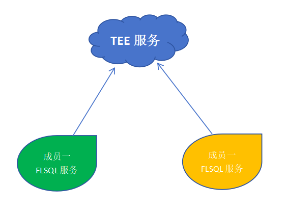
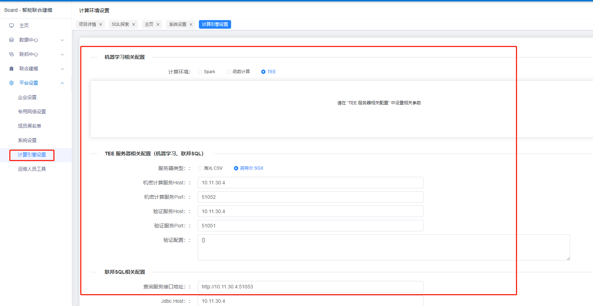
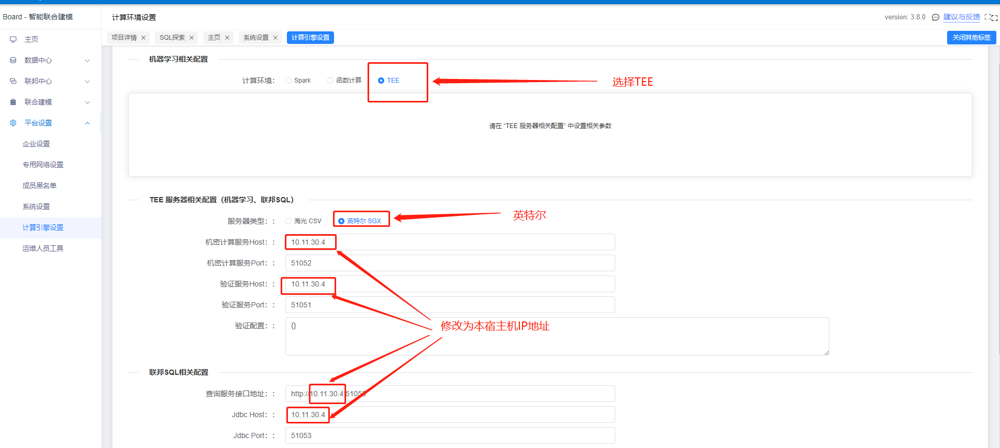
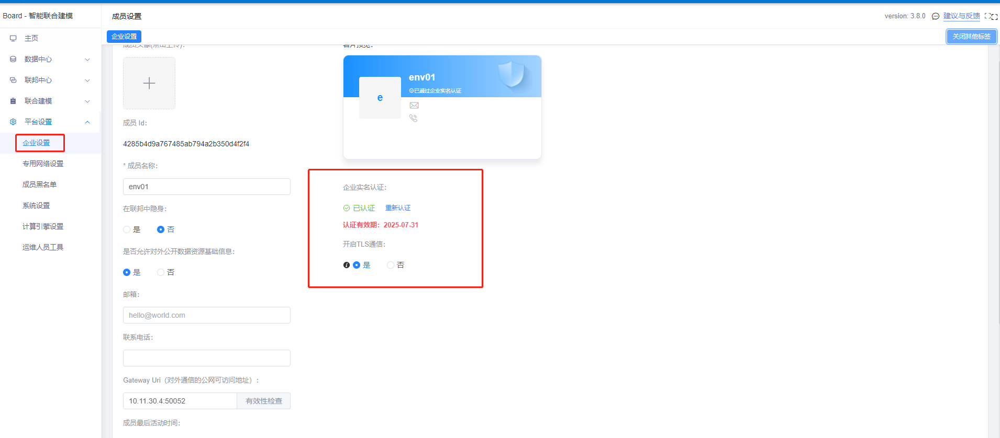

# WeFe隐私计算服务联邦SQL部署说明文档V2.0

## 一、背景说明

本安装过程基于 Docker 镜像安装，内置了FLSQL服务的所有依赖，支持服务器不联网的情况下进行部署。  

  

本系统分为“TEE服务”和“成员节点的FLSQL服务”两部分，多个成员节点共同接入同一个TEE服务。

## 二、安装前提条件
由于联邦FlSql服务依赖联邦学习平台，因此在安装联邦FlSql服务前先安装联邦学习平台（安装方法请参考：[WeFe隐私计算服务部署说明文档-V2.0.md](WeFe隐私计算服务部署说明文档-V2.0.md)）。

## 三、下载FLSQL相关镜像资源
> ⚠️注意事项：
> 目前FLSQL暂时只支持x86架构

```bash
# 下载镜像
# x86
rm -f /data/.archives/wefe-tee-sim.tar && wget -P /data/.archives/ https://welab-wefe-release.obs.cn-south-1.myhuaweicloud.com/deploy/3.8.3/x86_64/wefe-tee-sim.tar

# 把镜像加载到Docker中
docker load < /data/.archives/wefe-tee-sim.tar
```

## 四、下载FLSQL资源
```bash
# 下载资源并替换目录/opt/wefe/wefe-flsql-service/dist/ 下的config和presto子目录
rm -rf /opt/wefe/wefe-flsql-service/dist/presto/* && wget -P /opt/ https://welab-wefe-release.obs.myhuaweicloud.com/deploy/3.8.5/wefe-deploy-flsql-dist-v3.8.5.tar && tar -xvf /opt/wefe-deploy-flsql-dist-v3.8.5.tar -C /opt/wefe/wefe-flsql-service/dist/presto/
```

## 五、启动TEE服务和FLSQL服务
- 1、启动TEE相关服务
```bash
# 启动TEE验证服务
rundis-cli upstart wefe-tee-attestation

# 启动TEE后端服务
rundis-cli upstart wefe-tee-server
```
- 2、启动FLSQL服务
```bash
# 启动TEE验证服务
rundis-cli upstart wefe-flsql-service
```

## 六、打开FLSQL开关
- 1、进入mysql容器
```bash
# 进入mysql容器
rundis-cli exec mysql
```
- 2、登录mysql
```bash
# 登录mysql（默认密码为: wefepass）
mysql -u wefe -p
```
- 3、进入wefe_board库
```bash
# 进入wefe_board库
use wefe_board;
```
- 4、打开启用FLSQL开关
```bash
# 打开FLSQL
update global_config set value='true' where `group` = 'fl_sql_config' and name = 'enable';
```

## 七、配置TEE以及FLSQL

- 1.进入board的计算引擎设置页面
  

- 2.设置相关配置项  
（1）计算环境为：TEE  
（2）服务器类型为：英特尔SGX  
（3）修改机密计算服务Host、验证服务Host、联邦SQL中查询服务接口地址中的ip以用Jdbc Host为本宿主机IP:    


PS: TEE 服务器相关配置可共用一个，即成员2可共用成员1的TEE环境，这时成员2的TEE服务器相关配置中的IP地址则要填写为成员1的IP地址。

## 八、各方成员需实名认证而开启TLS通信


PS：成员实名认证流程请参数board的实名认证流程操作手册


## 九、常见问题
### 8.1 在添加联邦SQL资源时或运行联邦SQL任务时，报presto响应400错误问题
原因：大概率原来的是联邦SQL配置不对，修正保存后系统缓存没更新过来造成访问报错。  
解决方案：重启wefe-flsql-service应用。


