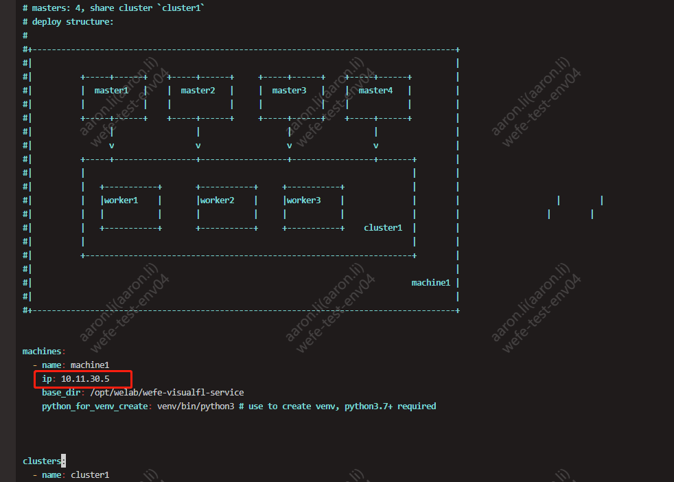
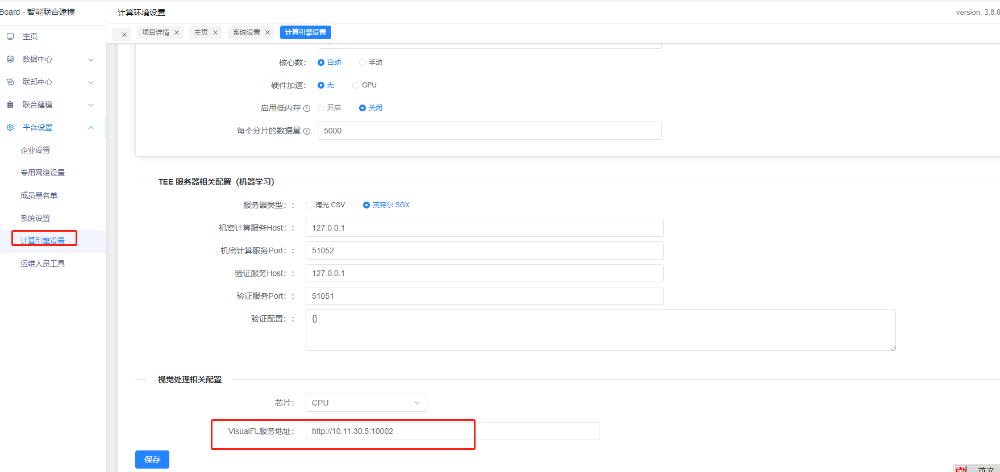

# WeFe隐私计算视觉处理服务Visualfl部署说明文档V2.0

## 一、背景说明

本安装过程基于 Docker 镜像安装，内置了视觉处理服务Visualfl的所有依赖，支持服务器不联网的情况下进行部署。

## 二、安装前提条件
由于视觉处理服务Visualfl依赖联邦学习平台，因此在安装视觉处理服务Visualfl前先安装联邦学习平台（安装方法请参考：[WeFe隐私计算服务部署说明文档-V2.0.md](WeFe隐私计算服务部署说明文档-V2.0.md)）。

## 三、下载Visualfl相关镜像资源
> ⚠️注意事项：
> 目前Visualfl暂时只支持x86架构

```bash
# 下载镜像
# x86
rm -f /data/.archives/wefe-visualfl-1.0.tar && wget -P /data/.archives/ https://welab-wefe-release.obs.cn-south-1.myhuaweicloud.com/deploy/3.8.3/x86_64/wefe-visualfl-1.0.tar

# 把镜像加载到Docker中
docker load < /data/.archives/wefe-visualfl-1.0.tar
```

## 四、启动Visualfl服务
- 1、修改配置
```bash
修改standalone.yaml文件中的配置：machines.ip的值为本宿主机IP地址.
vim /opt/wefe/wefe-visualfl-service/config/standalone.yaml
```


- 2、启动Visualfl相关服务
```bash
# 启动Visualfl服务
rundis-cli upstart wefe-visualfl-service
```

## 五、登录Board配置Visualfl地址
- 1、打开board的系统配置下的计算引擎设置菜单并设置VisualFL服务地址为：http://${宿主机IP}:10002
  

🎉 恭喜你，配置完毕！  
可下载测试数据在 board 中执行建模流程验证。

测试数据：  
https://welab-wefe-release.obs.cn-south-1.myhuaweicloud.com/deploy/show_data/fl_fruit.7z


