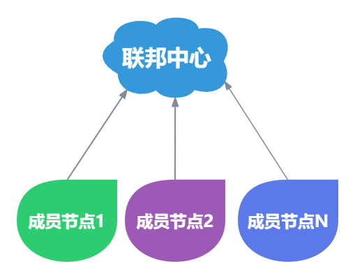
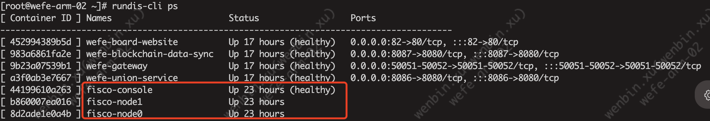
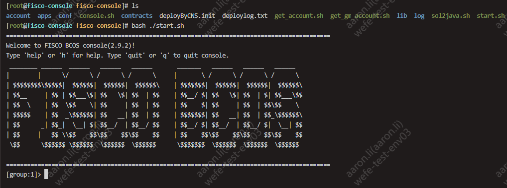
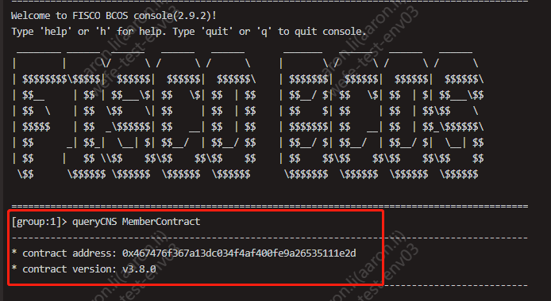
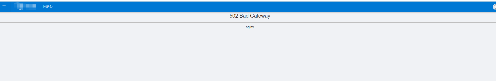
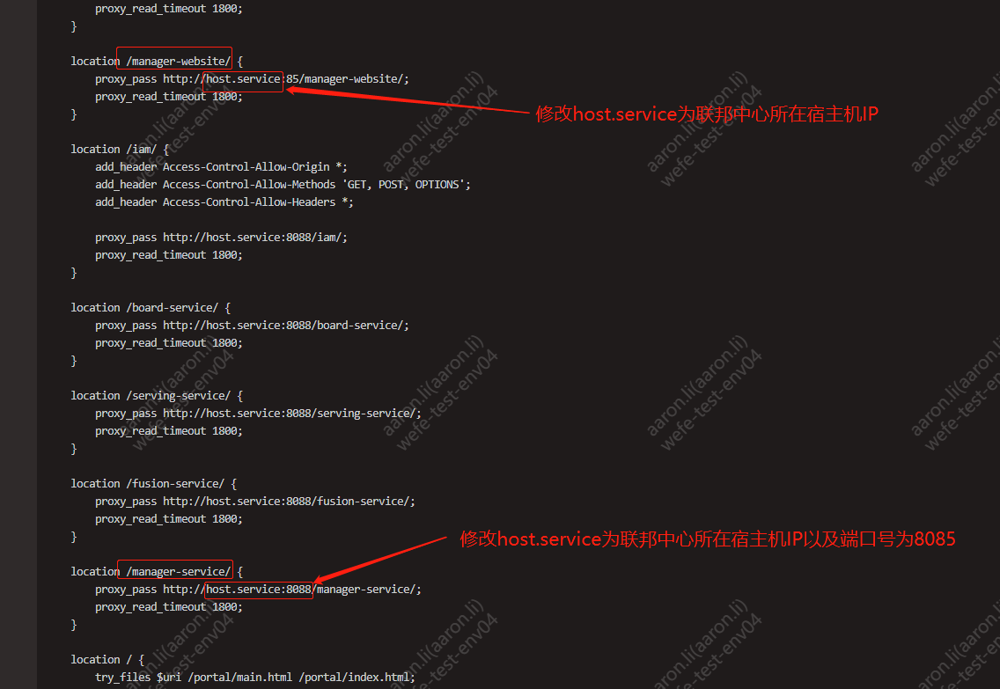

# WeFe隐私计算服务部署说明文档V2.0

## 一、背景说明

本安装过程基于 Docker 镜像安装，内置了各服务的所有依赖，支持服务器不联网的情况下进行部署。



本系统分为“联邦中心”和“成员节点”两部分，多个成员节点接入同一个联邦中心即构成联邦。

**`服务器要求：`**  
- **操作系统：** 支持 Linux 和 macOS，不支持 Windows。
- **指令架构：** aarch64 与 x86 均支持。
- 隐私计算平台硬件环境配置表

| 环境类型 | 服务类型 | CPU≥ | 内存≥ | 磁盘空间≥ | 服务器数量≥ | 带宽  |
|------|------|------|-----|-------|--------|-----|
| 体验   | 联邦服务 | 4核   | 16G | 300G  | 1      | --  |
|      | 成员一  | 8核   | 32G | 300G  | 1      | --  |
|      | 成员二  | 8核   | 32G | 300G  | 1      | --  |
|      | ---  | ---  | --- | ---   | ---    | --- |
| 经济   | 联邦服务 |8核   | 16G | 500G    | 1      | 10M |
|      | 成员一  | 32核   | 64G  | 500G    | 1      | 10M  |
|      | 成员二 | 32核   | 64G  | 500G    | 1      | 10M  |
|      | ---  | ---  | --- | ---   | ---    | --- |
| 生产   | 联邦服务  | 16核   | 32G  | 500G    | 1      | 100M  |
|      | 成员一   | 64核   | 128G  | 500G    | 1      | 100M  |
|      | 成员二  | 64核   | 128G  | 500G    | 1      | 100M  |

说明：联邦中心可与成员节点共同部署在同一台服务器中，但多个成员节点不能部署在相同服务器。


## 二、准备环境

主要包括Docker的离线安装包、WeFe各服务镜像文件以及WeFe各服务的Docker-compose相关部署脚本资源。

### 2.1 下载资源

> ⚠️注意事项：  
> /data 目录建议 300GB 或以上  
> 如果 /data 目录不在数据盘，可通过创建软连接把数据盘连接到 /data目录。  
>
> 以数据盘路径 /dev/mapper/dataVG 举例，创建软连接将数据盘指向 /data 目录：  
>       `ln -s /dev/mapper/dataVG /data`
 

```bash
# 创建目录用于储存镜像
mkdir -p /data/.archives/
# 创建目录用于储存安装包
mkdir -p /opt/wefe/ && cd /opt/wefe/

# 查看服务器芯片架构
uname -p

# 根据芯片架构选择对应的镜像（二选一）
# x86
rm -f /data/.archives/allImages.tar && wget -P /data/.archives/ https://welab-wefe-release.obs.cn-south-1.myhuaweicloud.com/deploy/3.8.3/x86_64/allImages.tar
# aarch64
rm -f /data/.archives/allImages.tar && wget -P /data/.archives/ https://welab-wefe-release.obs.cn-south-1.myhuaweicloud.com/deploy/3.8.3/aarch64/allImages.tar

# 下载安装包并解压到 /opt/wefe
rm -f /opt/wefe-deploy-v3.8.6.tar &&  wget -P /opt/ https://welab-wefe-release.obs.cn-south-1.myhuaweicloud.com/deploy/3.8.6/wefe-deploy-v3.8.6.tar && tar -xvf /opt/wefe-deploy-v3.8.6.tar -C /opt/wefe && cd /opt/wefe

# 把初始化rundis-cli脚本加到环境PATH中
cd /opt/wefe && ./rundis-cli
```


### 2.2 安装 Docker

#### 全新安装 Docker
```bash
# 以 root 身份安装 docker
# ⚠️注意：Docker默认的数据目录在/data/docker目录下（由/opt/wefe/.archives/docker.daemon.json文件指定），目录不能为软链接目录，必须为真实的文件目录！！！

sudo su -
cd /opt/wefe

# ⚠️注意！！！
# ⚠️注意！！！
# ⚠️注意！！！
# 此操作会全新安装 Docker，并清空已有 Docker 数据并重新初始化。
# 如果服务器中已存在 Docker 服务，请不要执行，并查看下文。
./rundis-cli init docker
```

#### 覆盖安装 Docker
```bash
# *****************************************
# 已有 Docker 情形一：现有 Docker 不要了
# *****************************************
# 覆盖安装
rundis-cli init docker
# 重启
reboot
```


#### 使用现有 Docker
```bash
# **************************************************
# 已有 Docker 情形二：保留现有 Docker
# **************************************************
# 检查现有 Docker 版本是否支持 docker compose子命令
docker compose version

# 情况1、如果提示命令不存在或显示docker: 'compose' is not a docker command.，表示当前docker版本不支持compose子命令，则需要手动安装 docker-compose 并将其添加到 PATH。
# 手动安装 docker-compose，过程略。
#
# 将手动安装的 docker-compose 关联到 rundis-cli 安装工具：
# 修改文件 /opt/wefe/rundis-cli 中的 __do_execute_docker_compose_cmd 方法（大概在138行）
# 把方法中的 docker compose 改成 docker-compose 保存退出。

# 情况2、如果命令执行成功则表示docker支持compose子命令，则直接执行下面的手动加载WeFe镜像到Docker即可。

# 加载镜像到 Docker
docker load < /data/.archives/allImages.tar
```


## 三、安装联邦中心

**`⚠️注意：`**   
如果您已有现成的联邦中心可用，那么不需要再安装联邦中心，在成员节点中将配置项 `wefe.union.base-url` 指定为现有 union 服务地址即可接入。

建议联邦中心和成员节点安装在不同的服务器中，在生产环境中将两者分离具有更好的稳定性和可维护性。

联邦中心包括6个容器服务，分别是：
- fisco
- mongo
- wefe-manager-service
- wefe-manager-website
- wefe-union-service
- wefe-blockchain-data-sync
 
其中 fisco、mongo 和其它服务安装过程不一样，所以分为三部分分别执行。


### 3.1 安装 fisco

```bash
# 安装 fisco，需要输入 yes 确认。
# 如果输出红色 ERROR 或其他莫名其妙的问题，重新执行此步骤。
rundis-cli init fisco


# 查看 fisbcos 相关容器是否启动成功（healthy表示成功）
rundis-cli ps | grep fisco
```



在 fisco 中查看并管理合约等高阶功能请查看后文相关章节。 

### 3.2 安装 MongoDB

```bash
# 安装 mongo
#
# ⚠️注意：
# 此命令会安装并初始化 MongoDB 服务
# 如果已经存在 mongo 容器，会删除对应的容器及数据！！！
rundis-cli install mongo
```
   

### 3.3 启动联邦服务

```bash
# 初始化服务参数，将本机 IP 写入相关配置文件。
#
# 将所有的服务的 dockercompose.yml 的 extra_hosts 自动修改为本机 IP，此动作影响范围包括成员节点相关服务。
# 包括：
# - mysql.service
# - redis.service
# - mongodb.service
# - clickhouse.service
# - fisco.service
# - host.service
# - wefe-union-service
# - wefe-blockchain-data-sync
# - wefe-manager-service
# - 各模块 application.properties 配置文件中的 block.chain.fisco-bcos.ip 配置项
rundis-cli init compose --all


# 启动联邦服务
rundis-cli upstart --center

# 查看服务状态（healthy表示成功）
rundis-cli ps

# 获取 union 服务地址（部署成员节点时需要使用；注意：如果网卡名不是eth0时请修改为真正的网卡名）
echo "http://"$(ip addr show eth0 | grep -oP '(?<=inet\s)\d+(\.\d+){3}')":8086/union-service/"

# 检查服务是否正常（注意：如果网卡名不是eth0时请修改为真正的网卡名）
# 正常时的输出：{"code":0,"data":null,"message":null,"spend":1}
curl "http://"$(ip addr show eth0 | grep -oP '(?<=inet\s)\d+(\.\d+){3}')":8086/union-service/service/alive"
```


## 四、安装成员节点

```bash
# 安装成员节点依赖的软件，不可重复执行，会覆盖已有容器导致数据丢失。
#
# 将会安装的依赖：
# - mysql
# - clickhouse
# - nacos
# - redis
rundis-cli install --member

# 初始化服务参数，将本机 IP 写入相关配置文件。
#
# 将所有的服务的 dockercompose.yml 的 extra_hosts 自动修改为本机 IP，此动作影响范围包括联邦中心相关服务。
# 包括：
# - mysql.service
# - redis.service
# - mongodb.service
# - clickhouse.service
# - fisco.service
# - host.service
# - wefe-union-service
# - wefe-blockchain-data-sync
# - wefe-manager-service
# - 各模块 application.properties 配置文件中的 block.chain.fisco-bcos.ip 配置项
rundis-cli init compose --all


# 配置 Union 服务地址
# wefe-board-service 和 wefe-gateway 会请求 wefe-union-service 服务
# 在启动 wefe-board-service 和 wefe-gateway 前需要修改其配置文件，指定 Union 服务地址。
# 
# 修改配置项：
# wefe.union.base-url=<union 服务地址>
vim /opt/wefe/wefe-board-service/config/application.properties
vim /opt/wefe/wefe-gateway/config/application.properties

# 如果在修改配置文件前 wefe-board-service 和 wefe-gateway 已启动
# 需要在修改后重启服务
rundis-cli down wefe-board-service
rundis-cli upstart wefe-board-service
rundis-cli down wefe-gateway
rundis-cli upstart wefe-gateway

# 启动成员节点所有服务
rundis-cli upstart --member

# 查看服务状态
rundis-cli ps
```
---
## 五、登录系统
🎉 恭喜你，配置完毕！  
可登录系统后下载测试数据在 board 中执行建模流程验证。

    登录地址：http://宿主主机IP:80/portal/login
    用户名：superAdmin
    密码：Ab$123456

测试数据下载地址：  
https://welab-wefe-release.obs.cn-south-1.myhuaweicloud.com/deploy/show_data/wefe_show_data.zip


## 六、更多管理操作

### 6.1 rundis-cli 使用说明

执行 `./rundis-cli --help` 可以查看该工具支持的功能和各功能的使用方法。

```text
$ ./rundis-cli
Usage: rundis-cli <command> <options> <application>
       rundis-cli -h|--help

Commands
  init                         初始化: 谨慎操作, 会清空数据、重新初始化
  upstart                      启动服务
  down                         停止、删除服务
  restart                      停止、删除、启动服务
  exec                         登陆容器终端
  logs                         查看容器日志
  ps                           查看容器列表
  stats                        查看容器状态
```


执行 `./rundis-cli <子命令> --help` 可以查看子命令的使用方法。

```text
$ rundis-cli restart --help
Usage: rundis-cli restart <--all>
       rundis-cli restart <--application>
       rundis-cli restart <service1> <service2> ...
       rundis-cli restart -h|--help

Available Services:
* nacos
* redis
* mysql
* mongo
* clickhouse
* iam-portal-web
* iam-web
* wefe-board-website
* wefe-serving-website
* wefe-fusion-website
* wefe-manager-website
* welab-gateway
* welab-iam
* wefe-board-service
* wefe-serving-service
* wefe-fusion-service
* wefe-manager-service
* wefe-union-service
* wefe-blockchain-data-sync
* wefe-gateway
* wefe-flow

Examples:
- rundis-cli restart --all           : 重启所有服务
- rundis-cli restart --application   : 重启所有应用服务
- rundis-cli restart mysql redis ... : 重启指定服务
```


**upstart（启动服务）**


- **rundis-cli upstart --all** ：启动所有的服务。
- **rundis-cli upstart --member**：启动成员节点相关服务（mysql clickhouse wefe-board-service wefe-gateway wefe-flow wefe-board-website nacos redis welab-gateway welab-iam iam-web iam-portal-web）。
- **rundis-cli upstart --center**：启动联邦中心相关服务（mongo wefe-union-service wefe-blockchain-data-sync wefe-manager-service wefe-manager-website）。
- **rundis-cli upstart mysql clickhouse nacos**：启动指定的服务。

⚠️例外！！！  
fisco 的服务需要用 docker 原生命令来 启动、重启或暂停 容器。
```bash
# 停止
docker stop fisco-console fisco-node1 fisco-node0
# 启动
docker start fisco-console fisco-node1 fisco-node0
# 重启
docker restart fisco-console fisco-node1 fisco-node0
```


**install（安装依赖服务）**

⚠️危险！！！  
`install` 命令会覆盖已有容器，导致容器中的数据丢失，执行前可通过 `docker ps | grep <name>` 命令检查容器是否已存在。


- **rundis-cli install --all**：初始化所有的第三方软件，包括 mysql、clickhouse、nacos、redis、mongo。
- **rundis-cli install --member**：初始化member依赖的第三方软件，包括 mysql、clickhouse、nacos、redis。
- **rundis-cli install --center**：初始化 mongo。
- **rundis-cli install mysql clickhouse nacos redis mongo**：初始化指定服务。


**init compose（初始化服务参数）**

初始化服务参数，将所有的服务的 dockercompose.yml 的 extra_hosts 自动修改为本机 IP，此动作影响范围包括联邦中心相关服务成员节点相关服务。


包括：
- mysql.service
- redis.service
- mongodb.service
- clickhouse.service
- fisco.service
- host.service
- wefe-union-service
- wefe-blockchain-data-sync
- wefe-manager-service
- 各模块 application.properties 配置文件中的 block.chain.fisco-bcos.ip 配置项


获取宿主机 IP 的方式是读取 en0\wlan0\enp0s3\ens33\enp2s0\eno1\ens1 网卡的IP， 您也可以使用直接指定对应软件的IP，特别是想要复用已有的服务的时候。

以您的服务器地址为 10.11.30.107 举例：
> rundis-cli init compose --mysql 10.11.30.107 --redis 10.11.30.107 --mongodb 10.11.30.107 --clickhouse 10.11.30.107 --fisco 10.11.30.107 --host 10.11.30.107


### 6.2 在 fisco 控制台中管理区块链合约

```bash
# 进入 fisco 容器
rundis-cli exec fisco-console

# 退出容器
exit
```


进入容器后执行 ./start.sh 脚本连接到 fiscos，连接成功后会打印如下信息：

 

在 fisbcos-console 控制台中执行 `queryCNS MemberContract` 可查看合约：




## 七、常见问题

### 7.1 部分服务 healthy 部分 unhealthy

通过TOP命令查看内存情况，很可能是内存不足导致服务起不来，一般upstart --all启动所有服务器需要确保宿主机有32G的内存。


### 7.2 服务启动失败

启动服务后，通过 ```rundis-cli ps  ```看到对应的服务unhealthy，假如wefe-board-service启动后unhealthy，可以通过```rundis-cli logs wefe-board-service ```查看最新的日志，也可以通过```rundis-cli exec wefe-board-service```进入容器，然后使用```tail -1000 /data/logs/wefe-board-service/wefe-board-service.log```查看最新的1000条日志。

> 一般启动失败的原因是配置问题，可以通过```rundis-cli init compose 服务名称 ```修改配置，然后重启服务，这里需要强调的是修改配置后重启不能使用```rundis-cli restart 服务名称```,而应该使用 ```rundis-cli down 服务名称```+```rundis-cli upstart 服务名称```，以避免配置不生效！！！。  
> 举例说明，通过 ```rundis-cli ps  ```看到wefe-board-service服务unhealthy，可以尝试使用```rundis-cli init compose ```配置所有配置项，也可以直接通过 ``` cat /opt/wefe/wefe-board-service/docker-compose.yml ```查看extra_hosts配置是否正常。


- **配置文件检查**：一般配置文件位于/opt/wefe/服务名称/docker-compose.yml，主要是检查extra_hosts配置，而wefe-union-service、wefe-blockchain-data-sync和wefe-manager-service还需要核实application.properties的配置，具体查看/opt/wefe/服务名称/config/application.properties，该文件中block.chain.fisco-bcos.ip的值是否正常，一般为本宿主主机的IP地址。


### 7.3 fisco 服务重启
fisco服务包含3个容器，正常情况如下图

如遇到看不到fisco-node0和fisco-node1的情况，可以使用``` docker ps -a ```查看状态，然后使用``` docker start  fisco-node0``` 和 ``` docker start  fisco-node1``` 把fisco节点启动起来

### 7.4 union-service 请求服务 fisco 报响应超时问题
union-service请求fisco服务时报错如下，大概率原因为fisco容器启动不正常，节点之间通信失败：
```
-2024-04-28 09:37:17.833 - INFO [] [pool-6-thread-1] o.f.b.s.service.GroupManagerServiceImpl [GroupManagerServiceImpl.java:400] : Transaction timeout: 879bebdeeedb4c2e8894eea2bbbf664b
--2024-04-28 09:37:17.854 - INFO [] [           main] c.w.w.u.s.s.c.UnionNodeContractService  [UnionNodeContractService.java:57] : UnionNode contract insert transaction, unionBaseUrl: null,  receipt response: {"return_message":"Transaction receipt timeout","receipt_messages":"Transaction receipt timeout","return_code":50001,"transaction_receipt":{"status_o_k":false,"message":"Transaction receipt timeout","status":"50001"}}
--2024-04-28 09:37:17.859 -ERROR [] [           main] c.w.w.u.s.s.c.UnionNodeContractService  [UnionNodeContractService.java:62] : transaction error，blockchain response error: Transaction receipt timeout
-
com.welab.wefe.common.exception.StatusCodeWithException: transaction error，blockchain response error: Transaction receipt timeout
        at com.welab.wefe.union.service.service.contract.AbstractContractService.transactionIsSuccess(AbstractContractService.java:62) ~[classes!/:1.0.0]
        at com.welab.wefe.union.service.service.contract.UnionNodeContractService.add(UnionNodeContractService.java:59) ~[classes!/:1.0.0]
        at com.welab.wefe.union.service.service.UnionNodeService.registerUnionNode(UnionNodeService.java:78) [classes!/:1.0.0]
        at com.welab.wefe.union.service.listener.UnionApplicationListener.onApplicationEvent(UnionApplicationListener.java:61) [classes!/:1.0.0]
        at com.welab.wefe.union.service.listener.UnionApplicationListener.onApplicationEvent(UnionApplicationListener.java:36) [classes!/:1.0.0]
        at org.springframework.context.event.SimpleApplicationEventMulticaster.doInvokeListener(SimpleApplicationEventMulticaster.java:172) [spring-context-5.1.11.RELEASE.jar!/:5.1.11.RELEASE]
        at org.springframework.context.event.SimpleApplicationEventMulticaster.invokeListener(SimpleApplicationEventMulticaster.java:165) [spring-context-5.1.11.RELEASE.jar!/:5.1.11.RELEASE]
        at org.springframework.context.event.SimpleApplicationEventMulticaster.multicastEvent(SimpleApplicationEventMulticaster.java:139) [spring-context-5.1.11.RELEASE.jar!/:5.1.11.RELEASE]
        at org.springframework.context.support.AbstractApplicationContext.publishEvent(AbstractApplicationContext.java:402) [spring-context-5.1.11.RELEASE.jar!/:5.1.11.RELEASE]
        at org.springframework.context.support.AbstractApplicationContext.publishEvent(AbstractApplicationContext.java:359) [spring-context-5.1.11.RELEASE.jar!/:5.1.11.RELEASE]
        at org.springframework.boot.context.event.EventPublishingRunListener.started(EventPublishingRunListener.java:98) [spring-boot-2.1.10.RELEASE.jar!/:2.1.10.RELEASE]
        at org.springframework.boot.SpringApplicationRunListeners.started(SpringApplicationRunListeners.java:71) [spring-boot-2.1.10.RELEASE.jar!/:2.1.10.RELEASE]
        at org.springframework.boot.SpringApplication.run(SpringApplication.java:318) [spring-boot-2.1.10.RELEASE.jar!/:2.1.10.RELEASE]
        at org.springframework.boot.SpringApplication.run(SpringApplication.java:1215) [spring-boot-2.1.10.RELEASE.jar!/:2.1.10.RELEASE]
        at org.springframework.boot.SpringApplication.run(SpringApplication.java:1204) [spring-boot-2.1.10.RELEASE.jar!/:2.1.10.RELEASE]
        at com.welab.wefe.common.web.Launcher.launch(Launcher.java:102) [common-web-1.0.0.jar!/:1.0.0]
        at com.welab.wefe.union.service.UnionService.main(UnionService.java:93) [classes!/:1.0.0]
        at sun.reflect.NativeMethodAccessorImpl.invoke0(Native Method) ~[na:1.8.0_262]
        at sun.reflect.NativeMethodAccessorImpl.invoke(NativeMethodAccessorImpl.java:62) ~[na:1.8.0_262]
        at sun.reflect.DelegatingMethodAccessorImpl.invoke(DelegatingMethodAccessorImpl.java:43) ~[na:1.8.0_262]
        at java.lang.reflect.Method.invoke(Method.java:498) ~[na:1.8.0_262]
        at org.springframework.boot.loader.MainMethodRunner.run(MainMethodRunner.java:48) [wefe-union-service.jar:1.0.0]
        at org.springframework.boot.loader.Launcher.launch(Launcher.java:87) [wefe-union-service.jar:1.0.0]
        at org.springframework.boot.loader.Launcher.launch(Launcher.java:51) [wefe-union-service.jar:1.0.0]
        at org.springframework.boot.loader.JarLauncher.main(JarLauncher.java:52) [wefe-union-service.jar:1.0.0]

-2024-04-28 09:37:17.859 -ERROR [] [           main] c.w.w.u.s.service.UnionNodeService      [UnionNodeService.java:100] : registerUnionNode to blockchain failed
```
可通过查看进入容器fisco-node0或fisco-node1进看最新log日志：
```
# 进入fisco-node0或fisco-node1容器
rundis-cli exec fisco-node0

# 查看最新日志（最新日期）
tail -f /opt/welab/fisco-bcos/log/log_2024042810.00.log
```
不断打印以下错误日志，表示节点fisco-node0和fisco-node1启动不正常，造成共识失败：
```
info|2024-04-28 09:40:03.061913|[RPC][getGroupList]request
info|2024-04-28 09:40:04.238452|[RPC][getGroupList]request
info|2024-04-28 09:40:06.121495|[NETWORK][Host]Connecting to node,endpoint=127.0.0.1:30301
info|2024-04-28 09:40:06.121577|[P2P][Service] heartBeat,connected count=0
info|2024-04-28 09:40:06.121686|[NETWORK][ASIO]asyncResolveConnect,endpoint=127.0.0.1:30301
info|2024-04-28 09:40:06.121782|[NETWORK][Host]P2P Recv Connect, From=127.0.0.1:45936
info|2024-04-28 09:40:06.121815|[NETWORK][Host]P2P StartAccept,Host=0.0.0.0:30300
error|2024-04-28 09:40:06.122618|[NETWORK][Host]Get ca basic failed
error|2024-04-28 09:40:06.125670|[NETWORK][Host]Get ca basic failed
info|2024-04-28 09:40:06.127661|[NETWORK][Host]handshakeServer succ,remote endpoint=127.0.0.1:45936
info|2024-04-28 09:40:06.127692|[NETWORK][Host]startPeerSession, Remote=127.0.0.1:45936,local endpoint=127.0.0.1:30300,nodeID=3be8ea86...
info|2024-04-28 09:40:06.127738|[P2P][Service] Connection established,nodeID=3be8ea86...,endpoint=127.0.0.1:45936
info|2024-04-28 09:40:06.127748|[NETWORK][Host]handshakeClient succ,local endpoint=127.0.0.1:41288
info|2024-04-28 09:40:06.127764|[NETWORK][Host]startPeerSession, Remote=127.0.0.1:30301,local endpoint=127.0.0.1:41288,nodeID=3be8ea86...
warning|2024-04-28 09:40:06.127869|[NETWORK][Session]doRead error,endpoint=127.0.0.1:45936,message=short read
info|2024-04-28 09:40:06.127882|[NETWORK][Session]drop, call and erase all callbackFunc in this session!,endpoint=127.0.0.1:45936
warning|2024-04-28 09:40:06.127892|[NETWORK][Session][drop] closing remote 0.0.0.0:0,reason=Low-level TCP communication error.,endpoint=127.0.0.1:45936
error|2024-04-28 09:40:06.127913|[NETWORK][Session]Session inactived
warning|2024-04-28 09:40:06.127910|[P2P][Service] disconnect error P2PSession,nodeID=3be8ea86...,endpoint=127.0.0.1:45936,errorCode=3,what=Disconnect
error|2024-04-28 09:40:06.127921|[NETWORK][Session]Session inactived
warning|2024-04-28 09:40:06.127926|[NETWORK][Session][drop] shutdown failed ,errorValue=9,message=Bad file descriptor
warning|2024-04-28 09:40:06.127933|[P2P][Service] onDisconnect,errorCode=3,what=Dynamic exception type: dev::network::NetworkException
std::exception::what: Disconnect

info|2024-04-28 09:40:16.121622|[NETWORK][Host]Connecting to node,endpoint=127.0.0.1:30301
info|2024-04-28 09:40:16.121707|[P2P][Service] heartBeat,connected count=0
info|2024-04-28 09:40:16.121809|[NETWORK][ASIO]asyncResolveConnect,endpoint=127.0.0.1:30301
info|2024-04-28 09:40:16.121921|[NETWORK][Host]P2P Recv Connect, From=127.0.0.1:34612
info|2024-04-28 09:40:16.121955|[NETWORK][Host]P2P StartAccept,Host=0.0.0.0:30300
error|2024-04-28 09:40:16.122741|[NETWORK][Host]Get ca basic failed
error|2024-04-28 09:40:16.125765|[NETWORK][Host]Get ca basic failed
info|2024-04-28 09:40:16.127816|[NETWORK][Host]handshakeServer succ,remote endpoint=127.0.0.1:34612
info|2024-04-28 09:40:16.127847|[NETWORK][Host]startPeerSession, Remote=127.0.0.1:34612,local endpoint=127.0.0.1:30300,nodeID=3be8ea86...
info|2024-04-28 09:40:16.127892|[P2P][Service] Connection established,nodeID=3be8ea86...,endpoint=127.0.0.1:34612
info|2024-04-28 09:40:16.127912|[NETWORK][Host]handshakeClient succ,local endpoint=127.0.0.1:57540
info|2024-04-28 09:40:16.127927|[NETWORK][Host]startPeerSession, Remote=127.0.0.1:30301,local endpoint=127.0.0.1:57540,nodeID=3be8ea86...
warning|2024-04-28 09:40:16.128020|[NETWORK][Session]doRead error,endpoint=127.0.0.1:34612,message=short read
info|2024-04-28 09:40:16.128033|[NETWORK][Session]drop, call and erase all callbackFunc in this session!,endpoint=127.0.0.1:34612
warning|2024-04-28 09:40:16.128045|[NETWORK][Session][drop] closing remote 0.0.0.0:0,reason=Low-level TCP communication error.,endpoint=127.0.0.1:34612
warning|2024-04-28 09:40:16.128058|[P2P][Service] disconnect error P2PSession,nodeID=3be8ea86...,endpoint=127.0.0.1:34612,errorCode=3,what=Disconnect
error|2024-04-28 09:40:16.128078|[NETWORK][Session]Session inactived
error|2024-04-28 09:40:16.128088|[NETWORK][Session]Session inactived
warning|2024-04-28 09:40:16.128081|[P2P][Service] onDisconnect,errorCode=3,what=Dynamic exception type: dev::network::NetworkException
std::exception::what: Disconnect
```

解决方法为重启fisco-node0和fisco-node1容器即可：
```
docker restart fisco-node0
docker restart fisco-node1
```

重启后可再次进入fisco-node0或fisco-node1容器查看最新日志，如不断打印以下日志证明启动正常：
```
info|2024-04-28 09:54:37.641727|[P2P][Service] heartBeat,connected count=1
info|2024-04-28 09:54:38.449228|[g:1][CONSENSUS][SEALER]++++++++++++++++ Generating seal on,blkNum=37,tx=0,nodeIdx=1,hash=db3dc890...
info|2024-04-28 09:54:38.449709|[g:1][CONSENSUS][PBFT]checkTimeout Succ,view=341,toView=342,nodeIdx=1,changeCycle=1,myNode=f48d9620...,timecost=0
info|2024-04-28 09:54:38.450573|[g:1][CONSENSUS][PBFT]checkAndChangeView: Reach consensus,org_view=341,cur_changeCycle=1,curView=341,view=342
info|2024-04-28 09:54:39.451261|[g:1][CONSENSUS]addRawPrepare,height=37,reqIdx=0,hash=a5808d48...,time=0
info|2024-04-28 09:54:39.451465|[g:1][CONSENSUS][PBFT]checkTimeout Succ,view=342,toView=343,nodeIdx=1,changeCycle=1,myNode=f48d9620...,timecost=0
info|2024-04-28 09:54:39.451752|[g:1][CONSENSUS][PBFT]checkAndChangeView: Reach consensus,org_view=342,cur_changeCycle=1,curView=342,view=343
info|2024-04-28 09:54:40.451333|[g:1][CONSENSUS][SEALER]++++++++++++++++ Generating seal on,blkNum=37,tx=0,nodeIdx=1,hash=bd19346c...
info|2024-04-28 09:54:40.451807|[g:1][CONSENSUS][PBFT]checkTimeout Succ,view=343,toView=344,nodeIdx=1,changeCycle=1,myNode=f48d9620...,timecost=0
info|2024-04-28 09:54:40.452664|[g:1][CONSENSUS][PBFT]checkAndChangeView: Reach consensus,org_view=343,cur_changeCycle=1,curView=343,view=344
info|2024-04-28 09:54:41.453157|[g:1][CONSENSUS]addRawPrepare,height=37,reqIdx=0,hash=518ff6cc...,time=0
info|2024-04-28 09:54:41.453371|[g:1][CONSENSUS][PBFT]checkTimeout Succ,view=344,toView=345,nodeIdx=1,changeCycle=1,myNode=f48d9620...,timecost=0
info|2024-04-28 09:54:41.453653|[g:1][CONSENSUS][PBFT]checkAndChangeView: Reach consensus,org_view=344,cur_changeCycle=1,curView=344,view=345
info|2024-04-28 09:54:42.454128|[g:1][CONSENSUS][SEALER]++++++++++++++++ Generating seal on,blkNum=37,tx=0,nodeIdx=1,hash=a1465f66...
info|2024-04-28 09:54:42.454632|[g:1][CONSENSUS][PBFT]checkTimeout Succ,view=345,toView=346,nodeIdx=1,changeCycle=1,myNode=f48d9620...,timecost=0
info|2024-04-28 09:54:42.455491|[g:1][CONSENSUS][PBFT]checkAndChangeView: Reach consensus,org_view=345,cur_changeCycle=1,curView=345,view=346
info|2024-04-28 09:54:43.456046|[g:1][CONSENSUS]addRawPrepare,height=37,reqIdx=0,hash=36cef75f...,time=0
info|2024-04-28 09:54:43.456259|[g:1][CONSENSUS][PBFT]checkTimeout Succ,view=346,toView=347,nodeIdx=1,changeCycle=1,myNode=f48d9620...,timecost=0
info|2024-04-28 09:54:43.456524|[g:1][CONSENSUS][PBFT]checkAndChangeView: Reach consensus,org_view=346,cur_changeCycle=1,curView=346,view=347
info|2024-04-28 09:54:44.456831|[g:1][CONSENSUS][SEALER]++++++++++++++++ Generating seal on,blkNum=37,tx=0,nodeIdx=1,hash=f493eebe...
info|2024-04-28 09:54:44.457313|[g:1][CONSENSUS][PBFT]checkTimeout Succ,view=347,toView=348,nodeIdx=1,changeCycle=1,myNode=f48d9620...,timecost=0
info|2024-04-28 09:54:44.458185|[g:1][CONSENSUS][PBFT]checkAndChangeView: Reach consensus,org_view=347,cur_changeCycle=1,curView=347,view=348
info|2024-04-28 09:54:45.459385|[g:1][CONSENSUS]addRawPrepare,height=37,reqIdx=0,hash=c30ab00f...,time=0
info|2024-04-28 09:54:45.459585|[g:1][CONSENSUS][PBFT]checkTimeout Succ,view=348,toView=349,nodeIdx=1,changeCycle=1,myNode=f48d9620...,timecost=0
info|2024-04-28 09:54:45.459863|[g:1][CONSENSUS][PBFT]checkAndChangeView: Reach consensus,org_view=348,cur_changeCycle=1,curView=348,view=349
info|2024-04-28 09:54:46.459837|[g:1][CONSENSUS][SEALER]++++++++++++++++ Generating seal on,blkNum=37,tx=0,nodeIdx=1,hash=81fc6a07...
info|2024-04-28 09:54:46.460340|[g:1][CONSENSUS][PBFT]checkTimeout Succ,view=349,toView=350,nodeIdx=1,changeCycle=1,myNode=f48d9620...,timecost=0
info|2024-04-28 09:54:46.461884|[g:1][CONSENSUS][PBFT]checkAndChangeView: Reach consensus,org_view=349,cur_changeCycle=1,curView=349,view=350
```


### 7.5 修改IAM根机构名称
系统在安装部署时默认的根组织机构名称为 天冕科技，由于某种原因需修改根机构名称，可登录mysql，选中welab_iam库后执行以下sql语句修改：
update org_info set org_name='此处为新机构名称' where id='1550292621900984333';

### 7.6 在未重启系统（reboot）的前提下多次执行rundis-cli init docker或机器已安装了docker后再执行rundis-cli init docker命令，容器里ping不通宿主机IP造成容器连接不上其依赖服务从而启动失败的问题
原因：由于执行rundis-cli init docker命令时会修改到一些系统底层的信息，因此除非这台机器一开始就没有 docker，第一次init可以不用重启机器外，其他情况如多次执行rundis-cli init docker或如果机器已经安装了docker，再执行rundis-cli init docker就得重启机器，否则相关容器会ping不通宿主机IP

### 7.7 WeFe支持华为自研区块链V2版本的问题
默认情况下，下载的deploy包支持的区块链为Fisbcos，想支持华为自研区块链V2版本，则可下载支持华为区块链的相关资源并替换相关模块jar包以及修改相关配置，资源以及替换说明文档下载地址为：https://welab-wefe-release.obs.cn-south-1.myhuaweicloud.com/deploy/3.8.3/wefe-blockchain-huawei.zip

### 7.8 WeFe使用的FiscoBcos是什么，使用了哪个FiscoBcos的版本？
FISCO BCOS是由深圳市金融区块链发展促进会（以下简称“金链盟”）开源工作组牵头研发的金融级、国产安全可控的区块链底层平台。作为最早开源的国产联盟链底层平台之一，FISCO BCOS于2017年面向全球开源。WeFe使用的FiscoBcos为2.9版本，其官方文档地址为：https://fisco-bcos-documentation.readthedocs.io/zh-cn/latest/docs/introduction.html

### 7.9 在ARM架构下Mongo初始化失败并报提示：MongoDB 5.0+ requires ARMv8.2-A or higher, and your current system does not appear to implement any of the common features for that!
原因：在arm架构下，mongo5.x+需要ARMv8.2+版本的支持，可能当前机器的ARMv8版本低8.2，而WeFe默认的mongo镜像版本为5.0.21需ARMv8.2+版本的支持.
解决方案：修改mongo的docker-compose.yml文件，把镜像改为：wefe/mongo:4.2.20（PS：如docker未加载过该镜像，则可单独下载并加载到docker中，镜像的下载地址为：https://welab-wefe-release.obs.cn-south-1.myhuaweicloud.com/deploy/3.8.3/aarch64/wefe_mongo.4.2.20.tar）

### 7.10 在ARM架构下Clickhouse初始化失败报以下其中一种错误造成Clickhouse进程启动失败：
- 1、clickhouse 11:24:17.13 INFO  ==> Starting ClickHouse in background clickhouse 11:25:22.23 ERROR ==> Could not find entry "Application: Ready for connections" in /opt/bitnami/clickhouse/logs/clickhouse_init_scripts.log after 12 retries。

- 2、2024.05.11 03:34:20.426135 [ 34 ] {} <Fatal> BaseDaemon: Illegal opcode.
2024.05.11 03:34:20.426190 [ 34 ] {} <Fatal> BaseDaemon: Stack trace: 0xaaaac687032c 0xffffad811688
2024.05.11 03:34:20.426310 [ 34 ] {} <Fatal> BaseDaemon: 0. ? @ 0x903b32c in /opt/bitnami/clickhouse/bin/clickhouse
2024.05.11 03:34:20.426356 [ 34 ] {} <Fatal> BaseDaemon: 1. ? @ 0xffffad811688 in ?
2024.05.11 03:34:20.674136 [ 34 ] {} <Fatal> BaseDaemon: Integrity check of the executable skipped because the reference checksum could not be read. (calculated checksum: CD3959FB6B68C5D13C16593D45478A80)
- 3、entrypoint.sh: line 40:    24 Illegal instruction     (core dumped) clickhouse extract-from-config --config-file "$CLICKHOUSE_CONFIG" --key='storage_configuration.disks.*.path'
  /entrypoint.sh: line 41:    26 Illegal instruction     (core dumped) clickhouse extract-from-config --config-file "$CLICKHOUSE_CONFIG" --key='storage_configuration.disks.*.metadata_path'  

原因分析：在arm架构下，部分clickhouse版本需要ARMv8.2+版本的支持，可能当前机器的ARMv8版本低8.2，而WeFe默认的Clickhouse镜像版本为22.8需ARMv8.2+版本的支持.  

解决方案：修改clickhouse的docker-compose.yml文件，把镜像改为：wefe/bitnami/clickhouse:22.3.20（PS：如docker并加载过该镜像，则可单独下载并加载到docker中，镜像的下载地址为：https://welab-wefe-release.obs.cn-south-1.myhuaweicloud.com/deploy/3.8.3/aarch64/wefe_clickhouse22.3.20.tar)

### 7.11 在ARM架构下wefe-flow模块启动失败，报错找不到某module或ImportError: cannot import name 'json' from 'itsdangerous'等等。
原因：可能是宿主机的OS版本较低（如Ubuntu/Linaro 7.4.0-1ubuntu1~18.04.1），而WeFe默认的python镜像的OS较高，由于宿主机OS与镜像OS的底层不兼容造成启动失败。  
解决方案（二选一）：  
（1）下载较底版本的python镜像并加载到docker中，然后修改wefe-flow的docker-compose.yml的镜像为：wefe-python37-debain-buster:1.0-arm64，
         镜像下载地址为：https://welab-wefe-release.obs.cn-south-1.myhuaweicloud.com/deploy/3.8.3/aarch64/wefe-python37-debain-buster-1.0-arm64.tar。  
（2）升级宿主主机的OS为较新版本（如Ubuntu22+）。

### 7.12 修改WeFe的Docker部署时生成自定义的虚拟网卡网段问题
原因：在执行WeFe的应用部署时会创建WeFe自定义的虚拟网卡，有可能会造成与宿主机已存在的网段冲突或自定义的网段不符合客户要求，因此需修改WeFe自定义的虚拟网网段。  

解决方案：修改/opt/wefe/docker-compose.yml文件下的networks配置项为符合要求（一般建议修改为内网网段，如172、192等开头的），修改保存后根据以下情况二选一操作：  
- 1、在修改前，服务还从未启动过，则按时正常的部署流程操作即可。
- 2、在修改前，服务已启动过，则需使用rundis-cli down命令把所有服务先停掉然后再使用rundis-cli upstart命令把服务重启即可。

### 7.13 点击 Manager - 联邦资源管理服务 应用报502空白页面错误问题

原因：如果联邦中心相关服务（Manager、union、fisbcos）没与成员部署在同一台机器上而是单独部署（推荐）在另一台机器上，则在成员页面上默认是打不开Manager服务的，因此要修改nginx相关转发规则才行。  

解决方案：   
第一步：打开/opt/wefe/iam-portal-web/webapp.conf文件。  
第二步：找到location为manager-website的配置，修改其下的host.service为联邦中心所在的宿主机IP。  
第三步：找到location为manager-service的配置，修改其下的host.service为联邦中心所在的宿主机IP以及端口号改为8085。  
第四步：重启iam-portal-web应用（rundis-cli down iam-portal-web && rundis-cli upstart iam-portal-web）。  
