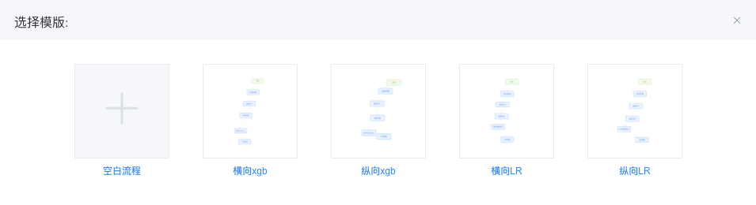
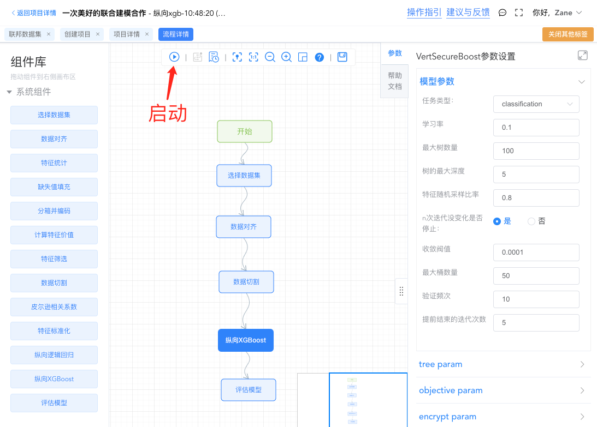
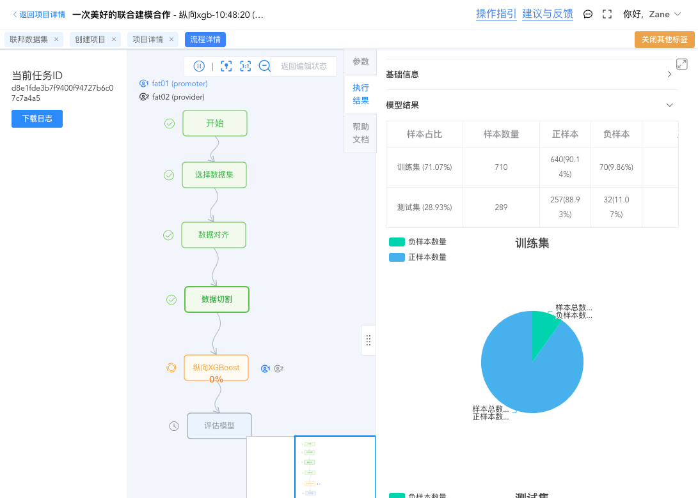
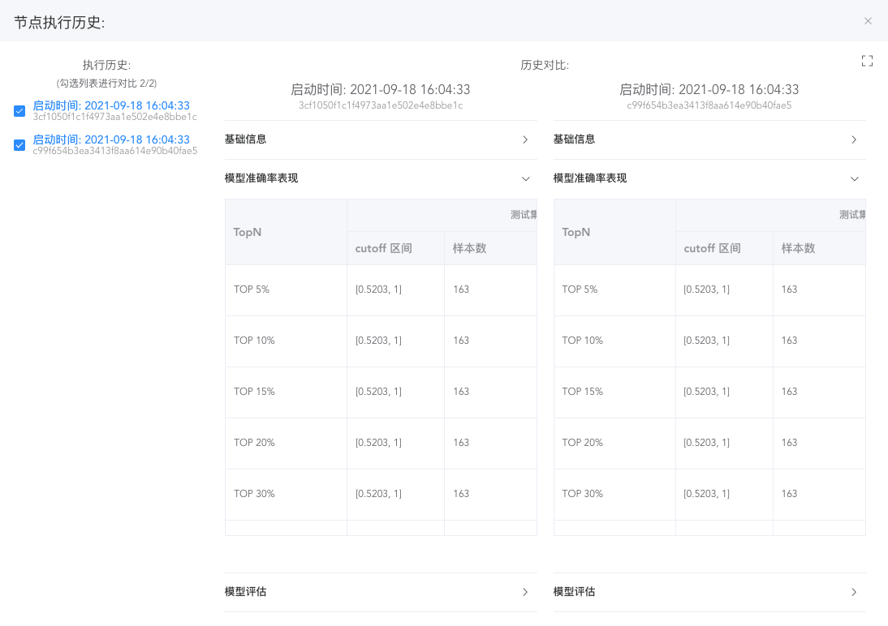
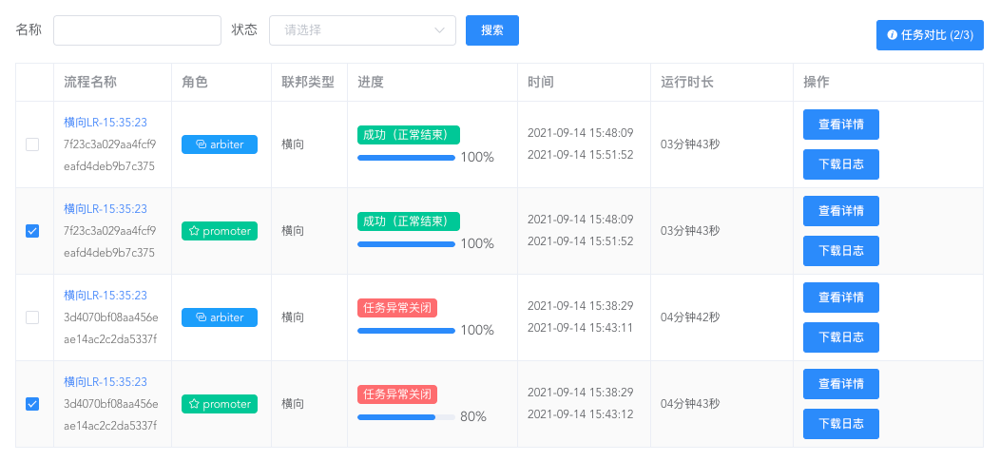
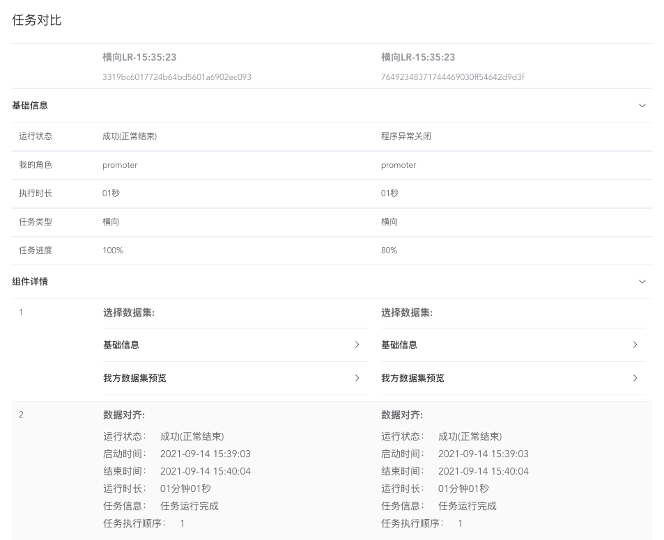
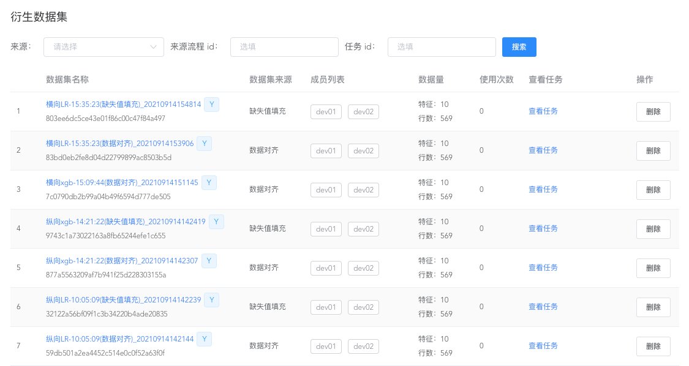
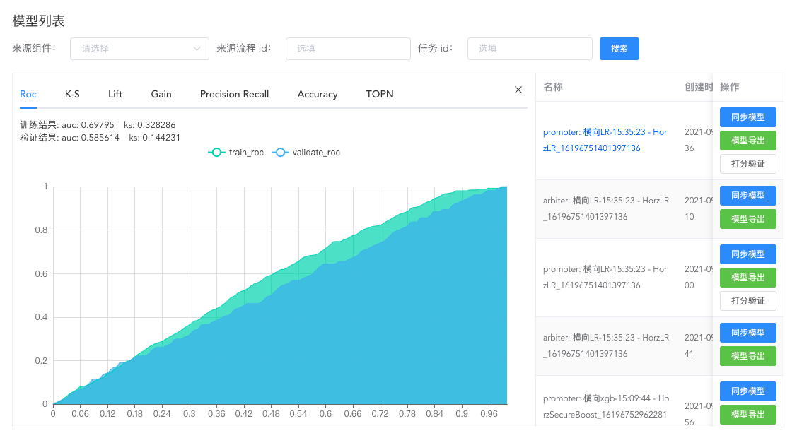
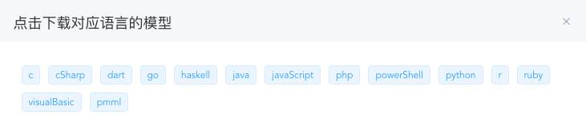

# 建模

实施联邦学习建模需要先创建项目，相关内容请查看 [建立合作](/operation_guide/project) 章节。

WeFe 提供了高度可自定义的建模过程编辑环境，完全通过可视化的方式定义任务过程、编辑相关参数、查看执行结果。

## 创建流程

在 WeFe 中，进行建模活动需要先创建流程，流程是对任务的描述，启动流程时才会创建任务（Job）实例，流程可以被反复编辑并启动。

流程根据联邦学习类型分为 `横向`、`纵向` 和 `混合` 三种类型，关于联邦学习类型的内容请查看 [**联邦学习**](/federated_learning/federated_learning) 章节。

根据自己的需要，通过可视化的方式编辑任务过程，并为每个流程节点设置好参数即可启动流程。

各组件的作用请查看 [kernel](/system_framework/kernel) 中的组件列表。

## 查看任务

启动流程后，会自动切换到 Job 运行状态视图，Job 执行结束完毕之前无法编辑流程。

在 Job 运行过程中，可以实时查看各流程节点的执行状态和执行结果，关闭页面不会影响任务的运行。

## 任务比对

任务对比能快速分析在不同任务中参数变化对模型效果的影响，有利于调整策略调教出更优的模型。

WeFe 中提供了两种粒度的比对方式，一种是节点（Task）比对，一种是任务（Job）比对。

> 流程启动后会生成 Job 实例，流程中的每个节点对应一个 Task。

 

##### Task 比对
在流程详情页的 Job 运行状态视图中，选择一个节点，查看其执行结果，这时可以选择查看其全部执行历史。

勾选多个执行历史进行比较，能快速比对其异同。

 

##### Job 比对

流程执行记录页中展示了该流程产生的所有 Job，在这里能查看所有历史 Job 的详细信息，并可以勾选 2-3 个 Job 进行对比。

对比视图中展示了每个节点的配置情况与执行结果，能快速比对其异同。

## 衍生数据集

为了提升建模效率，部分组件处理后输出的数据集会被储存起来，在选择数据集时使用衍生数据集，这样能实现数据集复用，减少重复特征工程处理的效果。

在项目详情页可以查看项目中各 Job 输出的衍生数据集，衍生数据集会占用 storage 服务的磁盘空间，请适时清理不需要的数据集。

支持输出衍生数据集的组件有：

* 数据对齐
* 缺失值填充
* 特征标准化

## 使用模型

项目详情页会展示所有 Job 输出的所有模型，您可以挑选有价值的模型进行投产使用。

WeFe 系统产生的模型有两种方式进行投产，分别是 `导出模型` 和 `同步模型到 Serving`。

 

##### 导出模型

下载包含模型内容的源代码，然后自行加工迁移到生产环境投入使用。

 

##### 同步模型到 Serving

WeFe 中的 Serving 服务是一个专门用于独立部署到生产环境进行模型预测的 web api 服务，包含联邦模型预测、模型管理、账务统计等功能。

Serving 相关功能的描述请查看 [serving](/system_framework/serving) 相关章节。