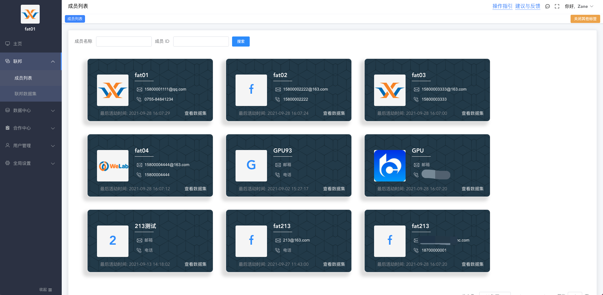
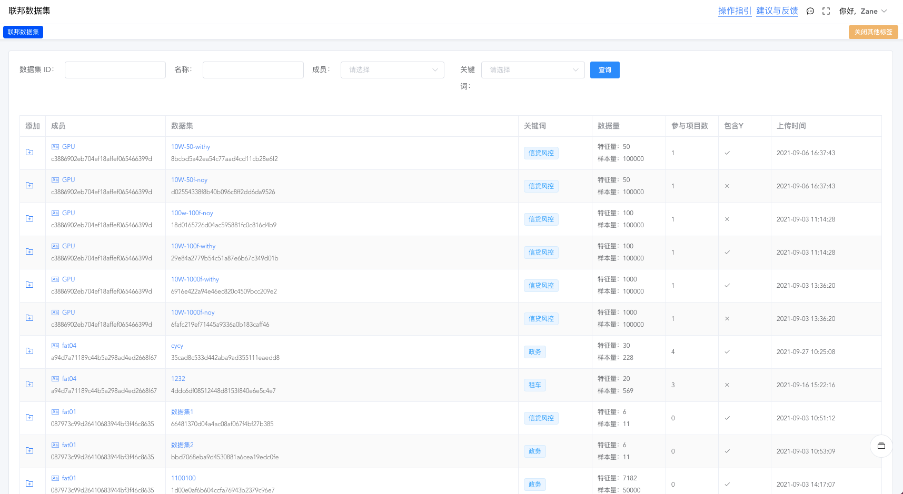

# 联邦

所有 WeFe 系统都是联邦中的一个节点，即联邦成员，WeFe 系统初始化时会生成唯一的 member_id 并向联邦中登记。

联邦相关业务是由 union 服务支撑，所以在技术角度来讲联邦即 union 服务，
union 由去中心化的区块链作为底层存储，更多 union 相关信息，
请查看 [系统架构](/system_framework/global) 相关章节。

## 联邦成员

WeFe 系统初始化后会在联邦中登记，这时在联邦成员列表中可以看到自己出现在成员列表中。

这种可见性是自愿选择的，您可以在 [全局设置][member 信息] 中选择 `在联邦中隐身`，隐身后其他成员无法在联邦中查看到您的任何信息。

## 联邦数据集

联邦数据集列表中会展示所有其他成员在联邦中登记的数据集，如果您希望与某个数据集进行联邦学习建模，可以点击添加按钮，快捷创建合作项目。

数据集是否展示在您的联邦数据集列表中，取决于数据集的可见性，数据集的可见性相关信息请查看 [数据集](/operation_guide/data_set) 章节。

