# 传统机器学习与 WeFe 纵向联邦学习对比实验

## 结论

对于逻辑回归和XGBoost两种算法，从标准样本的结果可以看到，纵向联邦学习算法和传统机器学习算法都能有接近100%的预测准确率，说明wefe算法本身已经能有效拟合传统算法。

通过实际样本验证也基本能达到相同的预测能力，但加密过程带来的精度损失，对模型稳定性造成一定影响。

另外，参数的设置不完全一致，也是导致结果不统一的原因之一。

**同量比较：** 相同的样本和特征，分别训练模型，比较模型在测试集的预测效果，结果如下。

**`逻辑回归模型：`**

| /            | 传统机器学习(CL) vs 纵向联邦学习(FL) |
| ------------ | ------------------------------------ |
| 区分度（KS） | CL 优于 FL                           |
| 稳定性       | 基本一致                             |
| 准确率       | FL 略优于 CL                         |

 

**`XGBoost模型：`**

| /            | 传统机器学习(CL) vs 纵向联邦学习(FL) |
| ------------ | ------------------------------------ |
| 区分度（KS） | FL 略优于 CL                         |
| 稳定性       | CL 优于 FL                           |
| 准确率       | FL 略优于 CL                         |

> **增量比较(待定)**
> 
> 样本s1，本地训练模型m1。s1加上第三方公司的特征，使用联邦学习训练模型m2，比较m1和m2在测试集的预测效果。

---

## 实验设计

### 总样本描述

##### 1. 标准测试样本：乳腺癌威斯康星(诊断)数据集，数量 569，特征 30

| /                | 数量 | 正样本     | 负样本         | 正：负 |
| :--------------- | :---- | :----------- | :----------- | :------ |
| 标准样本_t0 | 569 | 357 (62.74%) | 212 (37.26%) | 1:0.6 |

##### 2. 真实贷后样本：

- 时间：2019-12-17 至 2020-02-29
- 数量：10万
- y：mob5有逾期30+
- x：部分A卡特征，数量：27
- KS：0.3+

> 对逻辑回归，总样本所有特征做标准化后woe编码。对xgboost，特征空值填充-1。

##### 好坏占比

| /                | 数量  | 坏样本        | 好样本         | 坏：好 |
| :--------------- | :---- | :------------ | :------------- | :----- |
| 总样本_s0 | 100000 | 10208 (10.21%) | 89792 (89.79%) | 1:8.8 |

##### 特征字典

| 序号 | 特征                                               | 描述                                               |
| :--- | :------------------------------------------------- | :------------------------------------------------- |
| 1    | last_repay_to_now_days                             | 最近一次还款距离当前的天数                         |
| 2    | tot_due_index                                      | 总期数                                             |
| 3    | fm_phone_external_platform_loan_cnt                | 同盾查询手机外部贷款次数(7天)                      |
| 4    | fm_cnid_external_platform_loan_cnt_1month          | 同盾查询身份证外部贷款次数(1个月)                  |
| 5    | fm_cnid_external_platform_loan_cnt_7day            | 同盾查询身份证外部贷款次数(7天)                    |
| 6    | ylzh_last_12_month_consume_day_number              | 银联智慧：关联卡近12月消费天数                     |
| 7    | ylzh_last_1_month_amount_insufficient_trade_number | 银联智慧：关联卡近1月金额不足交易笔数              |
| 8    | icekredit_large_amount_huomou_score                | 冰鉴大额火眸评分                                   |
| 9    | ylzh_history_trade_day_number                      | 银联智慧：关联卡历史交易总天数                     |
| 10   | ylzh_last_1_month_rz_number                        | 银联智慧：关联卡近1月入账笔数                      |
| 11   | overdue_index_des                                  | 最后一次逾期的期数                                 |
| 12   | edu_level                                          | 学历                                               |
| 13   | age                                                | 年龄                                               |
| 14   | fm_final_score                                     | 同盾评分数                                         |
| 15   | ylzh_consume_ability_score                         | 银联智慧：消费能力分                               |
| 16   | max_overdue_day_his                                | 历史最大逾期天数                                   |
| 17   | last_overdue_index                                 | 最后一次逾期的期数                                 |
| 18   | ylzh_last_12_last_repayment_fail_to_today_number   | 银联智慧：关联卡近12月最近一笔还款失败交易距今天数 |
| 19   | ylzh_last_3_month_cc_consume_number                | 银联智慧：关联卡近3月信用卡消费笔数                |
| 20   | user_key_disb_cnt                                  | 截止申请时间的，同一个user_id的总放款笔数          |
| 21   | fm_phone_external_platform_loan_cnt_1month         | 同盾查询手机外部贷款次数(1个月)                    |
| 22   | icekredit_huiyan_score                             | 冰鉴慧眼评分                                       |
| 23   | ylzh_last_3_month_rz_number                        | 银联智慧：关联卡近3月入账笔数                      |
| 24   | ylzh_last_3_month_trade_fail_number                | 银联智慧：关联卡近3月失败交易笔数                  |
| 25   | ylzh_last_1_month_trade_fail_number                | 银联智慧：关联卡近1月失败交易笔数                  |
| 26   | ylzh_consume_behavior_score                        | 银联智慧：消费行为分                               |
| 27   | fm_phone_external_platform_loan_cnt_7day           | 同盾查询手机外部贷款次数(7天)                      |

### 样本切分

| 样本 | 描述                            | 切分训练样本和测试样本                                       |
| ---- | ------------------------------- | ------------------------------------------------------------ |
| s0   | 10w总样本                       | s0_lr_woe_test_0128.csv s0_lr_woe_test_promoter_0128.csv s0_lr_woe_test_provider_0128.csv s0_lr_woe_train_0128.csv s0_lr_woe_train_promoter_0128.csv s0_lr_woe_train_provider_0128.csv s0_xgb_test_0128.csv s0_xgb_test_promoter_0128.csv s0_xgb_test_provider_0128.csv s0_xgb_train_0128.csv s0_xgb_train_promoter_0128.csv s0_xgb_train_provider_0128.csv |
| s1   | s0中随机抽取5w，y值分布保持一致 | s1_lr_woe_test_0128.csv s1_lr_woe_test_promoter_0128.csv s1_lr_woe_test_provider_0128.csv s1_lr_woe_train_0128.csv s1_lr_woe_train_promoter_0128.csv s1_lr_woe_train_provider_0128.csv s1_xgb_test_0128.csv s1_xgb_test_promoter_0128.csv s1_xgb_test_provider_0128.csv s1_xgb_train_0128.csv s1_xgb_train_promoter_0128.csv s1_xgb_train_provider_0128.csv |
| s2   | s0中随机抽取5w，y值分布保持一致 | s2_lr_woe_test_0128.csv s2_lr_woe_test_promoter_0128.csv s2_lr_woe_test_provider_0128.csv s2_lr_woe_train_0128.csv s2_lr_woe_train_promoter_0128.csv s2_lr_woe_train_provider_0128.csv s2_xgb_test_0128.csv s2_xgb_test_promoter_0128.csv s2_xgb_test_provider_0128.csv s2_xgb_train_0128.csv s2_xgb_train_promoter_0128.csv s2_xgb_train_provider_0128.csv |
| s3   | s0中随机抽取5w，y值分布保持一致 | s3_lr_woe_test_0128.csv s3_lr_woe_test_promoter_0128.csv s3_lr_woe_test_provider_0128.csv s3_lr_woe_train_0128.csv s3_lr_woe_train_promoter_0128.csv s3_lr_woe_train_provider_0128.csv s3_xgb_test_0128.csv s3_xgb_test_promoter_0128.csv s3_xgb_test_provider_0128.csv s3_xgb_train_0128.csv s3_xgb_train_promoter_0128.csv s3_xgb_train_provider_0128.csv |
| t0   | 标准测试样本                    | t0_test_0128.csv t0_test_promoter_0128.csv t0_test_provider_0128.csv t0_train_0128.csv t0_train_promoter_0128.csv t0_train_provider_0128.csv t0_std_test_0128.csv t0_std_test_promoter_0128.csv t0_std_test_provider_0128.csv t0_std_train_0128.csv t0_std_train_promoter_0128.csv t0_std_train_provider_0128.csv |

---

## 结果对比

### 逻辑回归模型

#### KS 对比

| 样本    |     训练集，本地KS vs 联邦KS     |    测试集，本地KS vs 联邦KS     |
| ------- | :------------------------------: | :-----------------------------: |
|         |          训练集，本地KS          |         测试集，本地KS          |
| t0 本地 | 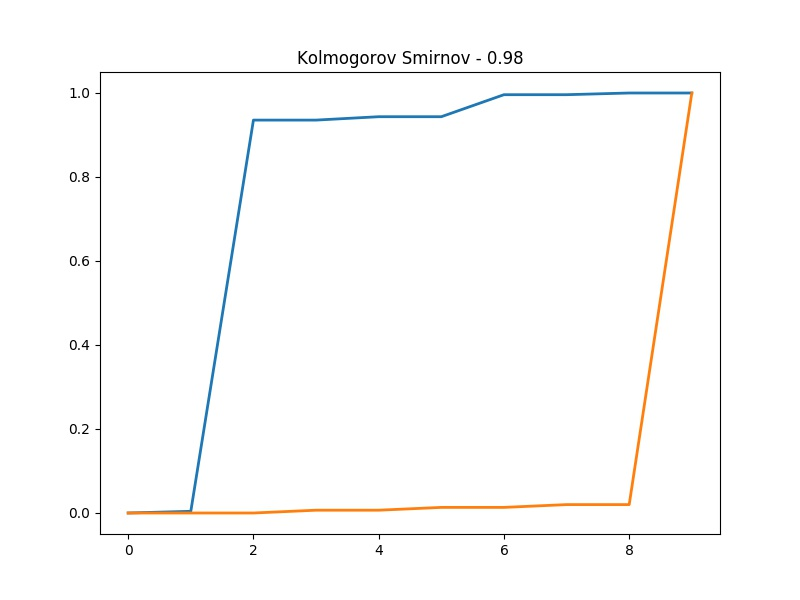 | 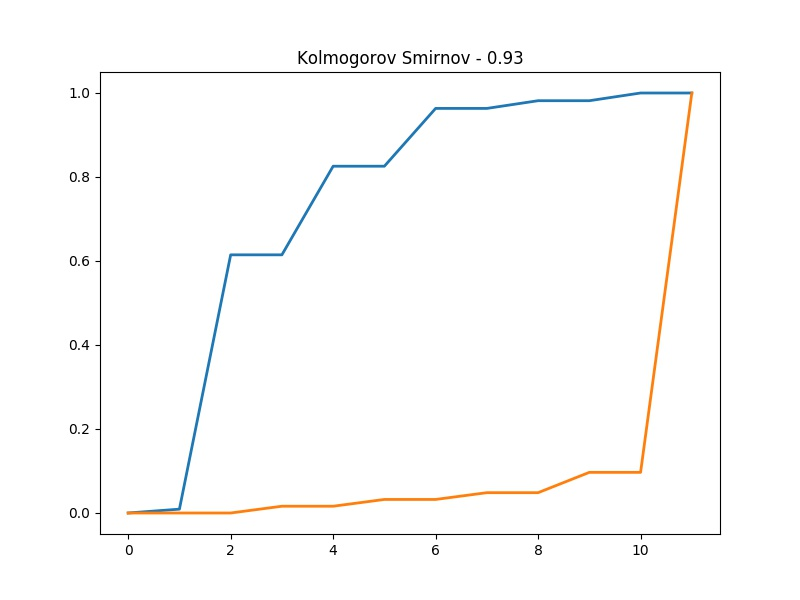 |
|         |          训练集，联邦KS          |         测试集，联邦KS          |
| t0联邦  | 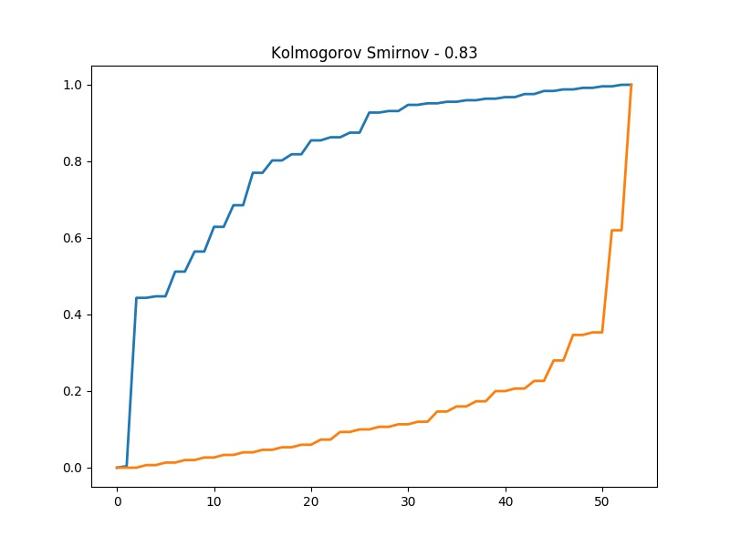 | 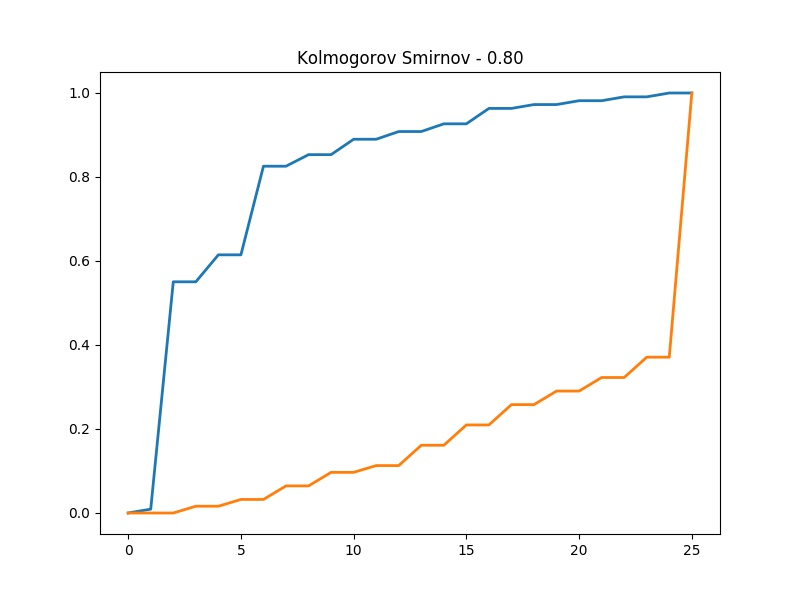 |
|         |          训练集，本地KS          |         测试集，本地KS          |
| s1 本地 |  | 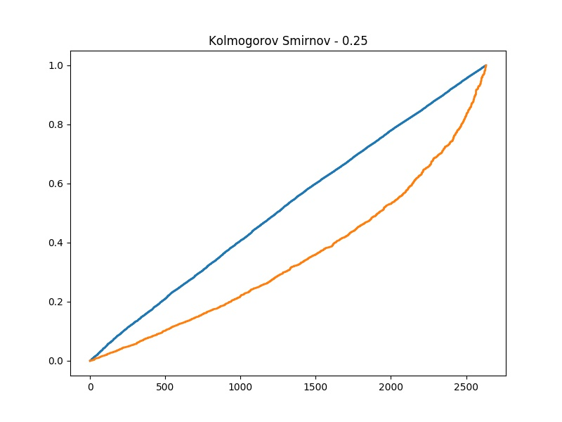 |
|         |          训练集，联邦KS          |         测试集，联邦KS          |
| s1 联邦 |   | 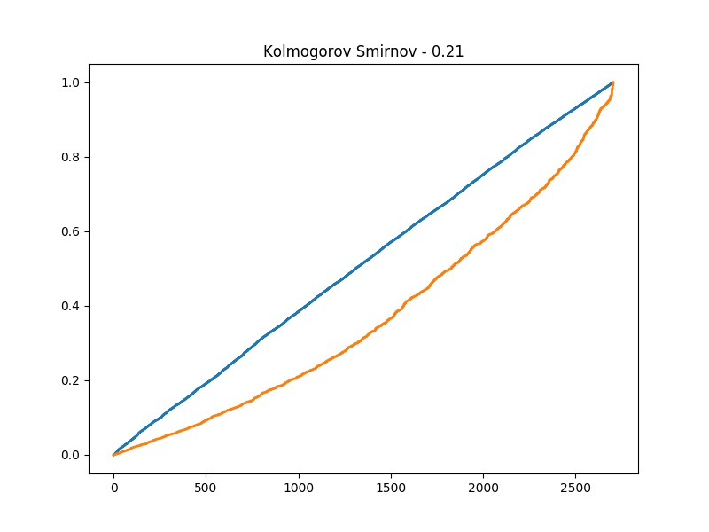  |
|         |          训练集，本地KS          |         测试集，本地KS          |
| s2 本地 | 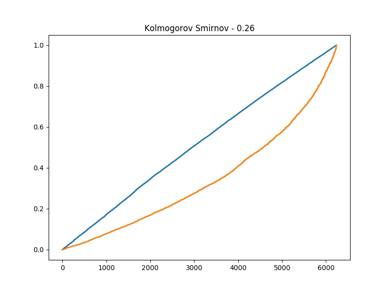 |  |
|         |          训练集，联邦KS          |         测试集，联邦KS          |
| s2 联邦 | 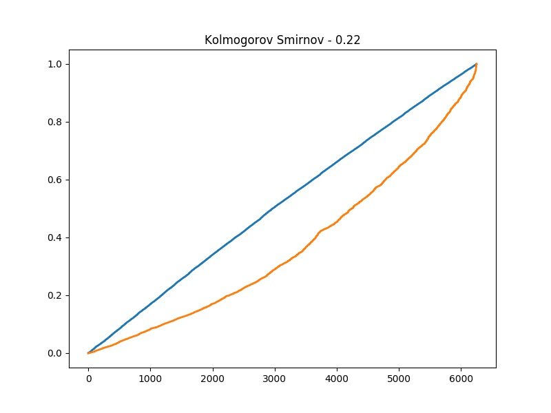  | 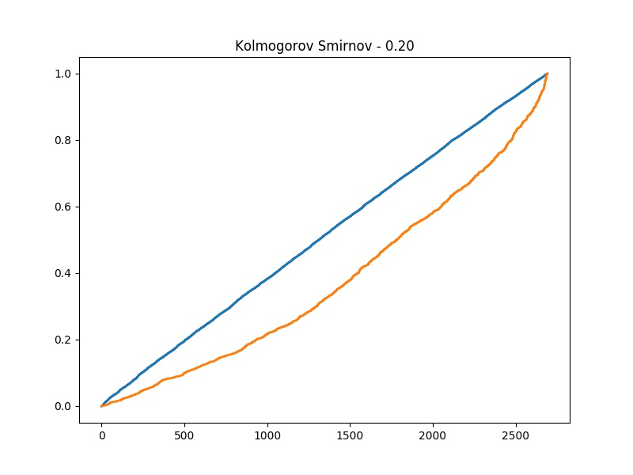  |
|         |          训练集，本地KS          |         测试集，本地KS          |
| s3 本地 |  | 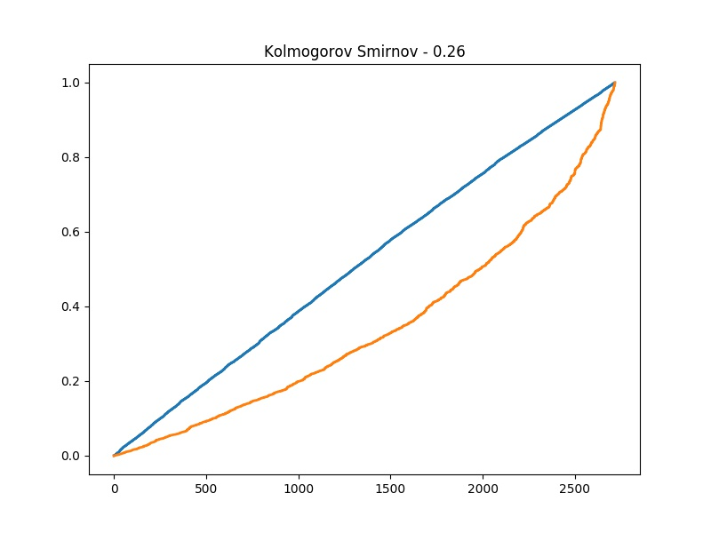 |
|         |          训练集，联邦KS          |         测试集，联邦KS          |
| s3联邦  | 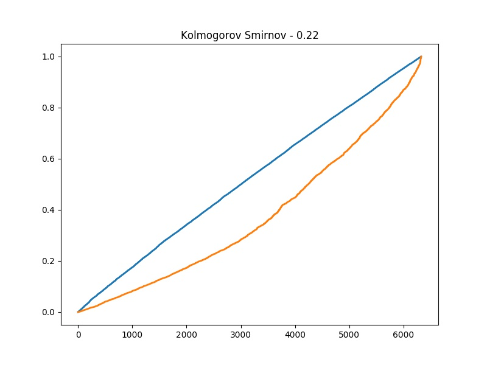  | 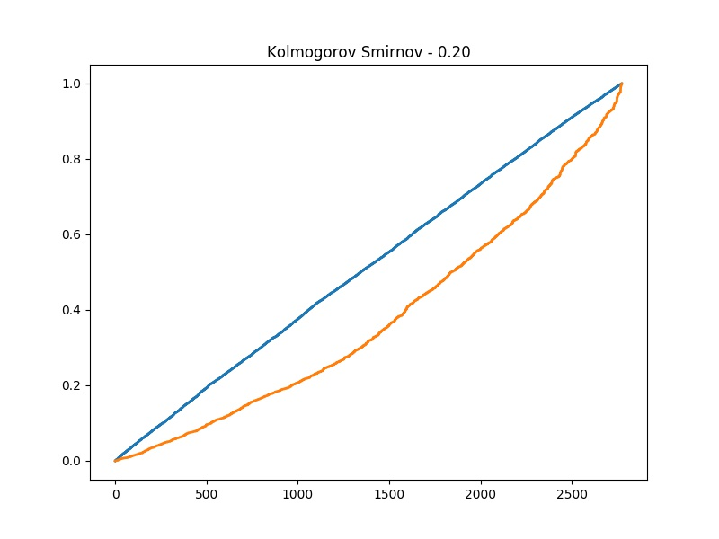  |
|         |          训练集，本地KS          |         测试集，本地KS          |
| s0 本地 | 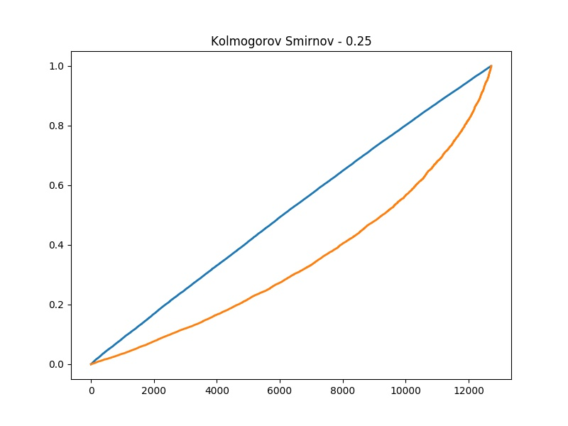 | 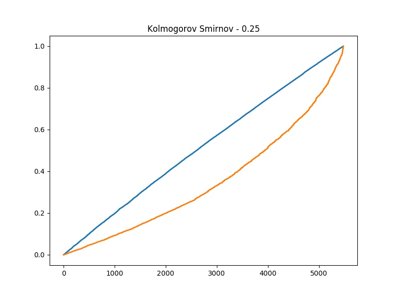 |
|         |          训练集，联邦KS          |         测试集，联邦KS          |
| s0联邦  | 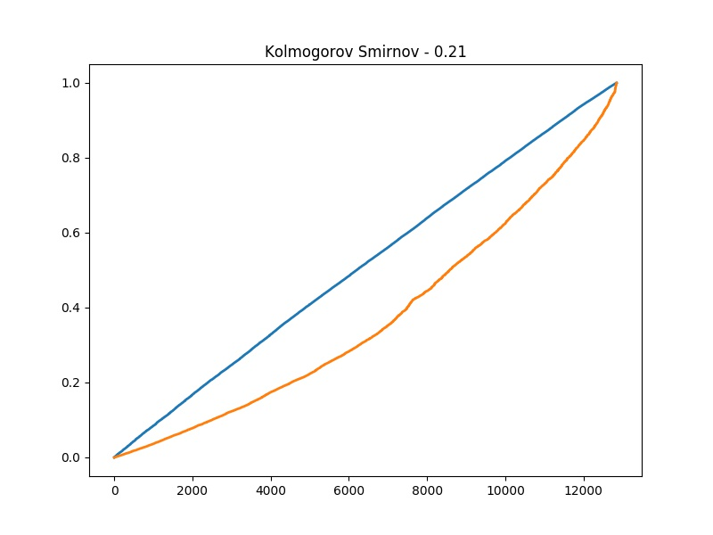  | 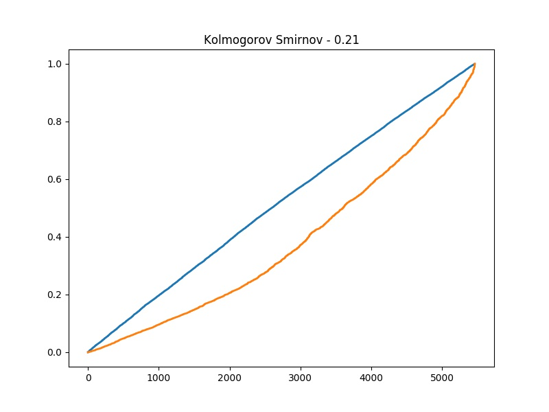  |

#### 测试集准确率对比

##### 1. 样本t0

| 本地 TOP N | CutOff | Pos数量 | 总数 | 准确率  | 召回率 |
| :--------- | :----- | :------ | :--- | :------ | :----- |
| TOP 5% | 1.0000 | 9 | 9 | 100.00% | 8.26% |
| TOP 10% | 1.0000 | 18 | 18 | 100.00% | 16.51% |
| TOP 15% | 0.9999 | 26 | 26 | 100.00% | 23.85% |
| TOP 20% | 0.9998 | 35 | 35 | 100.00% | 32.11% |
| TOP 30% | 0.9991 | 52 | 52 | 100.00% | 47.71% |
| TOP 50% | 0.9820 | 85 | 86 | 98.84% | 77.98% |

| 联邦 TOP N | CutOff   | Pos数量 | 总数 | 准确率  | 召回率 |
| :--------- | :------- | :------ | :--- | :------ | :----- |
| TOP 5% | 0.9863 | 9 | 9 | 100.00% | 8.26% |
| TOP 10% | 0.9719 | 18 | 18 | 100.00% | 16.51% |
| TOP 15% | 0.9584 | 26 | 26 | 100.00% | 23.85% |
| TOP 20% | 0.9412 | 35 | 35 | 100.00% | 32.11% |
| TOP 30% | 0.9176 | 52 | 52 | 100.00% | 47.71% |
| TOP 50% | 0.8257 | 84 | 86 | 97.67% | 77.06% |

##### 2. 样本s1

| 本地 TOP N | CutOff | Pos数量 | 总数 | 准确率 | 召回率 |
| :--------- | :----- | :------ | :--- | :----- | :----- |
| TOP 5% | 0.2107 | 152 | 750 | 20.27% | 10.07% |
| TOP 10% | 0.1811 | 284 | 1500 | 18.93% | 18.82% |
| TOP 15% | 0.1623 | 410 | 2250 | 18.22% | 27.17% |
| TOP 20% | 0.1476 | 531 | 3000 | 17.70% | 35.19% |
| TOP 30% | 0.1252 | 743 | 4500 | 16.51% | 49.24% |
| TOP 50% | 0.0907 | 1098 | 7500 | 14.64% | 72.76% |

| 联邦 TOP N | CutOff | Pos数量 | 总数 | 准确率 | 召回率 |
| :--------- | :----- | :------ | :--- | :----- | :----- |
| TOP 5% | 0.5675 | 151 | 750 | 20.13% | 10.01% |
| TOP 10% | 0.5617 | 285 | 1500 | 19.00% | 18.89% |
| TOP 15% | 0.5568 | 404 | 2250 | 17.96% | 26.77% |
| TOP 20% | 0.5522 | 518 | 3000 | 17.27% | 34.33% |
| TOP 30% | 0.5429 | 722 | 4500 | 16.04% | 47.85% |
| TOP 50% | 0.4709 | 1005 | 7501 | 13.40% | 66.60% |

##### 3. 样本s2

| 本地 TOP N | CutOff | Pos数量 | 总数 | 准确率 | 召回率 |
| :--------- | :----- | :------ | :--- | :----- | :----- |
| TOP 5% | 0.2049 | 164 | 750 | 21.87% | 10.73% |
| TOP 10% | 0.1772 | 293 | 1500 | 19.53% | 19.18% |
| TOP 15% | 0.1584 | 415 | 2250 | 18.44% | 27.16% |
| TOP 20% | 0.1458 | 515 | 3000 | 17.17% | 33.70% |
| TOP 30% | 0.1216 | 747 | 4500 | 16.60% | 48.89% |
| TOP 50% | 0.0876 | 1075 | 7500 | 14.33% | 70.35% |

| 联邦 TOP N | CutOff | Pos数量 | 总数 | 准确率 | 召回率 |
| :--------- | :----- | :------ | :--- | :----- | :----- |
| TOP 5% | 0.5672 | 149 | 750 | 19.87% | 9.75% |
| TOP 10% | 0.5622 | 283 | 1500 | 18.87% | 18.52% |
| TOP 15% | 0.5581 | 405 | 2250 | 18.00% | 26.51% |
| TOP 20% | 0.5545 | 521 | 3000 | 17.37% | 34.10% |
| TOP 30% | 0.5471 | 721 | 4500 | 16.02% | 47.19% |
| TOP 50% | 0.4648 | 1003 | 7500 | 13.37% | 65.64% |

##### 4. 样本s3

| 本地 TOP N | CutOff | Pos数量 | 总数 | 准确率 | 召回率 |
| :--------- | :----- | :------ | :--- | :----- | :----- |
| TOP 5% | 0.2039 | 152 | 750 | 20.27% | 9.86% |
| TOP 10% | 0.1768 | 292 | 1500 | 19.47% | 18.95% |
| TOP 15% | 0.1593 | 419 | 2250 | 18.62% | 27.19% |
| TOP 20% | 0.1452 | 558 | 3000 | 18.60% | 36.21% |
| TOP 30% | 0.1221 | 763 | 4500 | 16.96% | 49.51% |
| TOP 50% | 0.0871 | 1118 | 7500 | 14.91% | 72.55% |

| 联邦 TOP N | CutOff | Pos数量 | 总数 | 准确率 | 召回率 |
| :--------- | :----- | :------ | :--- | :----- | :----- |
| TOP 5% | 0.5708 | 152 | 750 | 20.27% | 9.86% |
| TOP 10% | 0.5652 | 288 | 1500 | 19.20% | 18.69% |
| TOP 15% | 0.5609 | 400 | 2250 | 17.78% | 25.96% |
| TOP 20% | 0.5571 | 514 | 3000 | 17.13% | 33.35% |
| TOP 30% | 0.5489 | 736 | 4500 | 16.36% | 47.76% |
| TOP 50% | 0.4654 | 1023 | 7500 | 13.64% | 66.39% |

##### 5. 样本s0

| 本地 TOP N | CutOff | Pos数量 | 总数  | 准确率 | 召回率 |
| :--------- | :----- | :------ | :---- | :----- | :----- |
| TOP 5%     | 0.2055 | 301     | 1500  | 20.07% | 9.70%  |
| TOP 10%    | 0.1787 | 593     | 3000  | 19.77% | 19.10% |
| TOP 15%    | 0.1608 | 872     | 4500  | 19.38% | 28.09% |
| TOP 20%    | 0.1470 | 1114    | 6000  | 18.57% | 35.89% |
| TOP 30%    | 0.1250 | 1576    | 9000  | 17.51% | 50.77% |
| TOP 50%    | 0.0900 | 2224    | 15000 | 14.83% | 71.65% |

| 联邦 TOP N | CutOff | Pos数量 | 总数  | 准确率 | 召回率 |
| :--------- | :----- | :------ | :---- | :----- | :----- |
| TOP 5%     | 0.5798 | 292     | 1500  | 19.47% | 9.41%  |
| TOP 10%    | 0.5743 | 580     | 3000  | 19.33% | 18.69% |
| TOP 15%    | 0.5697 | 846     | 4500  | 18.80% | 27.26% |
| TOP 20%    | 0.5655 | 1082    | 6000  | 18.03% | 34.86% |
| TOP 30%    | 0.5564 | 1512    | 9000  | 16.80% | 48.71% |
| TOP 50%    | 0.4605 | 2056    | 15000 | 13.71% | 66.24% |

---

### XGBoost模型

#### KS 对比

| 样本    |       训练集，本地KS vs 联邦KS       |      测试集，本地KS vs 联邦KS       |
| ------- | :----------------------------------: | :---------------------------------: |
|         |          训练集，本地KS          |         测试集，本地KS          |
| t0 本地 | 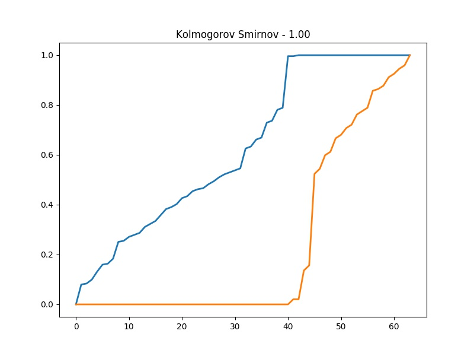 | 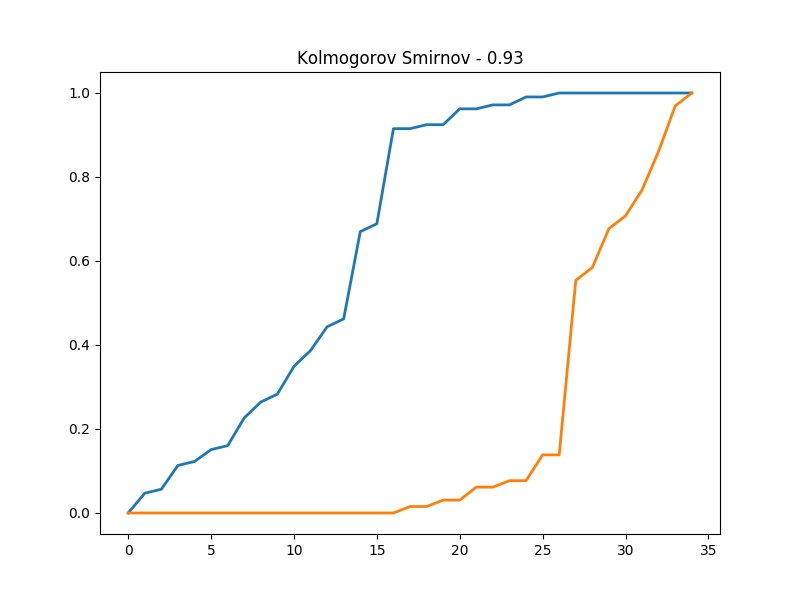 |
|         |          训练集，联邦KS          |         测试集，联邦KS          |
| t0联邦  | 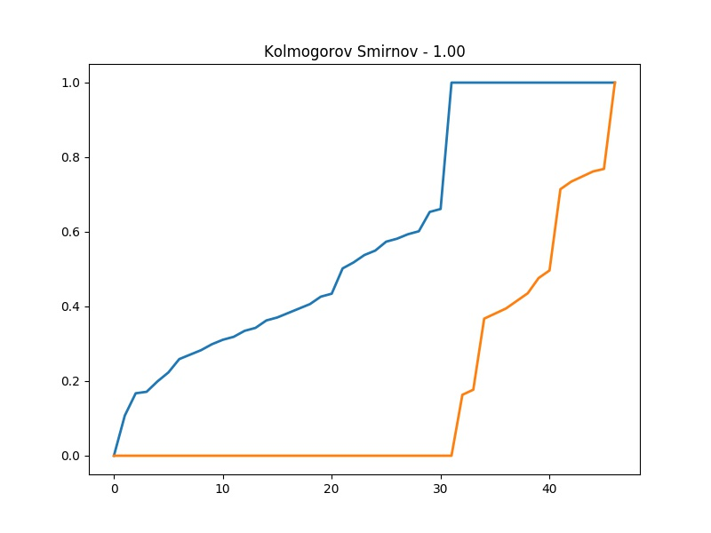  | 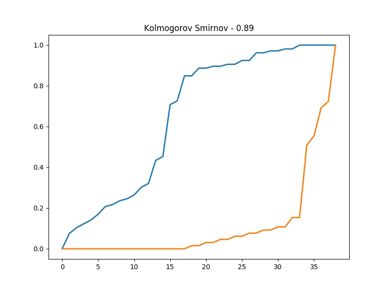  |
|         |            训练集，本地KS            |           测试集，本地KS            |
| s1 本地 | 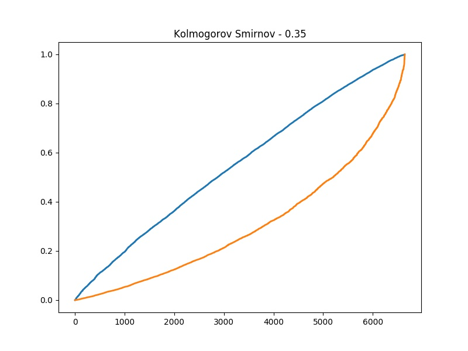 | 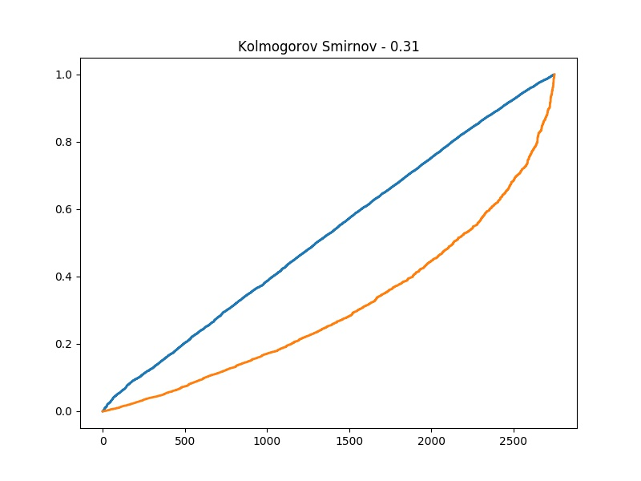 |
|         |            训练集，联邦KS            |           测试集，联邦KS            |
| s1 联邦 | 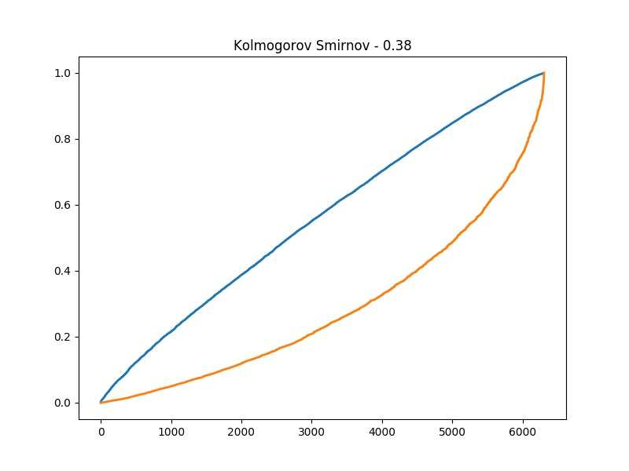  | 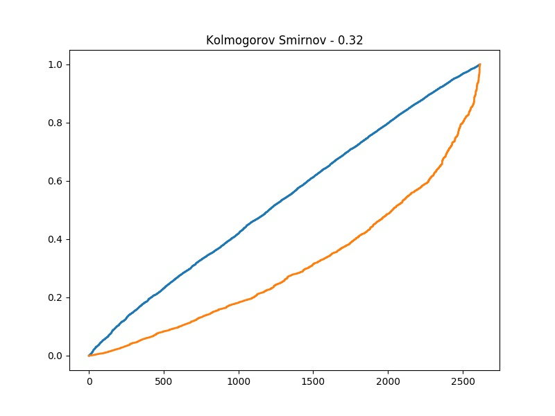  |
|         |            训练集，本地KS            |           测试集，本地KS            |
| s2 本地 |  |  |
|         |            训练集，联邦KS            |           测试集，联邦KS            |
| s2 联邦 | 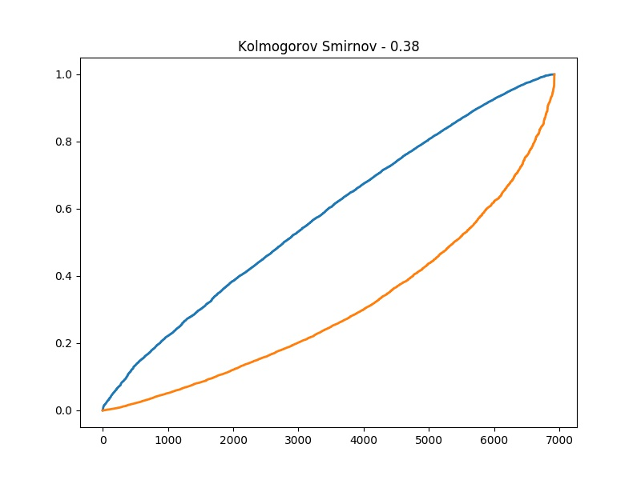  | 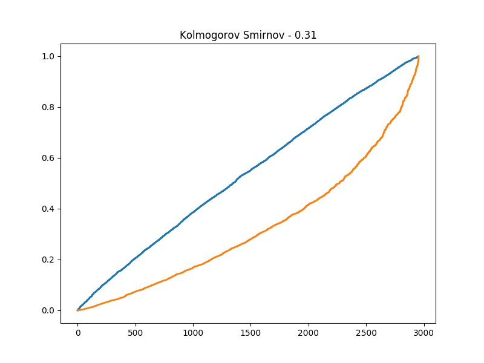  |
|         |            训练集，本地KS            |           测试集，本地KS            |
| s3 本地 | 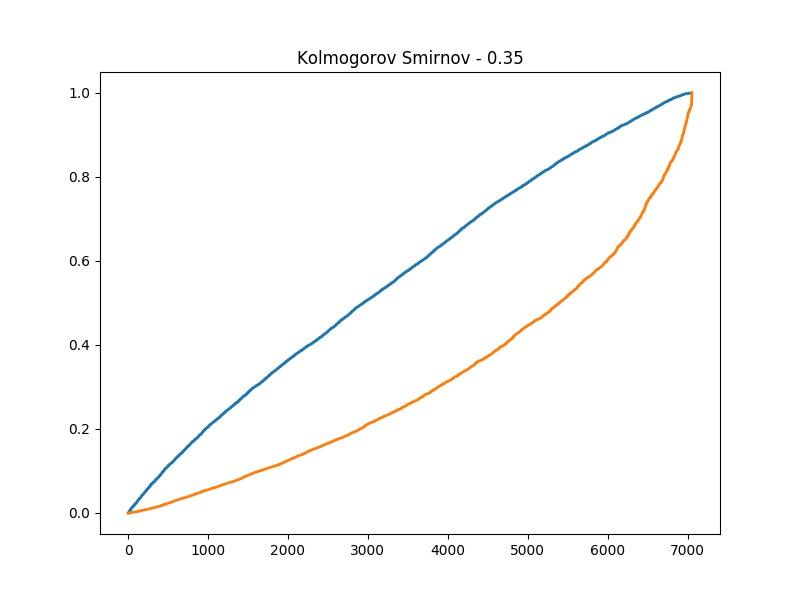 |  |
|         |            训练集，联邦KS            |           测试集，联邦KS            |
| s3联邦  | 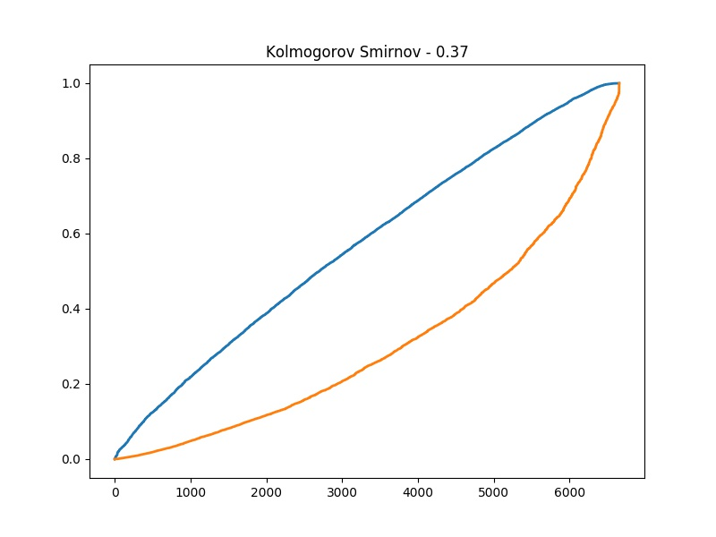  | 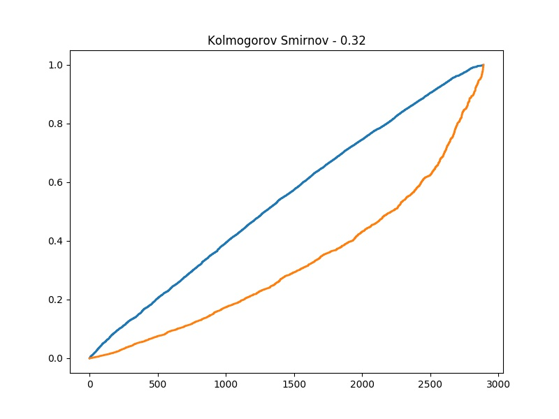  |
|         |            训练集，本地KS            |           测试集，本地KS            |
| s0 本地 | 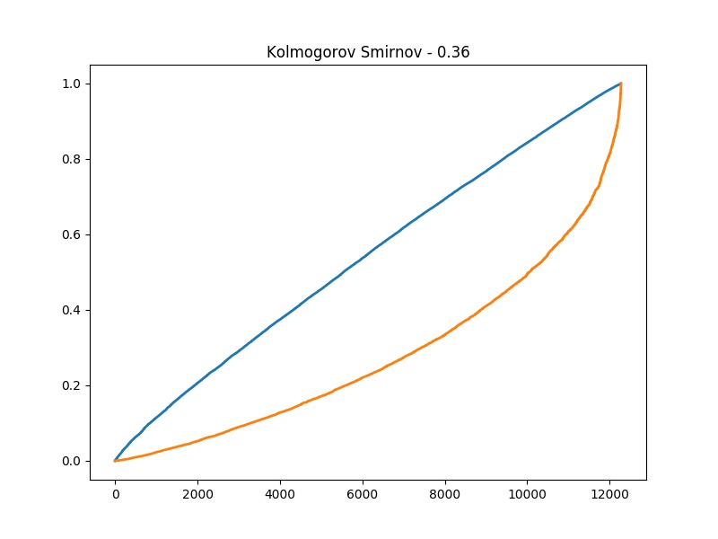 |  |
|         |            训练集，联邦KS            |           测试集，联邦KS            |
| s0联邦  | 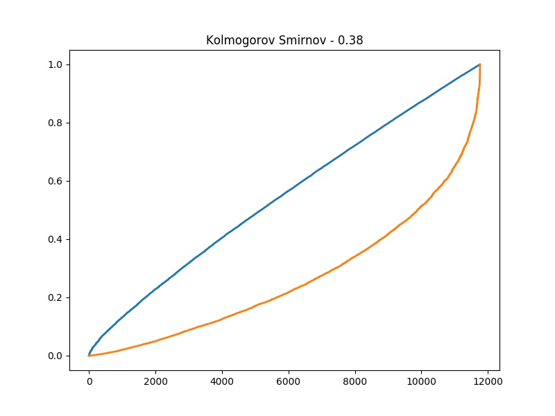  | 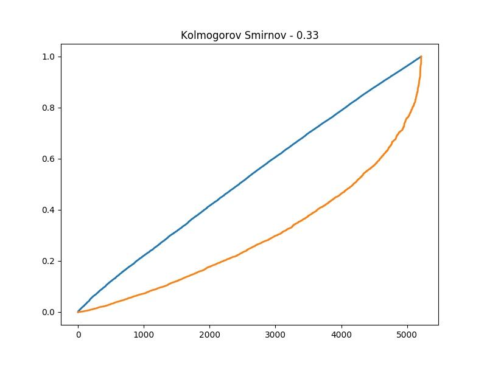  |

#### 测试集准确率对比

##### 1. 样本t0

| 本地 TOP N | CutOff | Pos数量 | 总数 | 准确率  | 召回率 |
| :--------- | :----- | :------ | :--- | :------ | :----- |
| TOP 5%     | 0.9944 | 9       | 9    | 100.00% | 8.49%  |
| TOP 10%    | 0.9942 | 24      | 24   | 100.00% | 22.64% |
| TOP 15%    | 0.9940 | 26      | 26   | 100.00% | 24.53% |
| TOP 20%    | 0.9936 | 35      | 35   | 100.00% | 33.02% |
| TOP 30%    | 0.9915 | 52      | 52   | 100.00% | 49.06% |
| TOP 50%    | 0.9728 | 86      | 86   | 100.00% | 81.13% |

| 联邦 TOP N | CutOff | Pos数量 | 总数 | 准确率  | 召回率 |
| :--------- | :----- | :------ | :--- | :------ | :----- |
| TOP 5%     | 0.9961 | 11      | 11   | 100.00% | 10.38% |
| TOP 10%    | 0.9959 | 18      | 18   | 100.00% | 16.98% |
| TOP 15%    | 0.9955 | 26      | 26   | 100.00% | 24.53% |
| TOP 20%    | 0.9953 | 35      | 35   | 100.00% | 33.02% |
| TOP 30%    | 0.9942 | 52      | 52   | 100.00% | 49.06% |
| TOP 50%    | 0.9837 | 86      | 86   | 100.00% | 81.13% |

##### 2. 样本s1

| 本地 TOP N | CutOff | Pos数量 | 总数 | 准确率 | 召回率 |
| :--------- | :----- | :------ | :--- | :----- | :----- |
| TOP 5%     | 0.4226 | 188     | 750  | 25.07% | 12.82% |
| TOP 10%    | 0.3867 | 331     | 1500 | 22.07% | 22.56% |
| TOP 15%    | 0.3620 | 467     | 2250 | 20.76% | 31.83% |
| TOP 20%    | 0.3414 | 593     | 3000 | 19.77% | 40.42% |
| TOP 30%    | 0.3044 | 817     | 4500 | 18.16% | 55.69% |
| TOP 50%    | 0.2346 | 1140    | 7500 | 15.20% | 77.71% |

| 联邦 TOP N | CutOff | Pos数量 | 总数 | 准确率 | 召回率 |
| :--------- | :----- | :------ | :--- | :----- | :----- |
| TOP 5%     | 0.2112 | 209     | 750  | 27.87% | 14.25% |
| TOP 10%    | 0.1828 | 350     | 1500 | 23.33% | 23.86% |
| TOP 15%    | 0.1658 | 479     | 2250 | 21.29% | 32.65% |
| TOP 20%    | 0.1523 | 598     | 3000 | 19.93% | 40.76% |
| TOP 30%    | 0.1297 | 806     | 4500 | 17.91% | 54.94% |
| TOP 50%    | 0.0950 | 1149    | 7500 | 15.32% | 78.32% |

##### 3. 样本s2

| 本地 TOP N | CutOff | Pos数量 | 总数 | 准确率 | 召回率 |
| :--------- | :----- | :------ | :--- | :----- | :----- |
| TOP 5%     | 0.4186 | 193     | 750  | 25.73% | 12.60% |
| TOP 10%    | 0.3887 | 343     | 1500 | 22.87% | 22.39% |
| TOP 15%    | 0.3657 | 477     | 2250 | 21.20% | 31.14% |
| TOP 20%    | 0.3458 | 607     | 3000 | 20.23% | 39.62% |
| TOP 30%    | 0.3114 | 807     | 4500 | 17.93% | 52.68% |
| TOP 50%    | 0.2387 | 1157    | 7500 | 15.43% | 75.52% |

| 联邦 TOP N | CutOff | Pos数量 | 总数 | 准确率 | 召回率 |
| :--------- | :----- | :------ | :--- | :----- | :----- |
| TOP 5%     | 0.2009 | 207     | 750  | 27.60% | 13.51% |
| TOP 10%    | 0.1809 | 356     | 1500 | 23.73% | 23.24% |
| TOP 15%    | 0.1676 | 486     | 2250 | 21.60% | 31.72% |
| TOP 20%    | 0.1557 | 617     | 3000 | 20.57% | 40.27% |
| TOP 30%    | 0.1370 | 833     | 4500 | 18.51% | 54.37% |
| TOP 50%    | 0.0981 | 1189    | 7500 | 15.85% | 77.61% |

##### 4. 样本s3

| 本地 TOP N | CutOff | Pos数量 | 总数 | 准确率 | 召回率 |
| :--------- | :----- | :------ | :--- | :----- | :----- |
| TOP 5%     | 0.4167 | 206     | 751  | 27.43% | 13.14% |
| TOP 10%    | 0.3842 | 347     | 1501 | 23.12% | 22.13% |
| TOP 15%    | 0.3591 | 490     | 2250 | 21.78% | 31.25% |
| TOP 20%    | 0.3386 | 621     | 3000 | 20.70% | 39.60% |
| TOP 30%    | 0.3059 | 848     | 4500 | 18.84% | 54.08% |
| TOP 50%    | 0.2353 | 1214    | 7500 | 16.19% | 77.42% |

| 联邦 TOP N | CutOff | Pos数量 | 总数 | 准确率 | 召回率 |
| :--------- | :----- | :------ | :--- | :----- | :----- |
| TOP 5%     | 0.2025 | 203     | 750  | 27.07% | 12.95% |
| TOP 10%    | 0.1770 | 354     | 1500 | 23.60% | 22.58% |
| TOP 15%    | 0.1609 | 503     | 2250 | 22.36% | 32.08% |
| TOP 20%    | 0.1497 | 626     | 3000 | 20.87% | 39.92% |
| TOP 30%    | 0.1321 | 855     | 4500 | 19.00% | 54.53% |
| TOP 50%    | 0.0972 | 1227    | 7500 | 16.36% | 78.25% |

##### 5. 样本s0

| 本地 TOP N | CutOff | Pos数量 | 总数  | 准确率 | 召回率 |
| :--------- | :----- | :------ | :---- | :----- | :----- |
| TOP 5%     | 0.4439 | 425     | 1500  | 28.33% | 14.00% |
| TOP 10%    | 0.4041 | 723     | 3000  | 24.10% | 23.82% |
| TOP 15%    | 0.3761 | 1002    | 4500  | 22.27% | 33.01% |
| TOP 20%    | 0.3528 | 1234    | 6000  | 20.57% | 40.66% |
| TOP 30%    | 0.3117 | 1731    | 9000  | 19.23% | 57.03% |
| TOP 50%    | 0.2322 | 2400    | 15000 | 16.00% | 79.08% |

| 联邦 TOP N | CutOff | Pos数量 | 总数  | 准确率 | 召回率 |
| :--------- | :----- | :------ | :---- | :----- | :----- |
| TOP 5%     | 0.2207 | 427     | 1500  | 28.47% | 14.07% |
| TOP 10%    | 0.1912 | 733     | 3000  | 24.43% | 24.15% |
| TOP 15%    | 0.1720 | 1006    | 4500  | 22.36% | 33.15% |
| TOP 20%    | 0.1575 | 1252    | 6000  | 20.87% | 41.25% |
| TOP 30%    | 0.1330 | 1717    | 9000  | 19.08% | 56.57% |
| TOP 50%    | 0.0915 | 2404    | 15000 | 16.03% | 79.21% |

