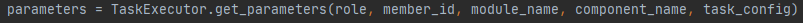
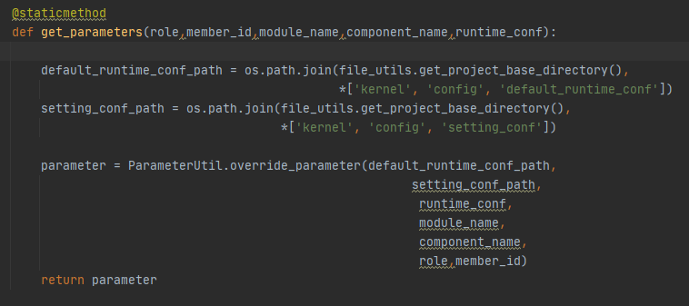
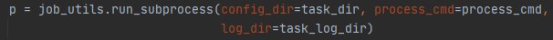
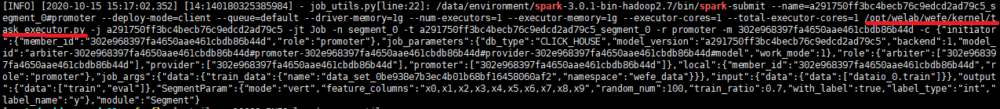
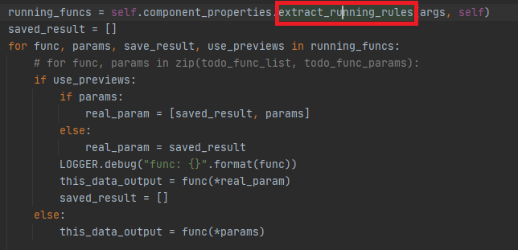

##### 基本流程

- 定义组件需要使用的 python 参数对象。
  - 在调用组件时初始化参数及检查参数。
  - `kernel/param/` 
  - 继承自 BaseParam。
- 定义组件的 json 配置文件。
  - `kernel/conf/setting_conf/`
- 定义组件默认运行配置文件。
  - `kernel/config/default_runtime_conf/`
  - 
  - 

- 若组件需要多方交互（联邦），需要定义 transfer_variable.json 文件。
  - `kernel/transfer/variables/definition/`
- 定义组件的主运行类，并继承 model_base 类重写方法。
  - `kernel/feature/`
  - 调用方法名为 `fit`。
  - 初始化是调用对应的参数对象对参数进行检查 `self.model_param = XxxParam()`。

以上是 jensen 的组件开发基本流程，在此基础上我做一定的补充说明。

##### 组件调用入口

在系统中，每一个组件都需要启动一个  task 来进行操作，这个 task 的基本信息由 board 进行拼接，然后写入到系统的队列中，即 mysql 的 flow_action_queue 表中。

flow 模块的 `task_scheduler.py` 中则对 task 的信息进行读取，运行 task 所需要的信息。



将拼接的信息整合，开启一个新的进程运行任务。



大概形式就是上面这一大串的样子。从上面的信息我们不难看出调用的是 spark 的环境去执行的调用。传参中包括 spark 环境的配置，以及需要运行的任务的基本配置。

红框标注的 py 文件就是此新启动的进程的主运行程序，接下来就是进入 kernel 的部分了。

##### 组件运行流程

在 `task_executor.py` 中对在 cmd 传入的配置进行获取，赋值等操作。

处理任务状态，初始化 tracker 用于日志输出。

```
run_object.run(parameters, task_run_args)
```

这个是调用的 `modelbase` 这个类中的 `run`  方法。在这个方法中我们根据规则（点击红框属性）进行不同方法拼接调用。



到这里，对应的组件就会根据规则定义的方法顺序进行调用了。通过观察规则可以发现，调用组件是通过 `fit` 方法，所以组件的主运行方法名应该为 `fit`。

##### 模型配置相关

```json
{
	"initiator": {
		"member_id": "e333ed098ccc418c9d24abdda5be2c88",
		"role": "promoter"
	},
	"job_parameters": {
		"db_type": "CLICK_HOUSE",
		"model_version": "f7324cb9f7bd4620a5251effff6fc1d7",
		"backend": 1,
		"model_id": "promoter-e333ed098ccc418c9d24abdda5be2c88#",
		"work_mode": 1
	},
	"role": {
		"arbiter": ["e333ed098ccc418c9d24abdda5be2c88"],
		"provider": [],
		"promoter": ["e333ed098ccc418c9d24abdda5be2c88"]
	},
	"local": {
		"member_id": "e333ed098ccc418c9d24abdda5be2c88",
		"role": "promoter"
	},
	"job_args": {
		"data": {
			"train_data": {
				"name": "data_set_8998201f93bd4420a8c8a8d56e024442",
				"namespace": "wefe_data"
			}
		}
	},
	"input": {
		"data": {
			"data": ["args.train_data"] // 表示原始数据
            // "data": ["dataio_0.train"] 表示取 dataio 之后的数据
		}
	},
	"output": { // 输出的数据名字为 model_name_0.data_name
		"data": ["data_name"],
		"model": ["model_name"]
	},
	"DistributionParam": {},
	"module": "Distribution"
}
```

