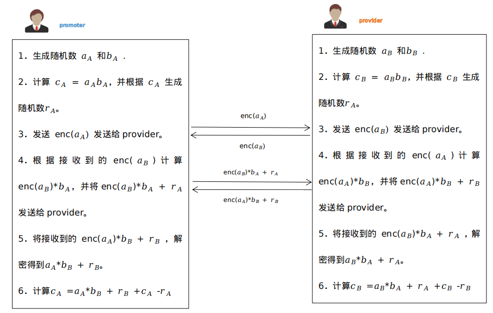
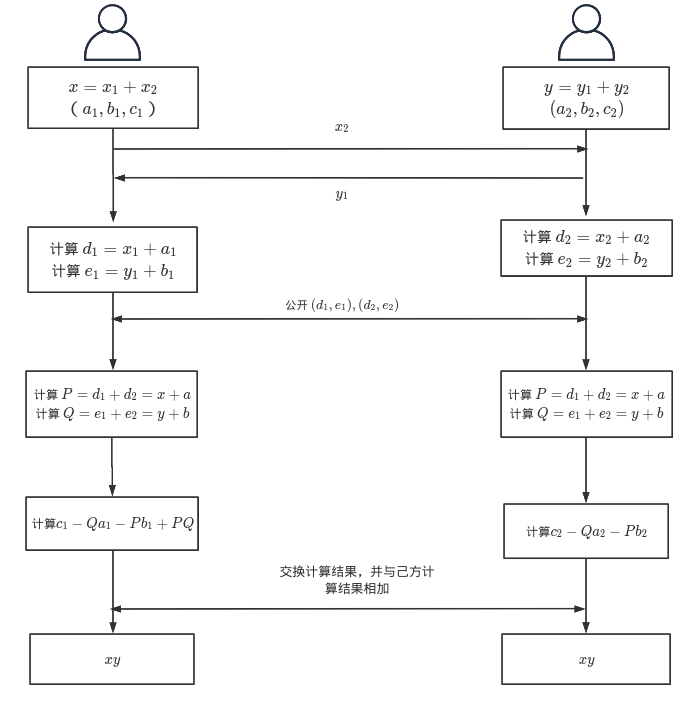

# SPDZ协议

> 在计算纵向两个参与方数据的皮尔逊相关系数时使用了[SPDZ协议](https://eprint.iacr.org/2017/1230.pdf) ，该协议基于Beaver三元组实现乘法门的密钥共享。

## Beaver三元组构造

Beaver三元组是随机数构成的并不涉及到计算的真实输入，每个“乘法门”的计算都需要消耗一个 Beaver三元组(a,b,c)，其中 c = ab。因此需要提前计算出大量的 Beaver 三元组以备用。

两个参与方 $P_1$ 和 $P_2$ 分别拥有的三元组 $(a_1,b_1,c_1)$和$(a_2,b_2,c_2)$，参与方的三元组满足$a= a_1+a_2$, $b = b_1+b_2$ ,$c = c_1+c_2$，同时需要满足 c = ab，即

$$
(a_1+a_2)(b_1+b_2) = (c_1+c_2)

$$

每个参与方参与方分别只有a,b,c部分份额，并都不知道 (a,b,c)，本系统使用了Paillier 同态加密方案构造出符合的三元组。

## 计算乘法门密钥共享

根据构造好的三元组可以执行以下过程实现乘法门的密钥共享，在以下交互过程中，因为三元组a,b,c是未知的随机数，所以交互的 d和e 并不会泄露原始的 x和y。

