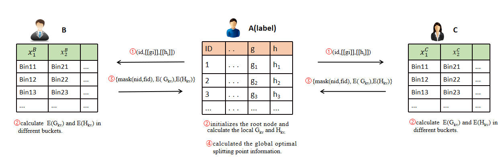
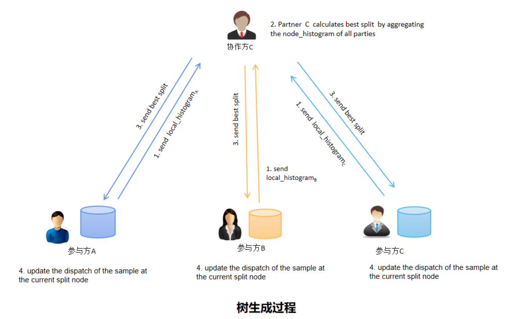

# SecureBoost

## 基础知识回顾

**损失函数**

在引入SecureBoost之前，这里先回顾一下[XGboost算法](https://arxiv.org/pdf/1603.02754.pdf) 。XGboost算法作为提升树算法，算法模型可以表示为决策树的加法模型，即：

$$\hat y_i = \sum_{t=1}^K f_t(x_i)$$

其中$\hat y_i$表示$x_i$的预测值，$f_t(x_i)$ 表示第 t 棵决策树，n 为决策树的个数。相应地，损失函数可以表示为:

$$L^{(t)} =  \sum_{i=1}^n l( y_i , \, \hat y _i) = \sum_{i=1}^n l( y_i , \, \hat y_i ^{(t-1)} + f_t(x_i)) + \Omega (f_t)$$

其中$f_t(x_i)$是第 t 棵树的预测结果，$\Omega(f_t)$是损失函数的正则项:$$\Omega (f_t) = \gamma T+\frac {1}{2} \lambda ||\omega||$$ 
T代表第t棵树叶子节点个数，$\omega$代表第 t 棵树叶子节点的权重。

**损失函数变换**

在 XGboost 算法中在点$( y_i ,\hat y_i ^{(t-1)} )$处使用泰勒展开得到近似损失函数，带入得到近似损失函数$L^{(t)}$如下：

$$L^{(t)} \approx \sum_{i=1}^n [l( y_i ,\hat y_i ^{(t-1)} )+  g_if_t(x_i) + \frac {1}{2} h_i f_t^2(x_i) ]+ \Omega (f_t)$$

其中$g_i = \partial_{\hat y^{(t-1)}}l(y_i,  \hat y^{(t-1)})$和$h_i = \partial^2_{\hat y^{(t-1)}}l(y_i,\hat y^{(t-1)})$。

在损失函数中第一项$y_i ,\hat y_i ^{(t-1)}$是已知的，因此$l(y_i,\hat y^{(t-1)})$是一个常数，所以损失函数可以改写为：

$$L^{(t)}  \approx \sum_{i=1}^n [ g_i f_t(x_i) + \frac {1}{2} h_i f_t^2(x_i)] +\Omega (f_t)$$

定义$F=\lbrace f(x) = w_{q(x)} \rbrace(q:R^m  \rightarrow T,W \in R^T)$，$I_j = \lbrace i|q(x_i) =j \rbrace$，$L^{(t)}$可以从样本统计计算转化为从叶子节点的统计计算：

$$\begin{align*}
L^{(t)} &= \sum_{i=1}^n [ g_i w_{q(x_i)} + \frac {1}{2} h_i w^2_{q(x_i)}] +  \gamma T + \frac{1}{2} \lambda \sum_{j=1}^T w^2_j\\
&= \sum_{j=1}^T[(\sum_{i \in I_j}g_i)w_j + \frac {1}{2}(\sum_{i \in I_j}h_i+ \lambda )w^2_j + \gamma T]
\end{align*}$$

在上述公式中，$g_i,h_i,\gamma,\lambda$都是已知变量，只有$w_j$是未知变量，此时的损失函数可以看做是变量$w_j$的二次函数，即可求出$w_j$的最优值(极值点在一阶导数为零)，可以得到：

$$w^*_j  = -\frac {\sum_{i \in I_j} g_i}{\sum_{i \in I_j} h_i+\lambda}$$

将$w_j$带回损失函数$L^{(t)}$中，得到如下损失函数:

$$L^{(t)} = -\frac {1}{2} \sum_{j=1}^T \frac {(\sum_{i \in I_j}g_i)^2}{\sum_{i \in I_j}h_i+ \lambda} + \gamma T    \tag{1}$$

**信息增益**

在XGboost中 **损失函数** 用来评价生成的树的得分，得分越小说明树的结构越好，那么一棵树该选择哪个节点进行分裂，根据$L^{(t)}$引入节点信息增益的 $Gain$ 的概念：

$$Gain =\frac {1}{2} [ \frac {(\sum_{i \in I_L}g_i)^2}{\sum_{i \in I_L}h_i+ \lambda} + \frac {(\sum_{i \in I_R}g_i)^2}{\sum_{i \in I_R}h_i+ \lambda}- \frac {(\sum_{i \in I}g_i)^2}{\sum_{i \in I}h_i+ \lambda}]- \gamma$$

XGboost算法的节点分裂后将会把该节点的样本空间分为两个互不相交的空间，$I_L$和$I_R$分别表示分裂后左右节点的样本空间，在当前所有叶子节点中我们选择信息增益最大的那个节点作为分裂点。可以得到XGboost的算法流程：

算法1称为贪心算法，因为其在求信息增益时第一个循环需要对叶子节点的m个特征都做线性搜索，第二个循环需要对每个特征取值排序后计算信息增益。当样本是连续型变量或者取值较多时算法的执行效率会很慢。因此，在实际应用更多采用近似寻找分裂点的算法（算法2），采用先对特征进行分段处理，只需计算出第k个特征每个分位点里样本的一阶导的和   和二阶导的和 ，最后计算邻近分位点的信息增益，这样大幅度降低了计算量。

以上过程主要描述了 XGboost算法思想，为了更好地理解secureboost算法，这里补充平方损失函数和对数损失函数的 gi 和 hi:

|          | 形式                                                         | $g_i$                         | $h_i$                      |
| -------- | ------------------------------------------------------------ | ----------------------------- | -------------------------- |
| 平方损失 | $$loss(y_i,\hat y_i^{(t-1)}) = (y_i - \hat y_i^{(t-1)})^2$$  | $$2(y_i- \hat y_i^{(t-1)} )$$ | 2                          |
| 对数损失 | $$loss(y_i,\hat y_i^{(t-1)}) = y_ilog \, p-(1-y_i)log(1-p)$$ | $$P_i^{t-1} -y_i$$            | $$P_i^{t-1}(1-P_i^{t-1})$$ |

## 纵向联邦学习

### 节点分裂过程

$$Gain =\frac {1}{2} [ \frac {(\sum_{i \in I_L}g_i)^2}{\sum_{i \in I_L}h_i+ \lambda} + \frac {(\sum_{i \in I_R}g_i)^2}{\sum_{i \in I_R}h_i+ \lambda}- \frac {(\sum_{i \in I}g_i)^2}{\sum_{i \in I}h_i+ \lambda}]- \gamma$$

从以上推理可以看出，树分裂点Gain 和叶子节点的权重计算只与 $g_i$ 和 $h_i$ 有关，这给构造 [secureboost算法](https://arxiv.org/pdf/1901.08755.pdf) 带来了很大的方便。

我们知道在纵向多方建模时，只有promoter方含有标签值，参与方provider没有有标签。如果promoter计算把计算的 $g_i$ 和 $h_i$ 发送给provider，provider就能根据信息增益公式计算自己本地数据的最优分割点。但是从损失函数的计算可以看到，如果provider方知道 $g_i$ 和 $h_i$  ，又知道前一棵树的训练结果，那他很容易就能推算出y标签值。因此， $g_i$ 和 $h_i$ 明文数据是不能直接透漏给provider参与方，这个时候引入了加法同态加密算法，promoter把每个样本的 $g_i$ 和 $h_i$ 进行加法同态加密后再发给provider，provider在接收到的 $g_i$ 和 $h_i$  是密文状态，provider不能推断出promoter放的标签数据。

同态加密的 $g_i$ 和 $h_i$ 保持加法的同态性，provider可以直接计算分裂点的的加密梯度聚合信息  和 ，将计算结果并返回到promoter。promoter解密后就可以得到了 provider的梯度聚合信息  和 ，这样promoter方就可以根据多方信息计算出全局特征的最优的分割点，交互如下图所示：

- 第 1 步：标签方方先计算出每个样本的 $g_i$ 和 $h_i$，之后将 $g_i$ 和 $h_i$ 发送给各个数据提供方。

  第 2 步：标签方初始化 root 节点，计算出 root 节点的$\sum_{i \in I}g_i$和$\sum_{i \in I}h_i$ 。

  - 标签方对本地数据采用近似寻找分裂点算法进行特征分箱编码，对于每个特征计算出不同分桶内的聚合信息$G_{kv}$ 和 $H_{kv}$，并计算出本地的最优分裂点信息；
  - 数据提供方接收到 $[[g_i]]$和$[[h_i]]$后，根据本地的数据分桶计算出每个桶内的聚合信息$E(G_{kv})$ 和 $E(H_{kv})$。

  第 3 步：数据提供方将自己的特征 id 和分箱 id 进行unmask操作后和$E(G_{kv})$ , $E(H_{kv})$一同返回给标签方。

  第 4 步：标签方计算全局最优分裂点。

  - 标签方接收到梯度聚合信息后解密，计算数据提供方的局部最优分裂结果，并将最优分裂特征的 mask _id 信息返回数据提供方。

  - 数据提供方进行unmask 操作，并将特征 id 返回给标签方。

  - 标签方接收到特征id后，将本地最有分裂点与数据提供方的最优分裂点比较信息增益大小，计算出全局最优分裂点，并根据最优分裂点更新的节点信息和各个节点样本的分布。

    

### 安全性说明

在训练过程中为了保证数据的保密性，标签方和数据提供方的训练过程遵循一下的安全规则：

1. 标签方独自生成第一棵树，保证了即是数据提供方反推也只能推到到第二层，无法获得标签值y的信息，保证了标签方的标签信息的安全。

2. 数据提供方在分裂过程中的局部最优分裂点对标签方不是完全公开的，标签方只知道数据提供方的身份id和最优分裂点特征 id，具体特征分箱编号id对其保密，这保证了数据提供方数据的安全性。

   

第 1 步：标签方初始化参数，计算每个样本的$g_i$和$h_i$ ，根据近似寻找分裂点算法，独自生成第一颗决策树。

第 2 步：根据叶子节点权重更新参数 $y_i$的值，并更新样本的$g_i$和$h_i$，将加密的$g_i$和$h_i$发送给数据提供方，根据第一节中节点分裂过程多方协作生成第二棵决策树。

第 3 步：重复第 2 步的过程，直至达到最优分裂或达到最大棵树，停止分裂得到最后的模型，保存模型。

在预测过程中，每个参与方只拥有本地特征分裂点的完整信息，因此在预测过程中需要多方合作者协作确定样本的叶子节点。确定样本的叶子节点后，由标签方方根据每棵树叶子节点权重计算出样本的预测值。

## 横向联邦学习

在横向联邦学习中，各个参与方都含有标签值 y， 在横向中不需要相互发送加密的聚合信息，各方可使用安全聚合方法把信息传送给一个第三方，通过第三方来聚合信息。在每个树节点分裂之前，协作方 C 需要聚合各方的信息，计算得到最优分割点返回给各个参与者，构建一棵树的过程如下：

1. 建立构建树模型之前，如需进行分箱，需要进行联邦分箱。

   联邦分箱过程：

   - 参与方：计算本地数据集的分割点；
   - 协作方：聚合计算得到所有参与方数据的平均分割点，返回联邦分箱的分割点；

   

2. 树生成（如下图）：

   -  参与方： 计算 $g_i$ 和 $h_i$，根据$g_i$和$h_i$计算本地 histogram；

   -  协作方： 聚合得到 node_histogram，计算最优分裂点，返回。
   -  参与方： 接收到最优分裂点信息，更新样本在当前层的分裂节点的分配情况。

   

3. 建立一棵树之后：

   - 参与方：更新$\hat y$, 计算 本地loss ；
   - 协作方：聚合loss值，判断是否收敛，返回收敛状态；
   - 参与方：接受收敛状态，判断是否停止迭代。

横向联邦学习参与方都含有标签值y， 因此在横向中不需要相互发送加密的梯度聚合信息。各方可使用 **加法安全聚合** 方法把信息传送给一个第三方，通过第三方来聚合信息。因此，在树模型的模型节点，arbiter需要聚合信息计算得到最优分割点返回给各个参与者，建模过程如下：

