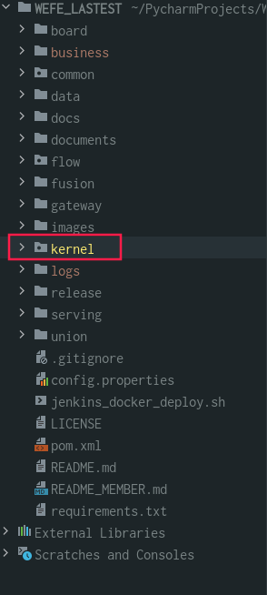
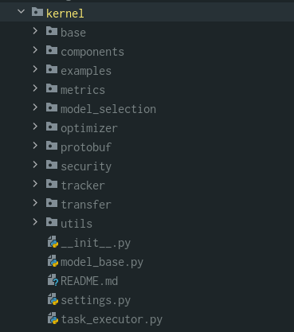
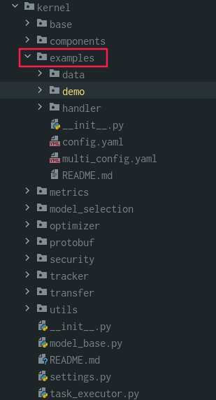
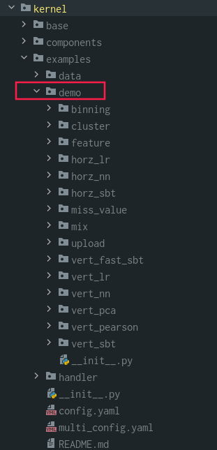
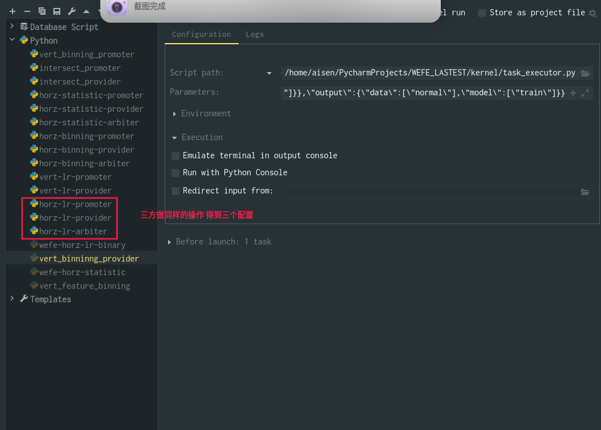

# Wefe 平台算法调试操作指引

本文档用于指导算法人员的学习研究，仅用于指导系统算法组件的调试工作，算法组件的实现使用的是Python语言，调试示例 IDE 选择的是Pycharm，其他 IDE 操作类似。

## kernel组件介绍

克隆项目之后请配置算法运行的依赖包，具体在项目的 requirement.txt 文件中，完成依赖项安装后使用pycharm打开 Wefe 项目，在项目列表中找到 kernel 包， Wefe 项目的所有的算法组件都在kernel包中实现。




kernel包结构有以下几部分组成，每部分功能参见 ./kernrl/README.md：





## 查找组件测试脚本

在 ==./kernel/example== 文件夹下提供了算法测试算法组件的实例demo，实例的数据源，以及实例的一些配置文件，具体细节参考本小节 README.md：



demo包包含的算法组件实例：



## 运行测试脚本

### 操作顺序

#### 执行算法组件的 py 文件

此处以横向逻辑回归模型为例介绍算法的demo，其余算法组件同理，找到并执行  ==./kernel/example/demo/horz_lr/wefe-horz-lr-binary.py== 文件，wefe-horz-lr-binary.py 文件提供了横向逻辑回归算法组件本地测试运行文件，主要用来为组件任务读取 job config 和添加模块形成用于运行作业的conf和dsl文件。


demo的终端执行结果，表示该组件已经执行完毕：


#### 查看组件运行结果

终端仅展示该组件的执行信息，进入==/logs / 执行的job_id / 输出文件== 可以查看算法执行结果或者确认程序是否正常执行，如未正常结束会输出报错提示：


#### 调试 job的一个task任务

联邦建模的一整个流程成为一个job，每个job下面有多个task任务。如例横向联邦学习流程job中，我们在==./kernel/example/demo/horz_lr/wefe-horz-lr-binary.py== 文件中，添加了dataio，horz_lr 和 evaluation 三个task任务。如果想进入其中一个task任务中做算法调试，可以执行以下操作。


此处以horz_lr为例，将运行 ==./kernel/example/demo/horz_lr/wefe-horz-lr-binary.py==  文件终端打印的的 task 运行参数，将 horz_lr 的 task 参数压缩转义后配置到 pycharm 的 Edit Configurations 就可以进入单个task任务调试了。**具体操作如下：**

##### 复制 task 任务参数

因在 horz_lr中传输数据需要第三方，因此此处需要配置三方，各方 task 任务的运行参数 **复制** 出来如下（下图红色框内内容）


```python
run subprocess command:python3 /home/aisen/PycharmProjects/WEFE_LASTEST/kernel/task_executor.py -j job_0005 -n horz_lr_0 -t job_0005_horz_lr_0 -r promoter -m 10001 -c {"job": {"project": {"project_id": "001"}, "env": {"name": "test", "db_type": "LMDB", "work_mode": 0, "backend": 0}, "members": [{"member_role": "promoter", "member_id": 10001}, {"member_role": "provider", "member_id": 10002}, {"member_role": "arbiter", "member_id": 10003}], "federated_learning_type": "horizontal"}, "task": {"members": [{"member_role": "promoter", "member_id": 10001}, {"member_role": "provider", "member_id": 10002}, {"member_role": "arbiter", "member_id": 10003}]}, "module": "HorzLR", "params": {"penalty": "L2", "alpha": 0.01, "optimizer": "rmsprop", "batch_size": 320, "learning_rate": 0.15, "init_param": {"init_method": "random_uniform"}, "max_iter": 30, "encrypt_param": {"method": null}}, "input": {"data": {"train": ["dataio_0"]}}, "output": {"data": ["normal"], "model": ["train"]}}


run subprocess command:python3 /home/aisen/PycharmProjects/WEFE_LASTEST/kernel/task_executor.py -j job_0005 -n horz_lr_0 -t job_0005_horz_lr_0 -r provider -m 10002 -c {"job": {"project": {"project_id": "001"}, "env": {"name": "test", "db_type": "LMDB", "work_mode": 0, "backend": 0}, "members": [{"member_role": "promoter", "member_id": 10001}, {"member_role": "provider", "member_id": 10002}, {"member_role": "arbiter", "member_id": 10003}], "federated_learning_type": "horizontal"}, "task": {"members": [{"member_role": "promoter", "member_id": 10001}, {"member_role": "provider", "member_id": 10002}, {"member_role": "arbiter", "member_id": 10003}]}, "module": "HorzLR", "params": {"penalty": "L2", "alpha": 0.01, "optimizer": "rmsprop", "batch_size": 320, "learning_rate": 0.15, "init_param": {"init_method": "random_uniform"}, "max_iter": 30, "encrypt_param": {"method": null}}, "input": {"data": {"train": ["dataio_0"]}}, "output": {"data": ["normal"], "model": ["train"]}}

run subprocess command:python3 /home/aisen/PycharmProjects/WEFE_LASTEST/kernel/task_executor.py -j job_0005 -n horz_lr_0 -t job_0005_horz_lr_0 -r arbiter -m 10003 -c {"job": {"project": {"project_id": "001"}, "env": {"name": "test", "db_type": "LMDB", "work_mode": 0, "backend": 0}, "members": [{"member_role": "promoter", "member_id": 10001}, {"member_role": "provider", "member_id": 10002}, {"member_role": "arbiter", "member_id": 10003}], "federated_learning_type": "horizontal"}, "task": {"members": [{"member_role": "promoter", "member_id": 10001}, {"member_role": "provider", "member_id": 10002}, {"member_role": "arbiter", "member_id": 10003}]}, "module": "HorzLR", "params": {"penalty": "L2", "alpha": 0.01, "optimizer": "rmsprop", "batch_size": 320, "learning_rate": 0.15, "init_param": {"init_method": "random_uniform"}, "max_iter": 30, "encrypt_param": {"method": null}}, "input": {"data": {"train": ["dataio_0"]}}, "output": {"data": ["normal"], "model": ["train"]}}
```


##### task 运行参数转义

将 promoter，provider 和arbiter 三方 -c 参数后的内容 **转义**，转义后的horz_lr 的tas执行参数如下所示：

```python
-j job_0005 -n horz_lr_0 -t job_0005_horz_lr_0 -r promoter -m 10001 -c 
{\"job\":{\"project\":{\"project_id\":\"001\"},\"env\":{\"name\":\"test\",\"db_type\":\"LMDB\",\"work_mode\":0,\"backend\":0},\"members\":[{\"member_role\":\"promoter\",\"member_id\":10001},{\"member_role\":\"provider\",\"member_id\":10002},{\"member_role\":\"arbiter\",\"member_id\":10003}],\"federated_learning_type\":\"horizontal\"},\"task\":{\"members\":[{\"member_role\":\"promoter\",\"member_id\":10001},{\"member_role\":\"provider\",\"member_id\":10002},{\"member_role\":\"arbiter\",\"member_id\":10003}]},\"module\":\"HorzLR\",\"params\":{\"penalty\":\"L2\",\"alpha\":0.01,\"optimizer\":\"rmsprop\",\"batch_size\":320,\"learning_rate\":0.15,\"init_param\":{\"init_method\":\"random_uniform\"},\"max_iter\":30,\"encrypt_pa

```

```python
-j job_0005 -n horz_lr_0 -t job_0005_horz_lr_0 -r provider -m 10002 -c 
{\"job\":{\"project\":{\"project_id\":\"001\"},\"env\":{\"name\":\"test\",\"db_type\":\"LMDB\",\"work_mode\":0,\"backend\":0},\"members\":[{\"member_role\":\"promoter\",\"member_id\":10001},{\"member_role\":\"provider\",\"member_id\":10002},{\"member_role\":\"arbiter\",\"member_id\":10003}],\"federated_learning_type\":\"horizontal\"},\"task\":{\"members\":[{\"member_role\":\"promoter\",\"member_id\":10001},{\"member_role\":\"provider\",\"member_id\":10002},{\"member_role\":\"arbiter\",\"member_id\":10003}]},\"module\":\"HorzLR\",\"params\":{\"penalty\":\"L2\",\"alpha\":0.01,\"optimizer\":\"rmsprop\",\"batch_size\":320,\"learning_rate\":0.15,\"init_param\":{\"init_method\":\"random_uniform\"},\"max_iter\":30,\"encrypt_param\":{\"method\":null}},\"input\":{\"data\":{\"train\":[\"dataio_0\"]}},\"output\":{\"data\":[\"normal\"],\"model\":[\"train\"]}}
```

```python
-j job_0005 -n horz_lr_0 -t job_0005_horz_lr_0 -r arbiter -m 10003 -c 
{\"job\":{\"project\":{\"project_id\":\"001\"},\"env\":{\"name\":\"test\",\"db_type\":\"LMDB\",\"work_mode\":0,\"backend\":0},\"members\":[{\"member_role\":\"promoter\",\"member_id\":10001},{\"member_role\":\"provider\",\"member_id\":10002},{\"member_role\":\"arbiter\",\"member_id\":10003}],\"federated_learning_type\":\"horizontal\"},\"task\":{\"members\":[{\"member_role\":\"promoter\",\"member_id\":10001},{\"member_role\":\"provider\",\"member_id\":10002},{\"member_role\":\"arbiter\",\"member_id\":10003}]},\"module\":\"HorzLR\",\"params\":{\"penalty\":\"L2\",\"alpha\":0.01,\"optimizer\":\"rmsprop\",\"batch_size\":320,\"learning_rate\":0.15,\"init_param\":{\"init_method\":\"random_uniform\"},\"max_iter\":30,\"encrypt_param\":{\"method\":null}},\"input\":{\"data\":{\"train\":[\"dataio_0\"]}},\"output\":{\"data\":[\"normal\"],\"model\":[\"train\"]}}
```


##### 配置各方 task 参数

将以上参数**配置**到 pycharm 的 Edit Configurations，在配置文件中需要找到 task 的执行入口 task_executor.py 文件，run_task方法需要的下图色框里的这些参数，也就是上述我们复制需要配置的参数（具体算法的执行流程可以参考 [documents/开发文档/组件开发流程.md](./documents) 文件），task的参数配置操作如下：





##### 在执行文件进行中断点调试

找到该task任务中各方的执行 py 文件，本系统的所有组件的配置文件均在其组件实现包中的 setting.json 中查看，可以看到本测试例子的task任务实现代码的执行文件，如想要调试 promoter的代码，只需在 provider和arbiter的 run 的情况下，在 promoter的执行文件中打断点进行 debug 即可。


以上就是一个 task 任务的调试过程，其他组件调试与此一致，开始debug吧！！！

