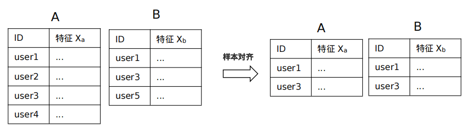
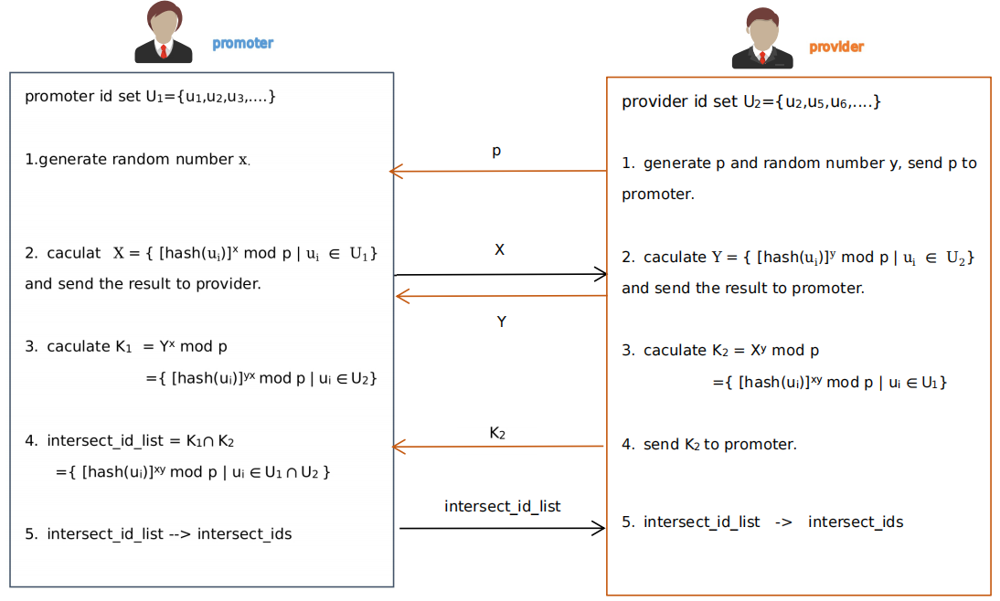
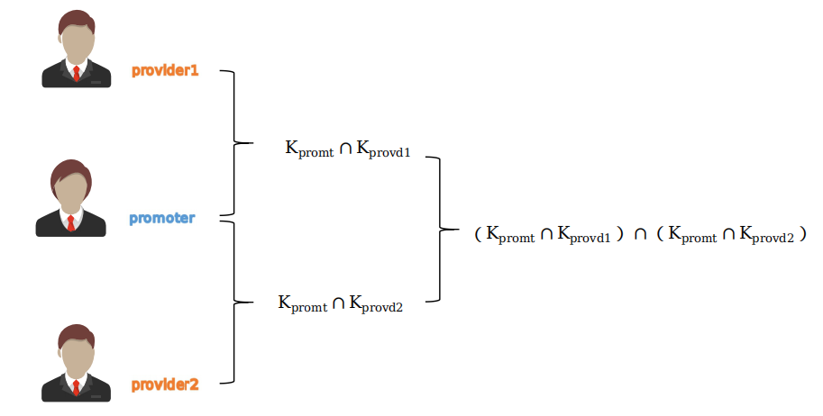

# 样本对齐

>
> 使用场景：纵向联邦学习
>
> 目的：计算所有参与方的样本交集。

样本ID对齐在不泄露各个参与方输入信息的前提下，协同计算输入集合的交集，参与方只能获得交集部分的ID，而不会获得或泄露非交集的ID。

## 两方

本系统采用了Diffine-Hellman密钥交换算法实现 ，参考具体技术流程如下：

## 多方

多方与两方的算法原理一致，在实现过程中 promoter 分别与每个 provider 求得交集后的结果，做再次求交运算，即：

 intersect_id_list = $(K_{promt}  \cap K_{provd 1}) \cap (K_{promt}  \cap K_{provd 2}) \cap ..\cap (K_{promt}  \cap K_{provd n}) $.

