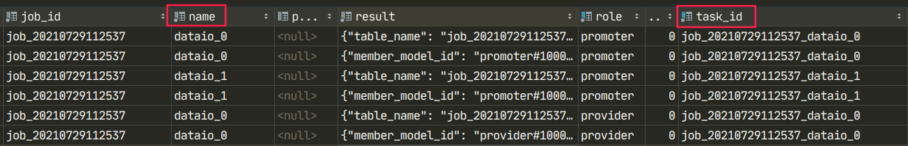
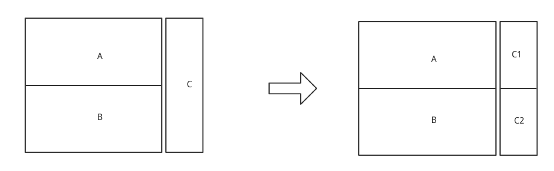
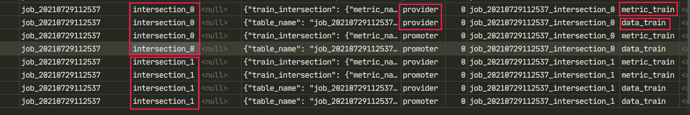

# 混合的配置过程

此文档介绍混合联邦学习的本地配置方法，以三个参与方为例，包含两个promoter和一个provider的配置操作。


## 数据上传	

首先将三方 [数据集](../examples/data) 传输到数据库中 ：

```
breast_mix_promoter_1.csv
breast_mix_promoter_2.csv
breast_mix_provider_1.csv	
```


## dataio 组件

### promoter01


```python
-j
job_20210729112537
-n
dataio_0
-t
job_20210729112537_dataio_0
-r
promoter
-m
10001
-c
{\"job\":{\"project\":{\"project_id\":\"001\"},\"env\":{\"name\":\"test\",\"db_type\":\"LMDB\",\"work_mode\":0,\"backend\":0},\"members\":[{\"member_role\":\"promoter\",\"member_id\":10001},{\"member_role\":\"promoter\",\"member_id\":10002},{\"member_role\":\"provider\",\"member_id\":10003},{\"member_role\":\"arbiter\",\"member_id\":10004}],\"federated_learning_type\":\"vertical\"},\"task\":{\"members\":[{\"member_role\":\"promoter\",\"member_id\":10001},{\"member_role\":\"promoter\",\"member_id\":10002},{\"member_role\":\"provider\",\"member_id\":10003},{\"member_role\":\"arbiter\",\"member_id\":10004}]},\"module\":\"DataIO\",\"params\":{\"with_label\":true,\"output_format\":\"dense\",\"table\":{\"name\":\"breast_horz_promoter_1\",\"namespace\":\"wefe_data\"},\"namespace\":\"wefe_data\",\"name\":\"breast_mix_promoter_1\",\"data_set_id\":null},\"input\":{\"data\":{}},\"output\":{\"data\":[\"normal\"],\"model\":[\"train\"]}}
```

### promoter02

```python
-j
job_20210729112537
-n
dataio_1
-t
job_20210729112537_dataio_1
-r
promoter
-m
10002
-c
{\"job\":{\"project\":{\"project_id\":\"001\"},\"env\":{\"name\":\"test\",\"db_type\":\"LMDB\",\"work_mode\":0,\"backend\":0},\"members\":[{\"member_role\":\"promoter\",\"member_id\":10001},{\"member_role\":\"promoter\",\"member_id\":10002},{\"member_role\":\"provider\",\"member_id\":10003},{\"member_role\":\"arbiter\",\"member_id\":10004}],\"federated_learning_type\":\"vertical\"},\"task\":{\"members\":[{\"member_role\":\"promoter\",\"member_id\":10001},{\"member_role\":\"promoter\",\"member_id\":10002},{\"member_role\":\"provider\",\"member_id\":10003},{\"member_role\":\"arbiter\",\"member_id\":10004}]},\"module\":\"DataIO\",\"params\":{\"with_label\":true,\"output_format\":\"dense\",\"table\":{\"name\":\"breast_horz_promoter_2\",\"namespace\":\"wefe_data\"},\"namespace\":\"wefe_data\",\"name\":\"breast_mix_promoter_2\",\"data_set_id\":null},\"input\":{\"data\":{}},\"output\":{\"data\":[\"normal\"],\"model\":[\"train\"]}}
```

### provider

```python
-j
job_20210729112537
-n
dataio_0
-t
job_20210729112537_dataio_0
-r
provider
-m
10003
-c
{\"job\":{\"project\":{\"project_id\":\"001\"},\"env\":{\"name\":\"test\",\"db_type\":\"LMDB\",\"work_mode\":0,\"backend\":0},\"members\":[{\"member_role\":\"promoter\",\"member_id\":10001},{\"member_role\":\"promoter\",\"member_id\":10002},{\"member_role\":\"provider\",\"member_id\":10003},{\"member_role\":\"arbiter\",\"member_id\":10004}],\"federated_learning_type\":\"vertical\"},\"task\":{\"members\":[{\"member_role\":\"promoter\",\"member_id\":10001},{\"member_role\":\"promoter\",\"member_id\":10002},{\"member_role\":\"provider\",\"member_id\":10003},{\"member_role\":\"arbiter\",\"member_id\":10004}]},\"module\":\"DataIO\",\"params\":{\"with_label\":false,\"output_format\":\"dense\",\"table\":{\"name\":\"breast_horz_provider_1\",\"namespace\":\"wefe_data\"},\"namespace\":\"wefe_data\",\"name\":\"breast_mix_provider_1\",\"data_set_id\":null},\"input\":{\"data\":{}},\"output\":{\"data\":[\"normal\"],\"model\":[\"train\"]}}
```


 组件的名字两个 promoter 和 task_id 要设置不一样，否则在sqlite数据库中 两个promoter的数据会覆盖，传输成功后的 sqlite 里的查询结果：




## 样本对齐

>   样本对齐需要做，A与C，B与C分别求交，此过程 provider 需要在本地同时模拟开启两个进程，共需要四个进程。



### promoter01与provider

```python
-j
job_20210729112537
-n
intersection_0
-t
job_20210729112537_intersection_0
-r
promoter
-m
10001
-c
{\"job\":{\"project\":{\"project_id\":\"001\"},\"env\":{\"name\":\"test\",\"db_type\":\"LMDB\",\"work_mode\":0,\"backend\":0},\"members\":[{\"member_role\":\"promoter\",\"member_id\":10001},{\"member_role\":\"provider\",\"member_id\":10003}],\"federated_learning_type\":\"vertical\"},\"task\":{\"members\":[{\"member_role\":\"promoter\",\"member_id\":10001},{\"member_role\":\"promoter\",\"member_id\":10002},{\"member_role\":\"provider\",\"member_id\":10003}]},\"module\":\"Intersection\",\"params\":{\"intersect_method\":\"dh\",\"sync_intersect_ids\":true},\"input\":{\"data\":{\"normal\":[\"dataio_0\"]}},\"output\":{\"data\":[\"train\"]}}
```

```python
-j
job_20210729112537
-n
intersection_0
-t
job_20210729112537_intersection_0
-r
provider
-m
10003
-c
{\"job\":{\"project\":{\"project_id\":\"001\"},\"env\":{\"name\":\"test\",\"db_type\":\"LMDB\",\"work_mode\":0,\"backend\":0},\"members\":[{\"member_role\":\"promoter\",\"member_id\":10001},{\"member_role\":\"provider\",\"member_id\":10003}],\"federated_learning_type\":\"vertical\"},\"task\":{\"members\":[{\"member_role\":\"promoter\",\"member_id\":10001},{\"member_role\":\"provider\",\"member_id\":10003}]},\"module\":\"Intersection\",\"params\":{\"intersect_method\":\"dh\",\"sync_intersect_ids\":true},\"input\":{\"data\":{\"normal\":[\"dataio_0\"]}},\"output\":{\"data\":[\"train\"]}}
```

### promoter02与provider

```PYTHON
-j
job_20210729112537
-n
intersection_1
-t
job_20210729112537_intersection_1
-r
promoter
-m
10002
-c
{\"job\":{\"project\":{\"project_id\":\"001\"},\"env\":{\"name\":\"test\",\"db_type\":\"LMDB\",\"work_mode\":0,\"backend\":0},\"members\":[{\"member_role\":\"promoter\",\"member_id\":10001},{\"member_role\":\"provider\",\"member_id\":10003}],\"federated_learning_type\":\"vertical\"},\"task\":{\"members\":[{\"member_role\":\"promoter\",\"member_id\":10001},{\"member_role\":\"provider\",\"member_id\":10003}]},\"module\":\"Intersection\",\"params\":{\"intersect_method\":\"dh\",\"sync_intersect_ids\":true},\"input\":{\"data\":{\"normal\":[\"dataio_1\"]}},\"output\":{\"data\":[\"train\"]}}
```

```PYTHON
-j
job_20210729112537
-n
intersection_1
-t
job_20210729112537_intersection_1
-r
provider
-m
10003
-c
{\"job\":{\"project\":{\"project_id\":\"001\"},\"env\":{\"name\":\"test\",\"db_type\":\"LMDB\",\"work_mode\":0,\"backend\":0},\"members\":[{\"member_role\":\"promoter\",\"member_id\":10002},{\"member_role\":\"provider\",\"member_id\":10003}],\"federated_learning_type\":\"vertical\"},\"task\":{\"members\":[{\"member_role\":\"promoter\",\"member_id\":10002},{\"member_role\":\"provider\",\"member_id\":10003}]},\"module\":\"Intersection\",\"params\":{\"intersect_method\":\"dh\",\"sync_intersect_ids\":true},\"input\":{\"data\":{\"normal\":[\"dataio_0\"]}},\"output\":{\"data\":[\"train\"]}}
```



注意：\"input\":{\"data\":{\"normal\":[\"dataio_0\"]}},\"output\":{\"data\":[\"train\"]}


## 特征工程 

>  statistic 配置，此过程需要同时开启5个进程进行检验。

### promoter01 

```Python
-j
job_20210729112537
-n
mix_statistic_0
-t
job_20210729112537_mix_statistic_0
-r
promoter
-m
10001
-c
{\"job\":{\"project\":{\"project_id\":\"001\"},\"env\":{\"name\":\"test\",\"db_type\":\"LMDB\",\"work_mode\":0,\"backend\":0},\"members\":[{\"member_role\":\"promoter\",\"member_id\":10001},{\"member_role\":\"promoter\",\"member_id\":10002},{\"member_role\":\"provider\",\"member_id\":10003},{\"member_role\":\"arbiter\",\"member_id\":10004}],\"federated_learning_type\":\"horizontal\"},\"task\":{\"members\":[{\"member_role\":\"promoter\",\"member_id\":10001},{\"member_role\":\"promoter\",\"member_id\":10002},{\"member_role\":\"provider\",\"member_id\":10003},{\"member_role\":\"arbiter\",\"member_id\":10004}]},\"module\":\"MixStatistic\",\"params\":{\"col_names\":[\"x0\",\"x1\",\"x2\",\"x3\",\"x4\",\"x5\",\"x6\",\"x7\",\"x8\",\"x9\",\"x10\",\"x11\",\"x12\",\"x13\",\"x14\",\"x15\",\"x16\",\"x17\",\"x18\",\"x19\",\"x20\",\"x21\",\"x22\",\"x23\",\"x24\",\"x25\"]},\"input\":{\"data\":{\"train\":[\"intersection_0\"]}},\"output\":{\"data\":[\"train\"],\"model\":[\"train\"]}}
```

### promoter02

```python
-j
job_20210729112537
-n
mix_statistic_0
-t
job_20210729112537_mix_statistic_0
-r
promoter
-m
10002
-c
{\"job\":{\"project\":{\"project_id\":\"001\"},\"env\":{\"name\":\"test\",\"db_type\":\"LMDB\",\"work_mode\":0,\"backend\":0},\"members\":[{\"member_role\":\"promoter\",\"member_id\":10001},{\"member_role\":\"promoter\",\"member_id\":10002},{\"member_role\":\"provider\",\"member_id\":10003},{\"member_role\":\"arbiter\",\"member_id\":10004}],\"federated_learning_type\":\"horizontal\"},\"task\":{\"members\":[{\"member_role\":\"promoter\",\"member_id\":10001},{\"member_role\":\"promoter\",\"member_id\":10002},{\"member_role\":\"provider\",\"member_id\":10003},{\"member_role\":\"arbiter\",\"member_id\":10004}]},\"module\":\"MixStatistic\",\"params\":{\"col_names\":[\"x0\",\"x1\",\"x2\",\"x3\",\"x4\",\"x5\",\"x6\",\"x7\",\"x8\",\"x9\",\"x10\",\"x11\",\"x12\",\"x13\",\"x14\",\"x15\",\"x16\",\"x17\",\"x18\",\"x19\",\"x20\",\"x21\",\"x22\",\"x23\",\"x24\",\"x25\"]},\"input\":{\"data\":{\"train\":[\"intersection_1\"]}},\"output\":{\"data\":[\"train\"],\"model\":[\"train\"]}}
```

### provider01

```python
-j
job_20210729112537
-n
mix_statistic_0
-t
job_20210729112537_mix_statistic_0
-r
provider
-m
10003
-c
{\"job\":{\"project\":{\"project_id\":\"001\"},\"env\":{\"name\":\"test\",\"db_type\":\"LMDB\",\"work_mode\":0,\"backend\":0},\"members\":[{\"member_role\":\"promoter\",\"member_id\":10001},{\"member_role\":\"promoter\",\"member_id\":10002},{\"member_role\":\"provider\",\"member_id\":10003},{\"member_role\":\"arbiter\",\"member_id\":10004}],\"federated_learning_type\":\"horizontal\"},\"task\":{\"members\":[{\"member_role\":\"promoter\",\"member_id\":10001},{\"member_role\":\"promoter\",\"member_id\":10002},{\"member_role\":\"provider\",\"member_id\":10003},{\"member_role\":\"arbiter\",\"member_id\":10004}],\"mix_promoter_member_id\":\"10001\",\"provider_master\":true,\"provider_other_inner_id\":[\"20002\"],\"provider_master_inner_id\":\"20001\",\"provider_inner_id\":\"20001\"},\"module\":\"MixStatistic\",\"params\":{\"col_names\":[\"x26\",\"x27\",\"x28\",\"x29\"]},\"input\":{\"data\":{\"train\":[\"intersection_0\"]}},\"output\":{\"data\":[\"train\"],\"model\":[\"train\"]}}
```

### provider02

```python
-j
job_20210729112537
-n
mix_statistic_1
-t
job_20210729112537_mix_statistic_0
-r
provider
-m
10004
-c
{\"job\":{\"project\":{\"project_id\":\"001\"},\"env\":{\"name\":\"test\",\"db_type\":\"LMDB\",\"work_mode\":0,\"backend\":0},\"members\":[{\"member_role\":\"promoter\",\"member_id\":10001},{\"member_role\":\"promoter\",\"member_id\":10002},{\"member_role\":\"provider\",\"member_id\":10003},{\"member_role\":\"arbiter\",\"member_id\":10004}],\"federated_learning_type\":\"horizontal\"},\"task\":{\"members\":[{\"member_role\":\"promoter\",\"member_id\":10001},{\"member_role\":\"promoter\",\"member_id\":10002},{\"member_role\":\"provider\",\"member_id\":10003},{\"member_role\":\"arbiter\",\"member_id\":10004}],\"mix_promoter_member_id\":\"10002\",\"provider_master\":false,\"provider_other_inner_id\":[\"20001\"],\"provider_master_inner_id\":\"20001\",\"provider_inner_id\":\"20002\"},\"module\":\"MixStatistic\",\"params\":{\"col_names\":[\"x26\",\"x27\",\"x28\",\"x29\"]},\"input\":{\"data\":{\"train\":[\"intersection_1\"]}},\"output\":{\"data\":[\"train\"],\"model\":[\"train\"]}}
```

### arbiter

```python
-j
job_20210729112537
-n
mix_statistic_0
-t
job_20210729112537_mix_statistic_0
-r
arbiter
-m
10004
-c
{\"job\":{\"project\":{\"project_id\":\"001\"},\"env\":{\"name\":\"test\",\"db_type\":\"LMDB\",\"work_mode\":0,\"backend\":0},\"members\":[{\"member_role\":\"promoter\",\"member_id\":10001},{\"member_role\":\"promoter\",\"member_id\":10002},{\"member_role\":\"provider\",\"member_id\":10003},{\"member_role\":\"arbiter\",\"member_id\":10004}],\"federated_learning_type\":\"horizontal\"},\"task\":{\"members\":[{\"member_role\":\"promoter\",\"member_id\":10001},{\"member_role\":\"promoter\",\"member_id\":10002},{\"member_role\":\"provider\",\"member_id\":10003},{\"member_role\":\"arbiter\",\"member_id\":10004}]},\"module\":\"MixStatistic\",\"params\":{\"col_names\":[\"x0\",\"x1\",\"x2\",\"x3\",\"x4\",\"x5\",\"x6\",\"x7\",\"x8\",\"x9\",\"x10\",\"x11\",\"x12\",\"x13\",\"x14\",\"x15\",\"x16\",\"x17\",\"x18\",\"x19\",\"x20\",\"x21\",\"x22\",\"x23\",\"x24\",\"x25\"]},\"input\":{\"data\":{\"train\":[\"intersection_1\"]}},\"output\":{\"data\":[\"train\"],\"model\":[\"train\"]}}
```


## 算法模块 

>  混合LR配置，此过程需要同时在本地开启5个进程。

### promoter01

```python
-j
job_20210729112537
-n
mix_lr_0
-t
job_20210729112537_mix_lr_0
-r
promoter
-m
10001
-c
{\"job\":{\"project\":{\"project_id\":\"001\"},\"env\":{\"name\":\"test\",\"db_type\":\"LMDB\",\"work_mode\":0,\"backend\":0},\"members\":[{\"member_role\":\"promoter\",\"member_id\":10001},{\"member_role\":\"promoter\",\"member_id\":10002},{\"member_role\":\"provider\",\"member_id\":10003},{\"member_role\":\"arbiter\",\"member_id\":10004}],\"federated_learning_type\":\"vertical\"},\"task\":{\"members\":[{\"member_role\":\"promoter\",\"member_id\":10001},{\"member_role\":\"promoter\",\"member_id\":10002},{\"member_role\":\"provider\",\"member_id\":10003},{\"member_role\":\"arbiter\",\"member_id\":10004}]},\"module\":\"MixLR\",\"params\":{\"penalty\":\"L2\",\"tol\":1e-05,\"alpha\":0.01,\"optimizer\":\"adam\",\"batch_size\":-1,\"learning_rate\":0.15,\"init_param\":{\"init_method\":\"random_uniform\"},\"max_iter\":10,\"early_stop\":\"diff\",\"validation_freqs\":null,\"early_stopping_rounds\":null},\"input\":{\"data\":{\"train\":[\"intersection_0\"]}},\"output\":{\"data\":[\"normal\"],\"model\":[\"train\"]}}
```


### promoter02

```python
-j
job_20210729112537
-n
mix_lr_0
-t
job_20210729112537_mix_lr_0
-r
promoter
-m
10002
-c
{\"job\":{\"project\":{\"project_id\":\"001\"},\"env\":{\"name\":\"test\",\"db_type\":\"LMDB\",\"work_mode\":0,\"backend\":0},\"members\":[{\"member_role\":\"promoter\",\"member_id\":10001},{\"member_role\":\"promoter\",\"member_id\":10002},{\"member_role\":\"provider\",\"member_id\":10003},{\"member_role\":\"arbiter\",\"member_id\":10004}],\"federated_learning_type\":\"vertical\"},\"task\":{\"members\":[{\"member_role\":\"promoter\",\"member_id\":10001},{\"member_role\":\"promoter\",\"member_id\":10002},{\"member_role\":\"provider\",\"member_id\":10003},{\"member_role\":\"arbiter\",\"member_id\":10004}]},\"module\":\"MixLR\",\"params\":{\"penalty\":\"L2\",\"tol\":1e-05,\"alpha\":0.01,\"optimizer\":\"adam\",\"batch_size\":-1,\"learning_rate\":0.15,\"init_param\":{\"init_method\":\"random_uniform\"},\"max_iter\":10,\"early_stop\":\"diff\",\"validation_freqs\":null,\"early_stopping_rounds\":null},\"input\":{\"data\":{\"train\":[\"intersection_1\"]}},\"output\":{\"data\":[\"normal\"],\"model\":[\"train\"]}}
```


### provider01

```python
-j
job_20210729112537
-n
mix_lr_0
-t
job_20210729112537_mix_lr_0
-r
provider
-m
10003
-c
{\"job\":{\"project\":{\"project_id\":\"001\"},\"env\":{\"name\":\"test\",\"db_type\":\"LMDB\",\"work_mode\":0,\"backend\":0},\"members\":[{\"member_role\":\"promoter\",\"member_id\":10001},{\"member_role\":\"promoter\",\"member_id\":10002},{\"member_role\":\"provider\",\"member_id\":10003},{\"member_role\":\"arbiter\",\"member_id\":10004}],\"federated_learning_type\":\"vertical\"},\"task\":{\"members\":[{\"member_role\":\"promoter\",\"member_id\":10001},{\"member_role\":\"promoter\",\"member_id\":10002},{\"member_role\":\"provider\",\"member_id\":10003},{\"member_role\":\"arbiter\",\"member_id\":10004}]},\"mix_promoter_member_id\":10001,\"module\":\"MixLR\",\"params\":{\"penalty\":\"L2\",\"tol\":1e-05,\"alpha\":0.01,\"random_cipher_seed\":\"200\",\"optimizer\":\"adam\",\"batch_size\":-1,\"learning_rate\":0.15,\"init_param\":{\"init_method\":\"random_uniform\"},\"max_iter\":10,\"early_stop\":\"diff\",\"validation_freqs\":null,\"early_stopping_rounds\":null},\"input\":{\"data\":{\"train\":[\"intersection_0\"]}},\"output\":{\"data\":[\"normal\"],\"model\":[\"train\"]}}
```


### provider02

```Python
-j
job_20210729112537
-n
mix_lr_1
-t
job_20210729112537_mix_lr_0
-r
provider
-m
10003
-c
{\"job\":{\"project\":{\"project_id\":\"001\"},\"env\":{\"name\":\"test\",\"db_type\":\"LMDB\",\"work_mode\":0,\"backend\":0},\"members\":[{\"member_role\":\"promoter\",\"member_id\":10001},{\"member_role\":\"promoter\",\"member_id\":10002},{\"member_role\":\"provider\",\"member_id\":10003},{\"member_role\":\"arbiter\",\"member_id\":10004}],\"federated_learning_type\":\"vertical\"},\"task\":{\"members\":[{\"member_role\":\"promoter\",\"member_id\":10001},{\"member_role\":\"promoter\",\"member_id\":10002},{\"member_role\":\"provider\",\"member_id\":10003},{\"member_role\":\"arbiter\",\"member_id\":10004}]},\"mix_promoter_member_id\":10002,\"module\":\"MixLR\",\"params\":{\"penalty\":\"L2\",\"tol\":1e-05,\"alpha\":0.01,\"random_cipher_seed\":\"200\",\"optimizer\":\"adam\",\"batch_size\":-1,\"learning_rate\":0.15,\"init_param\":{\"init_method\":\"random_uniform\"},\"max_iter\":10,\"early_stop\":\"diff\",\"validation_freqs\":null,\"early_stopping_rounds\":null},\"input\":{\"data\":{\"train\":[\"intersection_1\"]}},\"output\":{\"data\":[\"normal\"],\"model\":[\"train\"]}}
```


###  arbiter

```python
-j
job_20210729112537
-n
mix_lr_0
-t
job_20210729112537_mix_lr_0
-r
arbiter
-m
10004
-c
{\"job\":{\"project\":{\"project_id\":\"001\"},\"env\":{\"name\":\"test\",\"db_type\":\"LMDB\",\"work_mode\":0,\"backend\":0},\"members\":[{\"member_role\":\"promoter\",\"member_id\":10001},{\"member_role\":\"promoter\",\"member_id\":10002},{\"member_role\":\"arbiter\",\"member_id\":10004}],\"federated_learning_type\":\"horizontal\"},\"task\":{\"members\":[{\"member_role\":\"promoter\",\"member_id\":10001},{\"member_role\":\"promoter\",\"member_id\":10002},{\"member_role\":\"arbiter\",\"member_id\":10004}]},\"module\":\"MixLR\",\"params\":{\"penalty\":\"L2\",\"tol\":1e-05,\"alpha\":0.01,\"optimizer\":\"adam\",\"batch_size\":-1,\"learning_rate\":0.15,\"init_param\":{\"init_method\":\"random_uniform\"},\"max_iter\":10,\"early_stop\":\"diff\",\"validation_freqs\":null,\"early_stopping_rounds\":null},\"input\":{\"data\":{\"train\":[\"intersection_0\"]}},\"output\":{\"data\":[\"normal\"],\"model\":[\"train\"]}}
```

