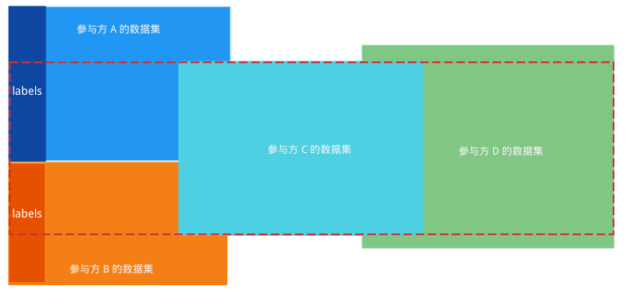
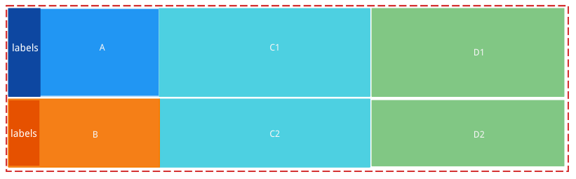
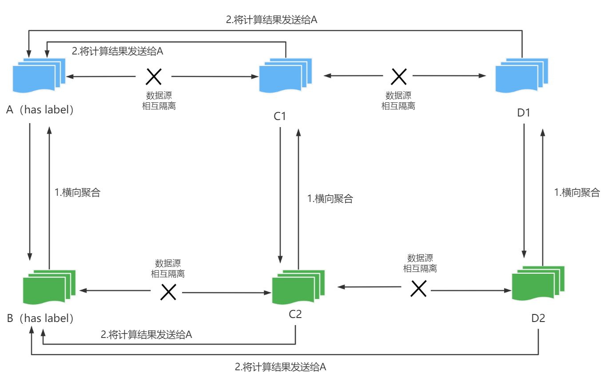
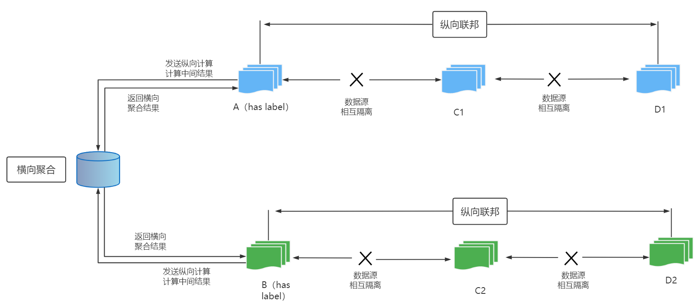
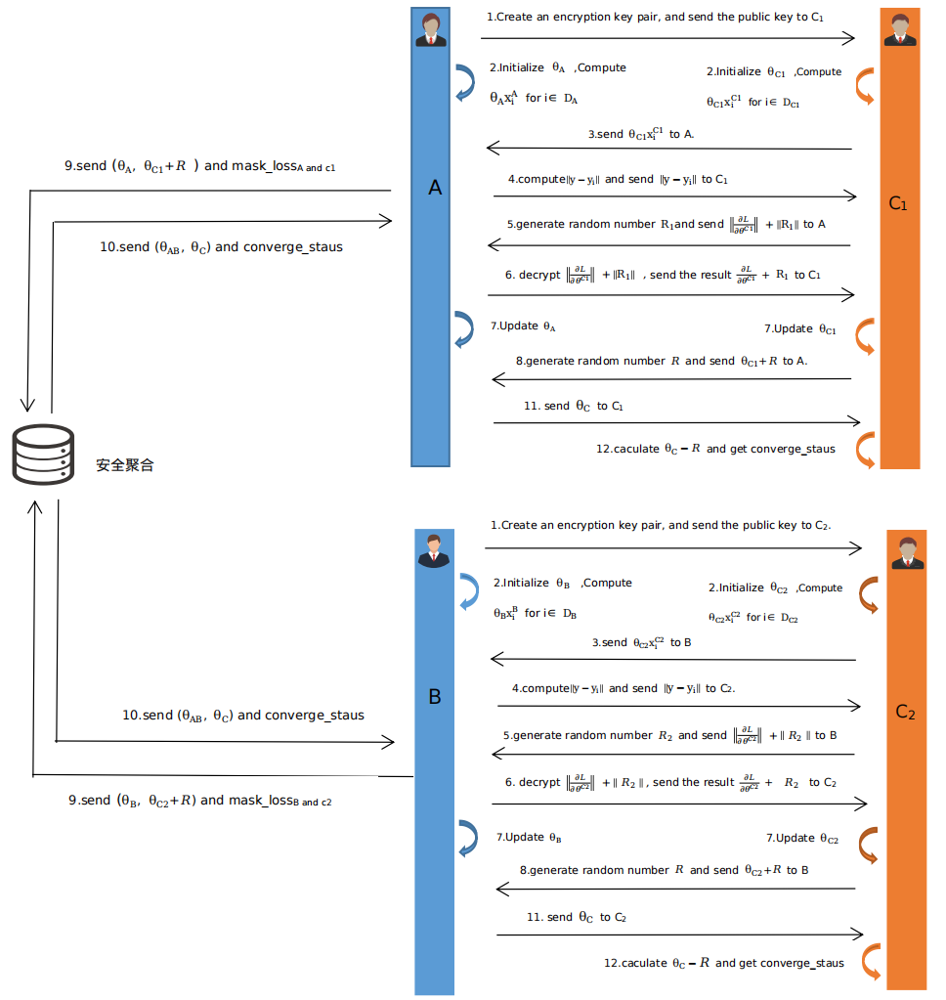

# 混合联邦学习

## 混合联邦学习的定义

联邦学习是一种连接数据孤岛释放数据价值的技术，在大多数场景下更丰富的样本和更丰富的特征都能提升模型的效果。WeFe 提出了一种新的联邦学习模式，称为混合联邦学习。混合联邦学习架构是横向联邦与纵向联邦的集成，允许在一次联邦建模任务中同时包含多个标签方 和多个数据方，为复杂的应用场景提供了有效的解决方案，实现了真正意义上的多方联合学习，以下是4个参与方包括两个promoter和两个provider的示意图：

## 混合联邦学习的算法模块

目前，wefe系统中混合联邦技术支持的算法组件有：

- 混合分箱
- 混合特征统计
- 混合逻辑回归算法
- 混合SecureBoost算法

### 样本对齐

> 建模开始之前，标签方分别与数据方进行数据对齐，得到数据交集。

在混合联邦学习的样本对齐阶段，每个数据标签方需要与所有的数据参与方进行样本对齐，得到数据的交集。如以上图中两个标签方和两个数据方进行联合建模时，标签方A与数据提供方C和D进行样本对齐，得到与C的交集C1，与D的交集D1。标签方B做同样的操作，与C的交集C2，与D的交集D2。

### 特征工程

在特征工程阶段，目前支持的算法组件的实现流程是：

- ​	标签方A与标签方B做横向联邦；
- ​	数据方C的子数据集 C1和C2 做横向联邦，数据方D的子数据集D1和D2做横向联邦。

### 建模算法

算法实现遵循一下流程：

- ​	A与C1和D1做纵向联邦，B与C2和D2做纵向联邦；
- ​	( A,C1,D1)做纵向联邦的结果与( B,C2,D2)做纵向联邦的结果做横向联邦。

#### 混合逻辑回归

以下列举了三个参与方混合逻辑回归算法的实现，包括两个标签方A和B 和一个数据方C。算法实现过程如下：

