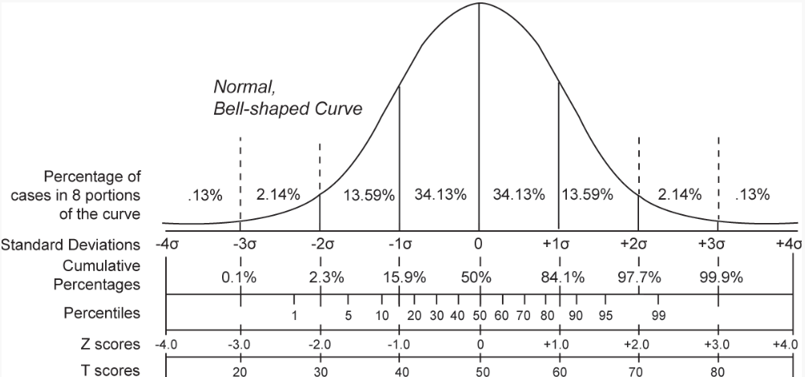
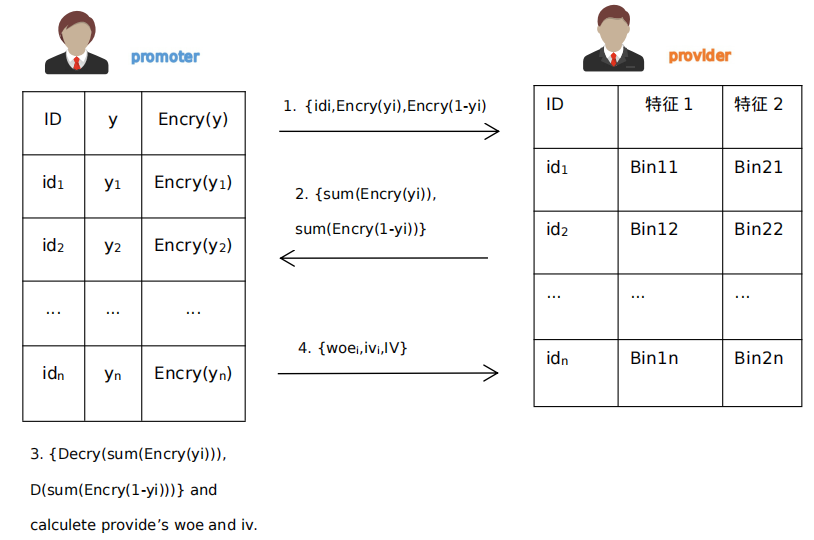
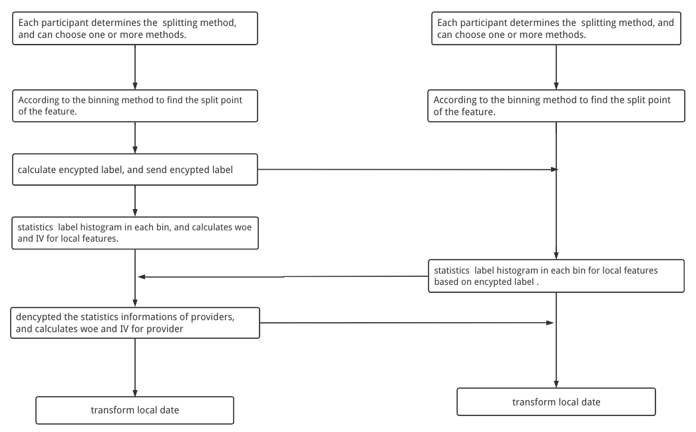
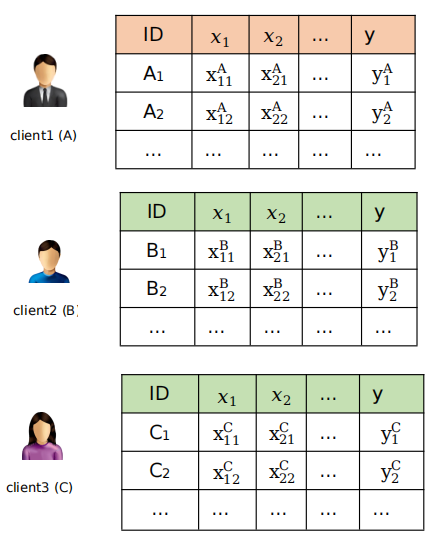
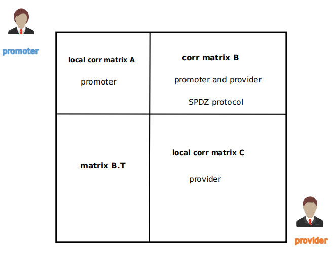
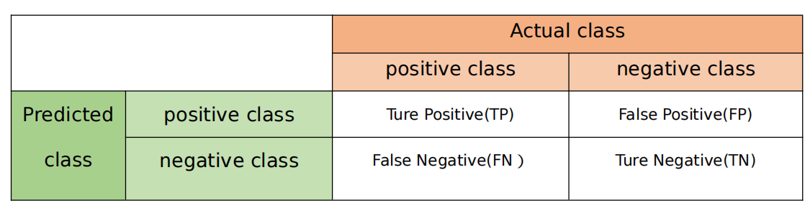
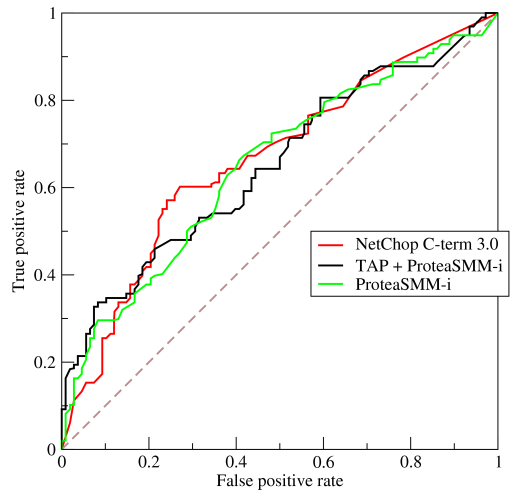
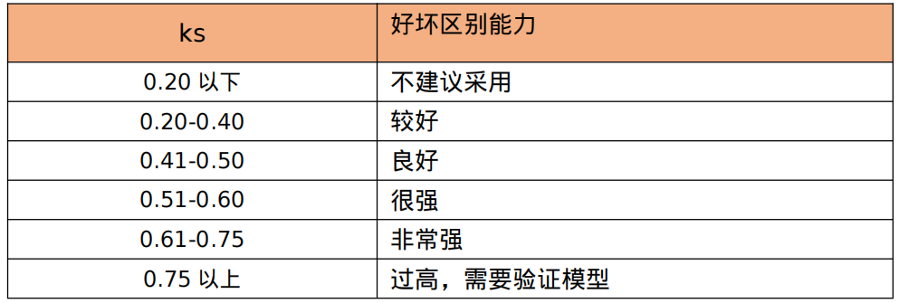

# 特征工程

## DataIO

> 把上传的数据集转换成组件使用的Instance对象。

```
把上传的数据集转换成Instance对象，数据上传的完成后在数据库是以
```

`(key, value)`的形式存储或者表中仅有两列（一列是key，另一列是value值），`key`表示样本的id，`value`表示样本的特征和标签(可有)。格式如下：

`id : "y,x1,x2,x3,x4"`

## 数据预处理

### 样本过滤

> 组件功能：对数据按照过滤表达式进行筛选。
>
> 场景支持：纵向联邦。

#### **过滤条件**

1. =
2. !=
3. \>
4. <
5. \>=
6. <=

如: 根据age特征和性别特征，挑选出样本集中年龄在10~30岁之间，性别标签是1的样本的过滤条件可以表示为：

`age>18&age<30&sex=男`

### 缺失值填充

> 组件功能：对数据集中缺失的特征进行填充。
>
> 场景支持：横向联邦，纵向联邦和混合联邦。

#### 填充方法

1. 最大值
2. 最小值
3. 均值
4. 众数（仅纵向联邦学习）
5. 自定义值

### 标准化

> 组件功能：对数据集的指定的列进行标准化。
>
> 场景支持：横向联邦，纵向联邦和混合联邦。

#### **归一化**

> 把数据映射到$[0,1]$区间上。

$$
x_i = \frac{x_i - x_{max}}{x_{max} - x_{min}}

$$

#### **标准化**

> 把数据处理成符合标准正态分布

$$
x_i = \frac{x_i - \overline{x}}{\sigma}

$$

其中 x是总体的均值$\overline x= \frac{1}{n} \sum_{i=0}^n x_i$，${\sigma}$是总体的标准差 ${\sigma} = \sqrt{\frac{1}{n-1} \sum_{i=0}^n(x_i-\overline{x})^2} $

### 类型转换

> 组件功能：把字符串类型特征转换成数值类型
>
> 场景支持：横向联邦，纵向联邦和混合联邦。

联邦建模算法组件和部分特征工程组件不支持数据集中有字符串。

## 降维

### 主成分分析

> 组件功能：主成分分析（PCA）是研究如何通过少数主成分揭示多个变量间的内部结构，考察多个变量间相关性的一种多元统计方法。PCA从原始变量中导出少数主成分，使它们尽可能多地保留原始变量的信息，并且彼此间互不相关，作为新的综合指标。
>
> 场景支持：目前支持纵向联邦（两方）

* 使用限制
  主成分分析算法实现了降维和降噪的功能，仅支持稠密数据格式。

## 特征变换

### 特征尺度变换

> 组件功能：对稠密或稀疏的数值类特征进行常见的尺度变换。
>
> 场景支持：目前支持纵向联邦。

* 变换方法

  支持常见的 log2、log10、ln、abs 及sqrt尺度变化函数。

### 特征异常平滑

> 组件功能：将输入特征中包含异常的数据平滑到一定区间，支持稀疏和稠密数据格式。
>
> 场景支持：目前支持纵向联邦。

#### 平滑方法

- Z-Score平滑

如果特征分布遵循正态分布，则噪音一般集中在-3×alpha和3×alpha之外，ZScore是将该范围的数据平滑到[-3×alpha,3×alpha]之间。

例如，某个特征遵循正态分布，均值为0，标准差为3。因此，-10的特征值会被识别为异常而修正为-3×3+0，即为-9。同理10会被修正为3×3+0，即为9。

如下图所示：



* 百分位平滑
  用于将分布不在 [minPer, maxPer] 的数据平滑到 minPer 和 maxPer 这两个分位点。
  例如，age特征取值0～200，设置 minPer 为0，maxPer 为50%，则不在0～100的特征取值都会被修正成0或100。
* 阈值平滑
  用于将分布不在[minThresh, maxThresh] 的数据平滑到 minThresh 和 maxThresh 这两个数据点。
  例如，age特征取值0～200，设置 minThresh 为10，maxThresh为80，则不在0～80的特征取值都会被修正成0或80。

## 特征编码

### 热编码

> 组件功能：使用N位状态寄存器来对N个状态进行编码，每个状态都有它独立的寄存器位，并且在任意时候，其中只有一位有效。
>
> 场景支持：支持横向联邦、纵向联邦和混合联邦。

如： 水果有 apple（苹果），banana（香蕉），以及pineapple（凤梨）三种经过onehot编码后：


| 水果 |   |   |   |
| :----- | --- | --- | --- |
| 苹果 | 1 | 0 | 0 |
| 香蕉 | 0 | 1 | 0 |
| 凤梨 | 0 | 0 | 1 |

### WOE编码

> 组件功能：对特征用woe编码，与分箱有关。
>
> 场景支持：支持横向联邦、纵向联邦和混合联邦。

## 分箱

> 组件功能：建立分类模型时，需要对连续变量离散化，特征离散化后模型会更稳定，易于模型的快速迭代，降低模型过拟合的风险。
>
> 场景支持：支持横向联邦、纵向联邦和混合联邦。

### 纵向分箱

系统分箱方法支持等频，等距，最优和自定义4种分箱方法：

- Quantile Binning ：等频是指各个箱子的样本个数一样，算法参考 paper。
- Bucket Binning：等距是指各个箱子的分段区间一致，分割点为 min(x) + [max(x) - min(x)] / n * k；
- Optimal Binning：最优分为merge optimal binning方法和split optimal binning方法，其中merge optimal binning是一种基于条件推断查找最佳分组的方法，条件准则可以使用基尼系数，卡方检验或IV值；
- Custom Binning自定义分箱是指用户根据业务实际情况自己定义分割点，可以用来调节分箱结果。

在联邦学习中，因provider方不含有y标签，在计算己方特征的woe和 iv值时需要数据交互，具体步骤如下：



在上图中promoter将标签值 y 使用加法同态加密算法发送给provider，provider根据己方数据特征的分箱结果统计每个箱子加密状态的正样本个数和负样本个数，并将统计结果返回给拥有标签方promoter，promoter来计算provider方特征的woe和iv值，最后将结算结果返回给provider。

本联邦学习系统中给参与者在建模过程中同时提供多种分箱方法，参与者可根据需求自行同时选择一种或多种分箱方法，实现拥有不同数据的参与方进行联邦建模方式的灵活多样，总体流程如下：



### 横向分箱

横向分箱各方含有标签值y ，三方只需使用安全聚合方法聚合得到分割点，实现数据分箱操作。

系统分箱支持 recursive query 和 virtual summary 两种分箱方法。

## 统计分析

### 统计量

> 组件功能：对常用统计量进行计算。
>
> 场景支持：横向联邦、纵向联邦、混合联邦，小部分统计量目前仅支持纵向。

* 均值

  $$
  \overline x = \frac{1}{n} \cdot \sum_{i=1}^nx_i

  $$
* 最大值

  $$
  x_{max} = max\{x_i\}

  $$
* 最小值

  $$
  x_{min} = min\{x_i\}

  $$
* 众数

  > 一组数据中出现次数最多的变数。
  >
* 方差

  > 描述随机变量的离散程度。
  >

  $$
  \sigma^2 = \frac{\sum_{i=1}^N(x_i - \overline x)^2}{n}

  $$
* 标准差

  $$
  \sigma = \sqrt{\frac{\sum_{i=1}^N(x_i - \overline x)^2}{n}}

  $$
* 分位数

  > 也称分位点，是指用分割点（cut point）将一个随机变量的概率分布范围分为几个具有相同概率的连续区间。
  >

  常用的有中位数（即二分位数）、四分位数（quartile）、十分位数（decile ）、百分位数等。
* 峰度

  > 衡量实数随机变量概率分布的峰态。
  >

  $$
  g_2 = \frac{m^4}{m_2^2} - 3 = \frac{\frac{1}{n}\sum_{i=1}^n(x_i-\overline x)^4}{(\frac{1}{n}\sum_{i=1}^n(x_i-\overline x)^2)^2} - 3

  $$
* 偏度

  > 衡量实数随机变量概率分布的不对称性。
  >

  $$
  g_1 = \frac{m^3}{m_2^{3/2}} =\frac{\frac{1}{n}\sum_{i=1}^n(x_i-\overline x)^3}{(\frac{1}{n}\sum_{i=1}^n(x_i-\overline x)^2)^{3/2}}

  $$
* CV

  > 变异系数，衡量序列的波动情况。
  >

  $$
  cv = \frac{\overline x}{\sigma}

  $$
* 特征样本缺失数量

  特征样本值为空，NULL，NONE、NAN的数量
* 数据分布统计

  只支持纵向

#### 横向特征统计

横向联邦学习个参与方数据组合形式如下：



此时，进行特征量统计需要使用安全聚合方案，即需要第三方参与使用安全聚合方法得到各个统计量。

#### 纵向特征统计

```
根据本地数据计算出本特征的特征统计量。
```

### 皮尔逊系数

> 组件功能：计算输入表或分区两列（数值列）的Pearson相关系数，计算结果输出至输出表。
>
> 场景支持：横向联邦、纵向联邦、混合联邦。

$$
\rho _{X,Y} = \frac{cov(X,Y)}{{\sigma _X}{\sigma _Y}} = \frac{E(X-\mu _X)E(Y-\mu _Y)}{{\sigma _X}{\sigma _Y}}

$$

估算样本的协方差和标准差，可得到样本相关系数(样本皮尔逊系数)，常用英文小写字母 r 表示：

$$
r = \frac
{\sum_{i=1}^n (x_i-\overline x)(y_i-\overline y)}
{ \sqrt {\sum_{i=1}^n (x_i-\overline x)^2}
\sqrt {\sum_{i=1}^n(y_i-\overline y)^2}}

$$

等价于

$$
r =\frac{1}{n-1} \sum_{i=1}^n 
(\frac{x_i - \overline x}{\sigma _X})
(\frac{y_i - \overline y}{\sigma _Y})

$$

#### 横向皮尔逊系数

根据横向皮尔逊系数的计算公式可以得到，假如有 A 和 B 两个参与方，皮尔逊系数的计算公式可以改写为：

$$
r = \frac{1}{n-1}( \sum_{A} (\frac{x_i - \overline x}{\sigma _X})(\frac{y_i - \overline y}{\sigma _Y}) +  \sum_{B} (\frac{x_i - \overline x}{\sigma _X})(\frac{y_i - \overline y}{\sigma _Y}))

$$

可以看出，只要知道数据总体的均值和方差就能根据上述公式计算出横向皮尔逊系数。在实现横向横向皮尔逊系数之前需要选进行横向特征统计出均值和方差，之后采用安全聚合的方法即可得到横向皮尔逊系数。

#### 纵向皮尔逊系数

在计算纵向皮尔逊系数时，因为数据的分布特点，各个参与方可以先根据本地数据计算出本地相关系数矩阵，不同参与方数据的相关矩阵采用SPDZ协议实现。如下列举纵向两个参与方的相关系数矩阵的构成可以包括以下几部分：



## 数据切分

> 组件功能：把数据集按比例切分成数据集和测试集。
>
> 场景支持：横向联邦、纵向联邦、混合联邦。

## 特征价值计算

> 组件功能：计算CV/IV，计划废除。
>
> 场景支持：横向联邦、纵向联邦、混合联邦。

```
引用FATE的特征筛选组件，把参数设置非常小。
```

## 特征选择

> 组件功能：选择对应的特征。
>
> 场景支持：横向联邦、纵向联邦、混合联邦。

## 模型泛化能力评估

> oot
>
> 场景支持：横向联邦、纵向联邦、混合联邦。

## 模型评估

> evaluation
>
> 场景支持：横向联邦、纵向联邦、混合联邦。

### 有监督学习评估指标

- 混淆矩阵

```
混淆矩阵的每一列代表了预测类别，每一列的总数表示预测为该类别的数据的数目；
```

```
每一行代表了数据的真实归属类别，每一行的数据总数表示该类别的数据实例的数目。
```



- accuracy

```
准确率计算公式如下：
```

$$
accuracy = \frac{TP + TN}{TP + TN + FP+FN} = \frac{TP+TN}{all\ data}

$$

```
在数据集不平衡时，准确率将不能很好地表示模型的性能。可能会存在准确率很高，而少数类样本全分错的情况，此时应选择其它模型评价指标。
```

- precision

```
精确率（precision）计算公式如下:
```

$$
precision = \frac{TP}{TP+FP}

$$

```
精确率表示在预测为positive的样本中真实类别为positive的样本所占比例。
```

- recall

```
positive class的召回率（recall）计算公式如下：
```

$$
recall = \frac{TP}{TP + FN}

$$

```
positive class的召回率表示在真实为positive的样本中模型成功预测出的样本所占比例。
```

- $F_1$值

```

```

$F_1$值的计算公式如下:

$$
F_1 = \frac{2}{\frac{1}{precision} + \frac{1}{recall}} = \frac{2 \cdot precision \cdot recall}{precision + recall}

$$

```

```

$F_1$值就是精确率和召回率的调和平均值，$F_1$值认为精确率和召回率一样重要。

- AUC值与ROC曲线

```
AUC全称为Area Under Curve，表示一条曲线下面的面积，ROC曲线的AUC值可以用来对模型进行评价。ROC曲线的纵坐标True Positive Rate（TPR）在数值上就等于positive class的recall，记作
```

$recall_{positive}$，横坐标False Positive Rate（FPR）在数值上等于(1 - negative class的recall)，记作$(1-recall_{negative})$如下所示：

$$
TPR = \frac{TP}{TP+FN} = recall_{positive} \\
FPR = \frac{FP}{FP+TN} = 1- \frac{TN}{FP+TN} = 1- recall_{negative}

$$

```
AUC值由定义通过计算ROC曲线、横轴和直线FPR = 1三者围成的面积即可得到。
```



- KS

```
KS指标来评估模型的区分度
```



- Lift曲线

  ```
  提升图
  ```
- Gain曲线

  ```
  增益曲线
  ```
