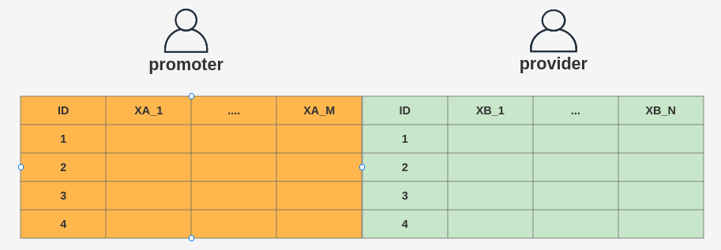
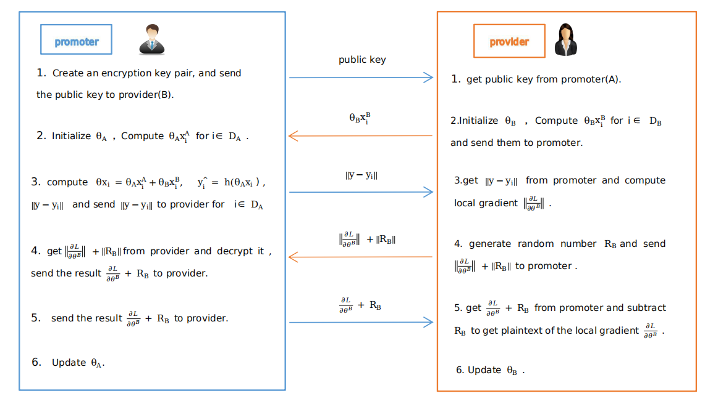
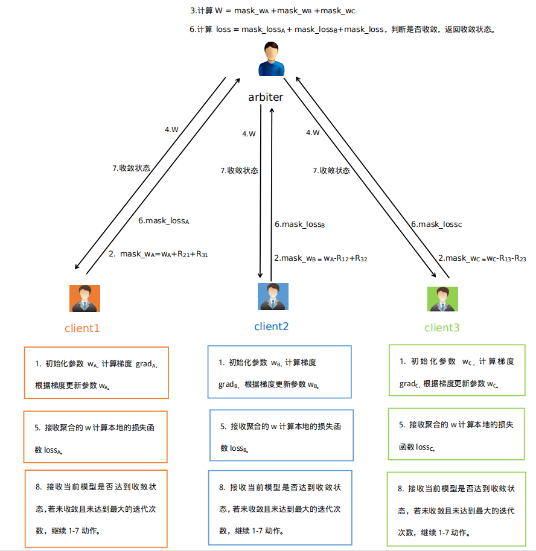
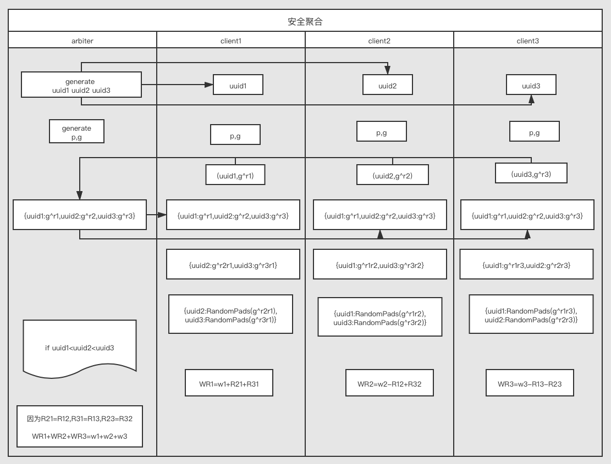

# 逻辑回归

**基础回顾**

在逻辑回归中，对于给定的数据集，可以根据极大似然估计法估计出模型的参数。在参数估计计算过程中，为了简化运算通常将似然函数极大化转化为其等价的对似然函数最大值问题。一般将逻辑回归模型的损失函数即为对数似然函数取负数得到，损失函数来衡量模型预测错误的程度，损失函数最小则对应对数似然函数大。逻辑回归的损失函数为：
$$
loss = -\sum_{n=1}^n [y_i log \pi (x_i) +(1-y_i)log(1- \pi(x_i))]
$$
根据逻辑回归的损失函数可以得到该问题的交叉熵损失函数：
$$
\begin{align*}
J(\theta) &= - \frac {1} {n} \sum_{i=1}^n [y_i log \pi (x_i) +(1-y_i)log(1- \pi(x_i))] \\
& = - \frac {1} {n} \sum_{i=1}^n [y_i log  g(w^Tx)) +(1-y_i)log(1- g(w^Tx))] 
\end{align*}
$$

对交叉熵损失函数 $  J(θ) $ 的其中某一项（第 i 行，第 j 列）求导得到损失函数的梯度值:
$$
\begin{align*}
\frac {d(J(\theta))} {d(\theta_j)}  &=  \frac {1} {n} \sum_{i=1}^n (g(w^Tx_i) - y_i)x_{ij}    \tag{1}\\   
&=\frac {1} {n} \sum_{i=1}^n  (\hat y_i -y_i)x_{ij}    \tag{2}\\
& = \frac {1} {n} ((\hat y -y)x^j)  \tag{3}
\end{align*}
$$
其中$ x_{ij} $是第 i 行第 j 列数据， $ j = 0,1,2,...,n$,   $ i = 1,2,3,...,n $ 。于是梯度 $\nabla J(\theta)$ 值：
$$
\nabla J(w) = \left\{
 \begin{matrix}
   \frac {d(J(w))} {d(w_0)} \\
   \frac {d(J(w))} {d(w_1)} \\
   ... \\
   \frac {d(J(w))} {d(w_n)}
  \end{matrix}
  \right\} 
  
  =\frac {1} {m}  \left\{
 \begin{matrix}
   \sum_{i=1}^n  (\hat y_i -y_i)x_{i0} \\
   \sum_{i=1}^n  (\hat y_i -y_i)x_{i1}\\
   ... \\
   \sum_{i=1}^n  (\hat y_i -y_i)x_{in}
  \end{matrix}
  \right\}
$$

## 纵向逻辑回归

**纵向逻辑回归设计原理**

有以上知识，我们可以讨论联邦学习中逻辑回归的实现方法。在纵向建模中需要不同数据方样本的特征组合来进行建模，假设当前有两个参与方需要进行联和建模，则其数据组合形式应如下图所示：

逻辑回归传入的训练集样本为  $x_i = (x_{i0},x_{i1},x_{i2},...,x_{in})^T $(其中$x_{i0} = 1$) ，由公式（3）可以看出在求梯度时需要知道  $ \hat y $ 和 $x^j$，其中  $ \hat y $  为逻辑回归模型的估计值， $x^j$ 是数据的特征列。因为纵向联邦学习中各方拥有各自完整的特征列，因此在公式(3) 中计算梯度中，  $x^j$ 是参与各方拥有的数据列无需交换得到，但如果双方想要得到 $\hat y_i$，就需要交换信息了。实现原理很简单，总体  $ w^T x_i $  可以分为两部分的和，一部分依靠 A 方数据计算得到，另一部分依靠 B 方数据计算得到：
$$
w^Tx_i  = w_0 + w_1x_{i1}+ w_1x_{i2} + ...+w_nx_{in}  = w^T_Ax_{A_i}+w^T_Bx_{B_i}
$$
如果 A 方把本地的$w^T_Ax_{A_i}$ 发送给 B方，B方 聚合得到了总体 $ w^Tx_i $ ，代入梯度计算公式（1）便可以得到了 总体  $ w^T x_i $  ，进而也就求得了 $\hat y_i$。

因此，当双方聚合得到总体  $ w^T x_i $  后就可以根据梯度公式（1）计算各自的在本地计算自己方的梯度了，也就是整体  $ \frac {d(J(w))} {d(w_j)} $  梯度分为两部分实现：
$$
\frac {d(J(w))} {d(w)} = (\frac {d(J(w))} {d(w_A)}，\frac {d(J(w))} {d(w_B)})
$$

 A 方计算如下:
$$
\begin{align*}
\frac {d(J(\theta))} {d(\theta_{A_j})}  &=  \frac {1} {m} \sum_{i=1}^n (g(w^Tx_i) - y_i)x_{ij}=\frac {1} {m} \sum_{i=1}^n  (\hat y_i -y_i)x_{ij}   = \frac {1} {m} ((\hat y -y)x^j) ，其中 j \in A方的特征 \\

\frac {d(J(\theta))} {d(\theta_0)} &= \frac {1} {m} \sum_{i=1}^n  (\hat y_i -y_i)x_{i0} = \frac {1} {m} \sum_{i=1}^n  (\hat y_i -y_i) ，常数项
\end{align*}
$$
对于 B 方同理可知：
$$
\begin{align*}
\frac {d(J(\theta))} {d(\theta_{B_j})}  &=  \frac {1} {m} \sum_{i=1}^n (g(w^Tx_i) - y_i)x_{ij}=\frac {1} {m} \sum_{i=1}^n  (\hat y_i -y_i)x_{ij} = \frac {1} {m} ((\hat y -y)x^j) ，其中 j \in B方特征 \\
\frac {d(J(\theta))} {d(\theta_0)} &= \frac {1} {m} \sum_{i=1}^n  (\hat y_i -y_i)x_{i0} = \frac {1} {m} \sum_{i=1}^n  (\hat y_i -y_i) ，常数项
\end{align*}
$$

**纵向逻辑回归实现流程**

根据从以上推理，可以设计出纵向逻辑回归交互过程：

上述算法第2步骤，provider 把 本地的$w^T_Ax_{A_i}$ 发送给 promoter，promoter 聚合得到了总体 $ w^Tx_i $ ，代入梯度计算公式（1）便可以得到本次迭代的梯度值，第3步将对所有的 i ，使用加法同态算法加密 $\hat y_i -y_i$ ，后将加密后的   $||\hat y_i -y_i||$ 发送给 provider，provider 根据梯度计算公式（1）可以计算得到本地加密的梯度值 $||\frac {d(J(w))} {d(w_{B})} || $。此时 provider 需要解密得到梯度，因为其不具有私钥，其对密文加上同态加密后的随机数掩码发送给 promoter，promoter 同态解密后获得的是加上随机掩码的梯度信息，并不能获得 provider 的原始梯度信息，将解密结果返回给provider ，provider 减去随机数掩码，得到本地梯度。双方计算得到梯度之后可以根据最速下降法或牛顿法来新梯度信息，一次纵向迭代交互完成。当迭代次数达到最大或者损失函数小于指定值时达到收敛时，停止迭代。

## 横向逻辑回归

**纵向逻辑回归设计原理**

根据基础部分得到的梯度计算方法如下，在求梯度时需要知道  $ \hat y $ 和 $x^j$，其中  $ \hat y $  为逻辑回归模型的估计值， $x^j$ 是数据的特征列。因为横向联邦学习中各方拥有各自完整的样本信息，因此在公式(1) 中计算梯度中，  $x^j$ 和 $ \hat y $ 参与各方无需交换得到，可根据自己数据集计算，最后计算结果后按照样本数量 i  做加和即可。
$$
\begin{align*}
\frac {d(J(\theta))} {d(\theta_j)}  &=  \frac {1} {n} \sum_{i=1}^n (g(w^Tx_i) - y_i)x_{ij}    \tag{1}\\   
&=\frac {1} {n} \sum_{i=1}^n  (\hat y_i -y_i)x_{ij}    \tag{2}\\
& = \frac {1} {n} ((\hat y -y)x^j)  \tag{3}
\end{align*}
$$
本系统中将横向逻辑回归将标签 {0,1} 转化为标签为 {-1,1} ，根据推理可得此时损失函数和损失函数分别为：

$$
\begin{align*}
损失函数：J(w) &=  - \frac {1} {n} \sum_{i=1}^n ln(1+e^{-y_i w^Tx_i}) \\
梯度：\frac {d(J(w)} {d(w_j)}  &=  \frac {1} {n} \sum_{i=1}^n -(\frac{1}{1+e^{-y_i w^Tx_i}} * e^{-y_i w^Tx_i}*-y_ix_i)\\
&=\frac {1} {n} \sum_{i=1}^n  (\frac{1}{1+e^{-y_i w^Tx_i}} -1)y_ix_i  
\end{align*}
$$

根据损失函数和梯度计算公式有，双方分别计算，之后结果 加和 就可以得到总体的损失函数和梯度值：
$$
\begin{align*}
J(w) &=  - \frac {1} {n} \sum_{i=1}^n ln(1+e^{-y_i w^Tx_i}) = - \frac {1} {n} \sum_{A} ln(1+e^{-y_i w^Tx_i})+ - \frac {1} {n} \sum_{B} ln(1+e^{-y_i w^Tx_i}) ,\quad 其中 A 和 B 中样本和等于 n \\
\frac {d(J(w))} {d(w_j)}  &= \frac {1} {n} \sum_{i=1}^n  (\frac{1}{1+e^{-y_i w^Tx_i}} -1)y_ix_i  =  \frac {1} {n} \sum_{A}  (\frac{1}{1+e^{-y_i w^Tx_i}} -1)y_ix_i + \frac {1} {n} \sum_{B}  (\frac{1}{1+e^{-y_i w^Tx_i}} -1)y_ix_i,\quad 其中 A 和 B 中样本和等于 n
\end{align*}
$$

以上举例有两个参与方时，多个时情况类似。

**横向逻辑回归流程**

本平台在实现横向联邦学习时，使用了安全加法聚合技术，安全加法聚合即根据一定规则使多个参与方的真实数据加减相同的随机数得到数据的掩码值，掩码值在第三方做加法聚合时各参与方的加减随机数可以抵消，在不泄露各方真实数据的情况下得到多个参与方的数值和。在本系统横向逻辑回归交互时，参数 w 和损失函数时 loss使用了该加法安全聚合技术，具体流程如下图所示，这里假设在使用安全聚合时 uuid1< uuid2 < uuid3:

本系统安全聚合的流程介绍如下：

