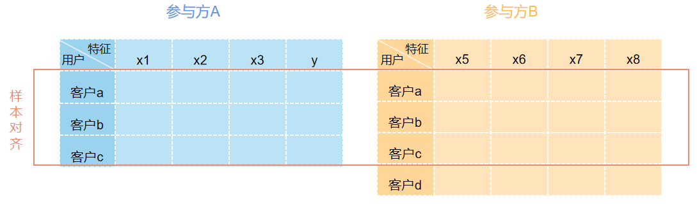
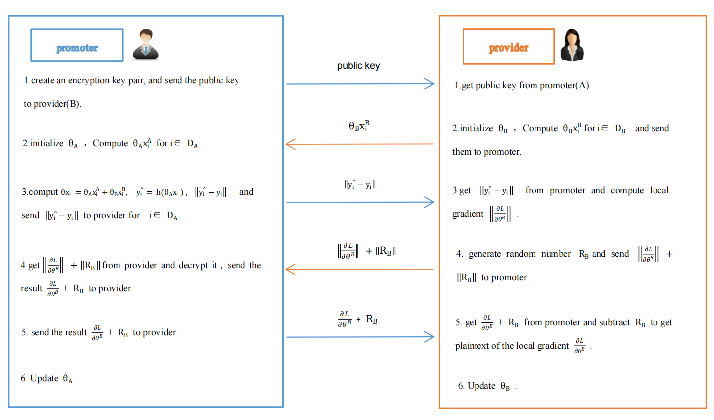
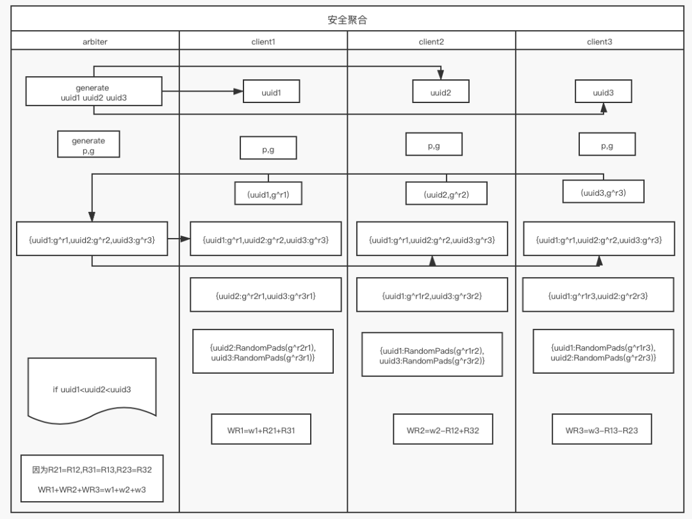
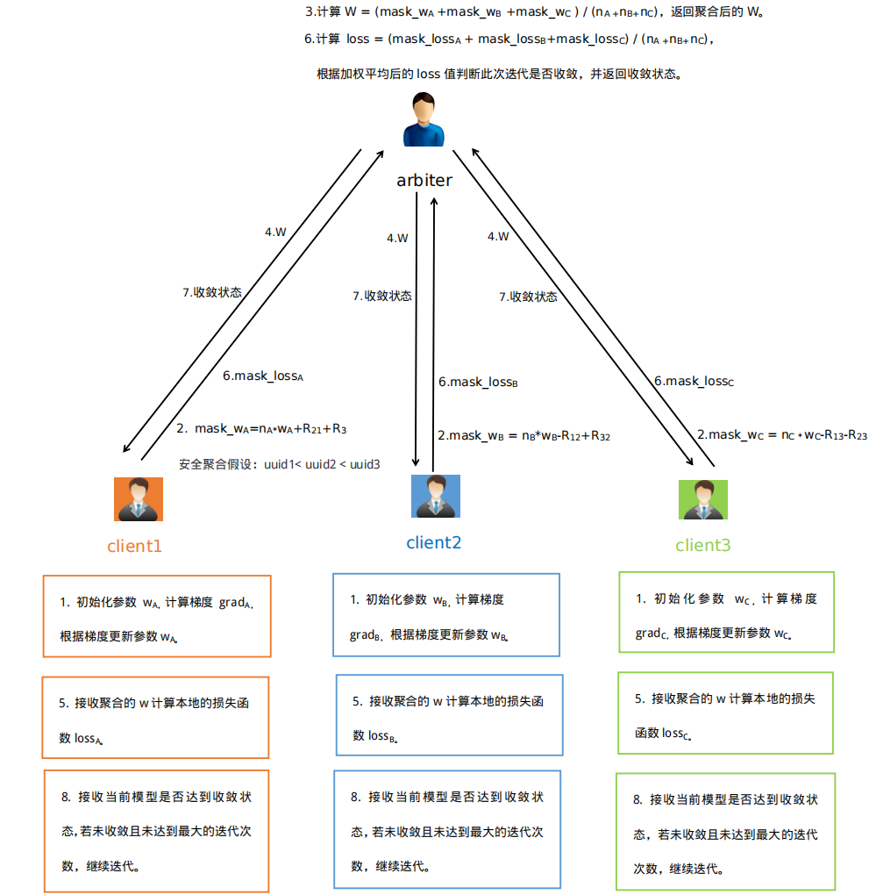

# 逻辑回归

**基础知识回顾**

在逻辑回归中，对于给定的数据集，可以根据极大似然估计法估计出模型的参数。在参数估计计算过程中，为了简化运算通常将似然函数极大化转化为其等价的对似然函数最大值问题。一般将逻辑回归模型的损失函数取对数似然函数的负数得到，损失函数来衡量模型预测错误的程度，损失函数最小则对应对数似然函数大。逻辑回归的损失函数为：

根据逻辑回归的损失函数可以得到该问题的交叉熵损失函数：

对交叉熵损失函数   J(w)  的其中某一项（第 i 行，第 j 列）求导得到损失函数的梯度值:

其中 是第 i 行第 j 列数据， 是第 j 列数据 ， j = 0,1,2,...,n,    i = 1,2,3,...,n  。于是梯度  ：

 

## 纵向逻辑回归

**纵向逻辑回归设计原理**

有以上知识，我们可以讨论联邦学习中逻辑回归的实现方法。在纵向建模中需要不同数据方样本的特征组合来进行建模，假设当前有两个参与方需要进行联和建模，则其数据组合形式应如下图所示：

逻辑回归传入的训练集样本为   (其中 ) ，由公式（3）可以看出在求梯度时需要知道    和  ，其中   为逻辑回归模型的估计值，  是数据的特征列。因为纵向联邦学习中各方拥有各自完整的特征列，因此在上述梯度计算公式中，  是参与各方拥有的数据列无需交换得到，但如果双方想要得到 ，就需要交换信息了。

(1) y的预测值计算

实现原理很简单，总体  可以分为两部分的和，一部分依靠 A 方数据计算得到，另一部分依靠 B 方数据计算得到：

如果 A 方把本地的   发送给 B方，B方聚合得到了总体 ，代入梯度计算公式便可以求得  ，求得     后就可以根据梯度公式计算各自的在本地计算自己方的梯度了。

(2) 梯度计算

整体      梯度可分为两部分实现：

 A 方梯度计算计算如下:

 ，其中 j 表示 A 方的第 j 个特征

，常数项

对于 B 方梯度计算同理可知：

，其中 j 表示 B 方的第 j 个特征

，常数项

**纵向逻辑回归实现流程**

根据从以上推理，可以设计出纵向逻辑回归交互过程：

参考《Parallel Distributed Logistic Regression for Vertical Federated Learning without Third-Party Coordinator》

算法第2步骤，provider 把 本地的    发送给 promoter，promoter 聚合得到了总体   ，代入梯度计算公式可以得到本地的梯度值。对于provider 第3步将对所有的 i ，使用加法同态算法加密  ，后将加密后的     发送给 provider，provider 根据梯度计算公式可以计算得到本地加密的梯度值  。

此时 provider 需要解密得到梯度，因为其不具有私钥，其对密文加上同态加密后的随机数掩码发送给 promoter，promoter 同态解密后获得的是加上随机掩码的梯度信息，并不能获得 provider 的原始梯度信息，将解密结果返回给provider ，provider 减去随机数掩码，得到本地梯度。双方计算得到梯度之后可以根据最速下降法或牛顿法来新梯度信息，一次纵向迭代交互完成。当迭代次数达到最大或者损失函数小于指定值时达到收敛时，停止迭代。

## 横向逻辑回归

**横向逻辑回归设计原理**

在应用中为了简化运算，将横向逻辑回归将标签 {0,1} 转化为标签为 {-1,1} 求解，此时的损失函数和损失函数计算分别为：

损失函数：

梯度：

求梯度时需要知道，  和  ，其中  是逻辑回归模型的系数，是需要模型迭代确定的参数信息，  为逻辑回归模型的估计值， 是数据第i行第j列的的特征值。因为横向联邦学习中各方拥有各自的完整数据，因此在公式(2) 中，  和参 与各方无需交换得到，参数 可以通过第三方聚合加权得到。

**安全聚合**

在实现横向联邦学习时，使用了加法安全聚合技术，即在安全前提下实现不同参数方的数据求和。具体实现原理是多个参与方会根据一定规则使其持有的真实数据加/减一个随机数得到数据的掩码值，掩码值在第三方做加法聚合时各参与方的加减随机数可以抵消，即在不泄露各方真实数据的情况下得到多个参与方的数值和，过程如下图所示：

**横向逻辑回归流程**

在本系统横向逻辑回归交互时，参数 w 和损失函数 loss 聚合时使用了该加法安全聚合技术（ 第3步和第6步），具体流程如下图所示，这里假设在使用安全聚合时 uuid1< uuid2 < uuid3:

