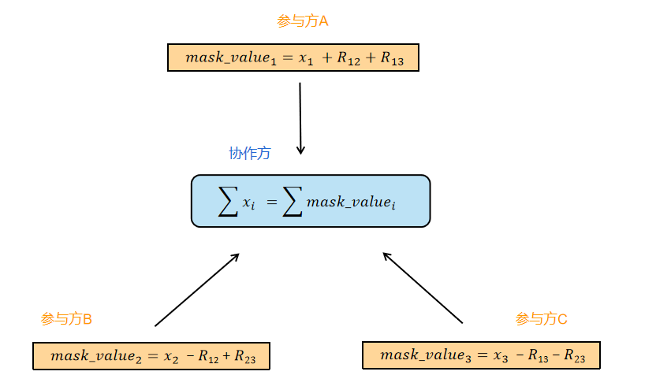

# 逻辑回归

**基础知识回顾**

在逻辑回归中，对于给定的数据集，可以根据极大似然估计法估计出模型的参数。在参数估计计算过程中，为了简化运算通常将似然函数极大化转化为其等价的对似然函数最大值问题。逻辑回归模型的损失函数取对数似然函数的负数得到，损失函数来衡量模型预测错误的程度，损失函数最小则对应对数似然函数大。逻辑回归的损失函数为：

$$L(\theta) = - \sum_{i=1}^n [y_i log \ g(\theta^Tx_i) +(1-y_i)log \ (1- g(\theta^Tx_i))]$$

根据逻辑回归的损失函数可以得到该问题的交叉熵损失函数：

$$J(\theta)  = - \frac {1} {n} \sum_{i=1}^n [y_i log \ g(\theta^Tx_i) +(1-y_i)log \ (1- g(\theta^Tx_i))]$$

对交叉熵损失函数  $J(w)$  的其中某一项（第 i 行，第 j 列）求导得到损失函数的梯度值:

$$\begin{align*}
\frac {\partial(J(\theta))} {\partial(\theta_j)}  &=  \frac {1} {n} \sum_{i=1}^n (g(\theta^Tx_i) - y_i)x_{ij}    \tag{1}\\   
&=\frac {1} {n} \sum_{i=1}^n  (\hat y_i -y_i)x_{ij}    \tag{2}\\
& = \frac {1} {n} ((\hat y -y)x^j)  \tag{3}
\end{align*}$$

其中 $x_{ij}$ 是第 i 行第 j 列数据，$x^j$ 是第 j 列数据 ， $j = 0,1,2,...,n$，$i = 1,2,3,...,n$。

于是梯度 $\nabla J(\theta)$ ：

$$J(w) = [\frac {\partial(J(w))} {\partial(\theta_0)},\frac {\partial(J(w))} {\partial(\theta_1)},...,\frac {\partial(J(w))} {\partial(\theta_n)} ]^T = \frac {1} {n} [\sum_{i=1}^n  (\hat y_i -y_i), \sum_{i=1}^n   (\hat y_i -y_i)x_{i1},...,\sum_{i=1}^n  (\hat y_i -y_i)x_{in}]^T$$

## 纵向逻辑回归

有以上知识，我们可以讨论联邦学习中逻辑回归的实现方法。在纵向建模中需要不同数据方样本的特征组合来进行建模，假设当前有两个参与方需要进行联和建模，则其数据组合形式应如下图所示：

**横向逻辑回归设计原理**

可以（1）中可以看出$\theta^Tx_i$是求梯度的关键信息，但现在的数据特征分布于两地，怎么求$\theta^Tx_i$？再仔细观察就可以发现，总体$\theta^Tx_i$可以由两部分求和得到，即：

$$\theta^Tx_i  = \theta_0 + \theta_1x_{i1}+ \theta_2x_{i2} + ...+\theta_nx_{in}  = \theta^T_Ax_{A_i}+\theta^T_Bx_{B_i}$$

其中$x_{A_i}$是参与方A含有的特征的集合，$x_{B_i}$ 是参与方B含有的特征的集合。如果 A 方把本地的计算$\theta^T_Ax_{A_i}$ 发送给 B方，B方得到信息后跟自己持有的 $\theta^T_Bx_{B_i}$ 求和就可以得到了总体的$\theta^Tx_i$ 。将总体$\theta^T x_i$ 代入梯度计算公式（1）也就求得了$\hat y_i$，进而可以求得$\hat y_i - y_i$，得到$\hat y_i - y_i$后就可以根据公式（3）计算梯度。

以上讨论在明文状态下，但在实际应用中考虑到中间数据的安全性，不允许泄露参与方的任何有用信息，针对这个问题引入了 **加密技术**。传输的中间数据需要特定性质的密码算法加密，保证交互过程不泄露参与方的任何有用信息。

**算法流程**

在本模型建模中，使用加法同态密码算法（如：paillier 算法）。A方在求得$\hat y_i - y_i$后，使用加法同态密码算法进行加密得到$||\hat y_i - y_i||$后进行传输，B 方得到密文数据后在密文的状态下计算本地梯度，此处密文的计算满足加法同态的数乘性质，对此运算后的结果解密后就可以得到B本地的梯度信息，此处可以参考同态密码算法的介绍。由此可以得到如下纵向联邦学习的流程：

- 第1步：A方产生一对密钥对，并将公钥发送给B方。

- 第2步：B 把本地计算得到的$\theta^T_Bx_{B_i}$发送给 A，A 聚合得到了总体$\theta^T x_i$，代入梯度计算公式可以直接得到本地的梯度值。

- 第3步：A 对所有的 $i$ ，使用加法同态算法加密$\hat y_i - y$，后将加密后的$||\hat y_i - y||$发送给B，因加法同态算法满足数乘的性质，B 可以计算得到本地加密的梯度值$||\frac {\partial(J(\theta))} {\partial(\theta_{B})}||$ 。

  

$$\begin{align*}
||\frac {\partial(J(\theta)} {\partial(\theta_{B_j})} || &=\frac {1} {n} \sum_{i=1}^n ||\hat y_i -y_i||x_{ij}   = \frac {1} {n} (||\hat y -y||x^j) ，其中 j \in B方的特征 \\
||\frac {\partial(J(\theta))} {\partial(\theta_0)} ||&= \frac {1} {n} \sum_{i=1}^n  ||\hat y_i -y_i||x_{i0} = \frac {1} {n} \sum_{i=1}^n  ||\hat y_i -y_i|| ，常数项
\end{align*}$$

- 第4步：此时 B 因为其不具有私钥，无法解密得到梯度，其对密文加上同态加密后的随机数掩码发送给 A。
- 第5步：A 同态解密后获得结果的是 加上随机掩码的梯度信息，并不能获得 B 的原始梯度信息，将解密结果返回给B，B 减去随机数掩码，得到本地梯度。
- 第6步：双方计算得到梯度之后可以根据最速下降法或牛顿法来新梯度信息，一次纵向迭代交互完成。当迭代次数达到最大或者损失函数小于指定值时达到收敛时，停止迭代。

## 横向逻辑回归

假设当前有两个参与方需要进行联合建模，其数据集组合形式应如下图所示，两个参与方数据集特征重合多而用户重叠少。此时，如果参与方 A 和参与方B想联合数据建立一个模型，但 A 和 B 双方都不愿意泄露自己的数据信息，为了达成合作，他们可以使用横向联邦建模来解决这个问题。

**横向逻辑回归设计原理**

根据基础部分得到的梯度计算方法如下，在求梯度时需要知$\hat y$和$x^j$，其中$\hat y$为逻辑回归模型的估计值，$x^j$是数据的特征列。因为横向联邦学习中各方拥有各自完整的样本信息，因此在公式(3) 中计算梯度中，$x^j$和$\hat y$参与各方无需交换得到，可根据自己数据集计算，最后计算结果后按照样本数量 i  做安全计算求和即可。

$$\begin{align*}
\frac {\partial(J(\theta))} {\partial(\theta_j)}  &=  \frac {1} {n} \sum_{i=1}^n (g(\theta^Tx_i) - y_i)x_{ij}    \tag{1}\\   
&=\frac {1} {n} \sum_{i=1}^n  (\hat y_i -y_i)x_{ij}    \tag{2}\\
& = \frac {1} {n} ((\hat y -y)x^j)  \tag{3}
\end{align*}$$

在应用中为了简化运算，本系统中将横向逻辑回归将标签{0,1}转化为标签为{-1,1}，此时推理可得此时损失函数和损失函数计算分别为：

损失函数：$$J(\theta) =  \frac {1} {n} \sum_{i=1}^n ln(1+e^{-y_i \theta ^Tx_i})$$

梯度：

$$\begin{align*}
\frac {\partial(J(\theta)} {\partial(\theta_j)}  &=  \frac {1} {n} \sum_{i=1}^n (\frac{1}{1+e^{-y_i \theta ^Tx_i}}  e^{-y_i \theta ^Tx_i}(-y_ix_{ij})) \\
&=\frac {1} {n} \sum_{i=1}^n  (\frac{1}{1+e^{-y_i \theta ^Tx_i}} -1)y_ix_{ij} 
\end{align*}$$

**安全聚合流程**

安全聚合算法实现过程如下：

1. 参与方会根据一定规则使其持有的真实数据加/减一个随机数得到数据的随机掩码值，参与方将掩码数据发送给协作方；

2. 协作方将接收到的掩码值做加法聚合可以抵消各方产生的随机数得到真实的和。

这种方式可以在不泄露各方真实数据的情况下得到多个参与方的数值和，过程如下图所示：

**横向逻辑回归流程**

本平台在实现横向联邦学习时，使用了安全加法聚合技术，安全加法聚合即根据一定规则使多个参与方的真实数据加减相同的随机数得到数据的掩码值，掩码值在第三方做加法聚合时各参与方的加减随机数可以抵消，在不泄露各方真实数据的情况下得到多个参与方的数值和。在本系统横向逻辑回归交互时，参数 w 和损失函数loss 聚合时使用了该加法安全聚合技术（ 第3步和第6步），具体流程如下图所示，这里假设在使用安全聚合时 uuid1< uuid2 < uuid3:

