# 函数计算部署

- [函数计算部署](#函数计算部署)
  - [一、服务开通](#一服务开通)
    - [1. FC 函数计算](#1-fc-函数计算)
    - [2. OSS（对象存储）](#2-oss对象存储)
    - [3. NAS（文件存储）](#3-nas文件存储)
    - [4. LOG（日志服务）可选，用于函数计算执行日志的关联](#4-log日志服务可选用于函数计算执行日志的关联)
  - [二、相关配置（按需配置）](#二相关配置按需配置)
    - [1. 函数部署相关用户创建](#1-函数部署相关用户创建)
      - [1.1、admin 用户创建](#11admin-用户创建)
      - [1.2 API 用户创建](#12-api-用户创建)
    - [2. OSS 服务配置](#2-oss-服务配置)
      - [2.1、创建 bucket](#21创建-bucket)
      - [2.2、OSS 服务相关RAM权限配置](#22oss-服务相关ram权限配置)
    - [3. FC 函数计算服务配置](#3-fc-函数计算服务配置)
      - [3.1、函数部署相关权限配置](#31函数部署相关权限配置)
    - [4. LOG 服务配置](#4-log-服务配置)
      - [4.1、创建 Project](#41创建-project)
      - [4.2、创建 Logstore](#42创建-logstore)
    - [5、项目参数配置](#5项目参数配置)
    - [6、函数计算服务关联日志(按需配置)](#6函数计算服务关联日志按需配置)

## 一、服务开通

> 本次服务开通注意事项：

函数计算：<font color='red'> 必选 </font> \
文件存储 (NAS): <font color='red'> 必选 </font> \
云存储 OSS: <font color='red'> 必选 </font> \
日志：<font color='grey'> 可选 </font>

### 1. FC 函数计算

> **函数计算服务** [点击](https://www.aliyun.com/product/fc) , 去往管理控制台

### 2. OSS（对象存储）

> 开通阿里云 **对象存储** 服务 [点击开通](https://www.aliyun.com/product/oss)

### 3. NAS（文件存储）

> 开通阿里云 **文件存储** 服务 [点击开通](https://www.aliyun.com/product/nas)

### 4. LOG（日志服务）可选，用于函数计算执行日志的关联

> 开通阿里云 **文件存储** 服务 [点击开通](https://www.aliyun.com/product/log)

## 二、相关配置（按需配置）

### 1. 函数部署相关用户创建

#### 1.1、admin 用户创建

- `admin`用户属于主账号下的子账号(RAM 账号), 该账号用于后续登录控制台管理该项目所有的服务

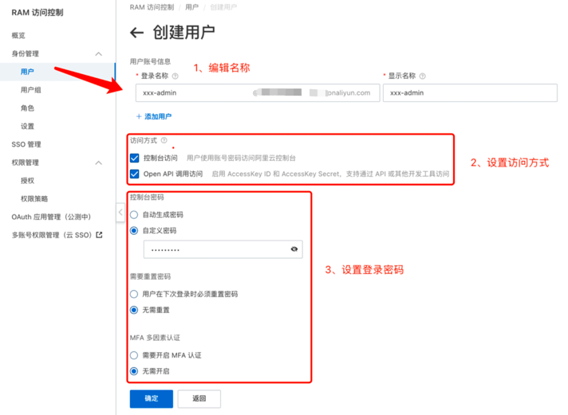

> 创建成功后，保存相关信息，例如用户登录名称等。

- 进入`admin`用户界面，使用主账号赋予`admin`用户`AdministratorAccess`权限策略


> 如无需对账号权限进行细粒度控制(即用`API`账号进行函数计算相关部署和接口调用)，可不用创建`API`用户，
> 直接使用`admin`账号的`AccessKey ID`、`AccessKey Secret`，配置过程中，可跳过`3. FC 函数计算服务配置`的相关配置过程


#### 1.2、API 用户创建

- `API`用户属于主账号下的子账号(RAM 账号), 该账号用于项目中实际接口调用时相关权限的设置，后续的配置全部围绕该账号进行

> 退出主账号，登录`admin`账号，创建`API`账号


注：保存`AccessKey ID`、`AccessKey Secret`，后续配置需要用到

- 前往`访问控制`控制台，在权限策略管理中,创建自定义策略

> 策略名称：wefe-fc-policy

以下是权限配置的json

```json
{
  "Version": "1",
  "Statement": [
    {
      "Action": [
        "ecs:CreateNetworkInterface",
        "ecs:DeleteNetworkInterface",
        "ecs:DescribeNetworkInterfaces",
        "ecs:CreateNetworkInterfacePermission",
        "ecs:DescribeNetworkInterfacePermissions",
        "ecs:DeleteNetworkInterfacePermission",
        "ecs:CreateSecurityGroup",
        "ecs:AuthorizeSecurityGroup"
      ],
      "Resource": "*",
      "Effect": "Allow"
    },
    {
      "Action": [
        "ram:DeletePolicyVersion",
        "ram:CreatePolicyVersion",
        "ram:CreateServiceLinkedRole",
        "ram:GetRole",
        "ram:PassRole"
      ],
      "Resource": "*",
      "Effect": "Allow"
    },
    {
      "Action": [
        "sts:AssumeRole"
      ],
      "Resource": "*",
      "Effect": "Allow"
    },
    {
      "Action": [
        "vpc:CreateVSwitch",
        "vpc:DescribeVSwitchAttributes"
      ],
      "Resource": "*",
      "Effect": "Allow"
    }
  ]
}
```  

> 自定义策略创建完成！

- 赋予`API`账号相关权限，如下所示：

```
AliyunOSSFullAccess
AliyunRAMReadOnlyAccess
AliyunSTSAssumeRoleAccess
AliyunLogFullAccess
AliyunFCFullAccess
AliyunNASFullAccess
AliyunVPCFullAccess
AliyunCloudMonitorFullAccess
wefe-fc-policy
```

> 其中，`wefe-fc-policy`为自定义策略

注：系统权限添加一次只能5个，剩下的请再次添加进去，如下：

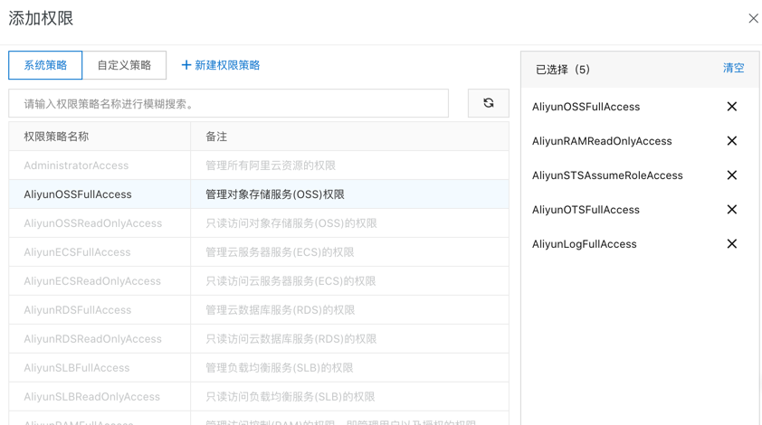

### 2. OSS 服务配置

#### 2.1、创建 bucket

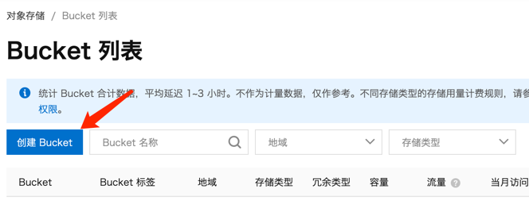


注：请留意 bucket 名称，后续配置需用到

#### 2.2、OSS 服务相关RAM权限配置

- 前往`访问控制`控制台，在权限策略管理中创建权限策略，如图：


> 策略名称：oss-readOnly

脚本配置的 json 如下：

```json
{
  "Version": "1",
  "Statement": [
    {
      "Effect": "Allow",
      "Action": "oss:Get*",
      "Resource": "acs:oss:*:*:{bucket_name}/wefe_transfer/*"
    },
    {
      "Effect": "Allow",
      "Action": "oss:ListObjects",
      "Resource": "acs:oss:*:*:{bucket_name}",
      "Condition": {
        "StringLike": {
          "oss:Prefix": "wefe_transfer/*"
        }
      }
    }
  ]
}
```
```
配置中 Resource 格式为 "acs:oss:{region}:{bucket_owner}:{bucket_name}"

例如："acs:oss:*:*:wefe-fc/wefe_transfer/*" 表示允许访问 "wefe_fc" bucket 下的 wefe_transfer 目录下的所有文件
```

- 创建 RAM 角色，如图：

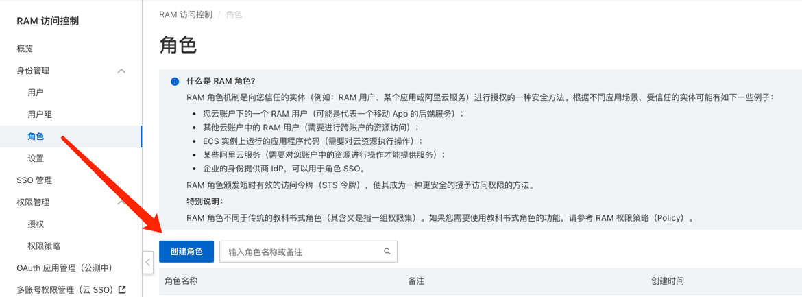

> 填写角色名称：wefe-fc-ossRead，如图：


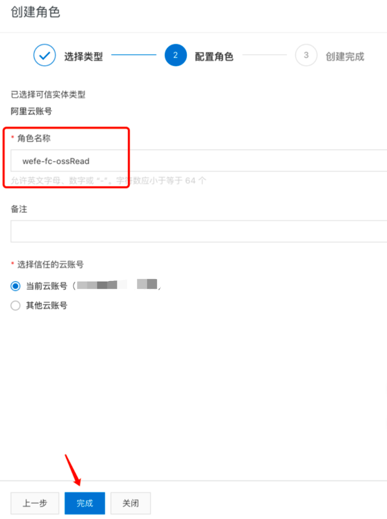

> 添加权限，将之前创建好的权限 oss-readOnly 添加到 wefe-fc-ossRead 角色

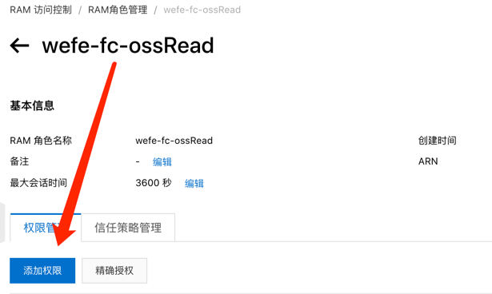

> 注：添加权限前，将最大会话时间调整到最大值，如图:


> 添加  oss-readOnly 权限

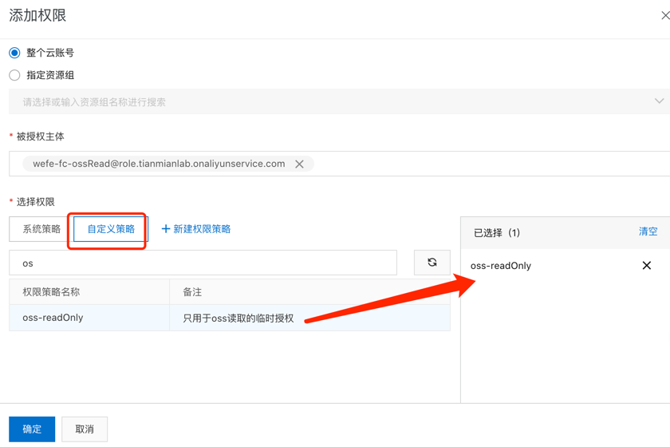


### 3. FC 函数计算服务配置

#### 3.1、函数部署相关权限配置

- 创建用于配置函数计算 template.yml文件的role角色(RAM 角色)

> 角色名称：wefe-fc-role

1、创建RAM 角色

- 选择阿里云服务


- 填写角色名称：wefe-fc-role, 同时选择受信服务：函数计算, 创建完成。

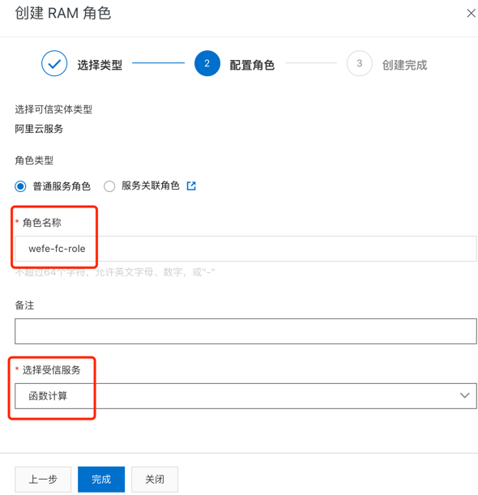

2、授权

- 给 wefe-fc-role 赋予相关系统权限，如下所示：

```
AliyunOSSFullAccess
AliyunFCFullAccess
AliyunLogFullAccess
AliyunNASFullAccess
```

- 添加自定义权限：

将上述步骤创建的策略：`wefe-fc-policy`, 添加到该 RAM 角色中，最终如下图所示：

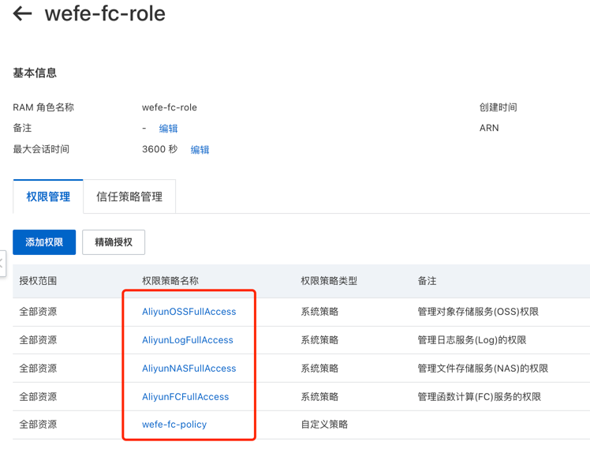

### 4. LOG 服务配置

#### 4.1、创建 Project


注：记录创建的 Project 名称，后续修改配置需用到

#### 4.2、创建 Logstore

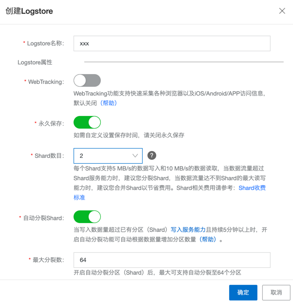

注：记录创建的 Logstore 名称，后续修改配置需用到


### 5、项目参数配置

- 统一修改 wefe.cfg 文件进行配置

> 温馨提示：下面需要配置的参数如：FC_ACCESS_KEY_ID、FC_ACCESS_KEY_SECRET 即为前面创建的`API`账户的 AccessKey ID 与 AccessKey

```
##### 函数计算的相关配置  #####

# 函数部署账号: api / admin 
FC_ACCOUNT_TYPE=admin

# 阿里云账号UID: 主账号 UID, 而非 api 或者 admin 账号 UID
FC_ACCOUNT_ID="102503****37039"

# 函数计算所在的区域，建议:cn-shenzhen
FC_REGION="cn-shenzhen"

# 提供RAM账号访问的access_key_id
FC_ACCESS_KEY_ID="xxx"

# 提供RAM账号访问的access_key_secret
FC_ACCESS_KEY_SECRET="xxx"

# 函数计算存储类型
FC_STORAGE_TYPE=oss

# oss bucket 名称
FC_OSS_BUCKET_NAME="xxx"

# CPU、GPU 模式相关配置，NONE or GPU
ACCELERATION="NONE"

# 函数计算调佣版本号
FC_QUALIFIER="LATEST"

```

> 至此全部配置完毕，可启动项目，部署函数！

### 6、函数计算服务关联日志(按需配置)
关联函数计算服务到日志服务后，函数计算执行的相关日志会写入日志仓库，后续如出现异常，便于排查问题！
> 前提：已开通日志服务, 且函数部署完毕

- 登录`admin`账户，进入函数计算控制台，修改配置

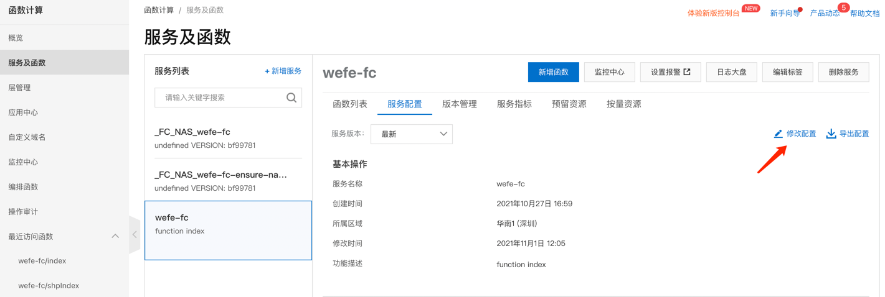


> 至此已完成关联！

