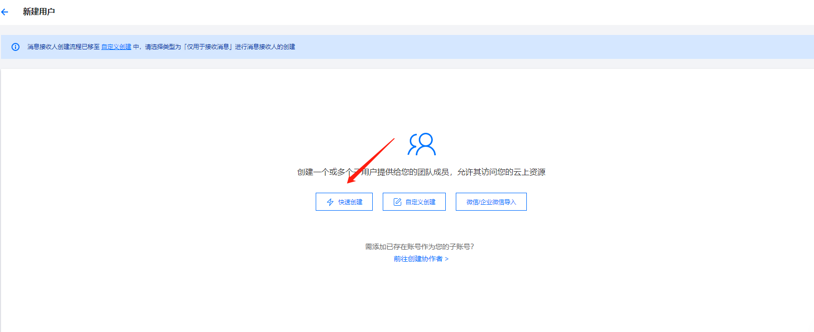
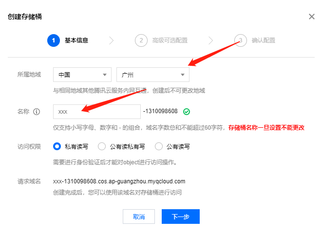

# 函数计算部署

- [函数计算部署](#函数计算部署)
  - [一、服务开通](#一服务开通)
    - [1. SCF 函数计算](#1-scf-函数计算)
    - [2. COS（云存储）](#2-cos云存储)
    - [3. 镜像仓库](#3-镜像仓库)
  - [二、相关配置（按需配置）](#二相关配置按需配置)
    - [1. 函数部署相关用户创建](#1-函数部署相关用户创建)
      - [1.1、注册腾讯云](#11注册腾讯云)
      - [1.2 子用户创建](#12子用户创建)
  - [三、创建COS（云存储）](#三创建COS（云存储）)
  - [四、创建镜像仓库](#四创建镜像仓库)
  - [五、制作镜像包](#五制作镜像包)
  - [六、创建腾讯云函数](#六创建腾讯云函数)
  - [七、项目参数配置](#七项目参数配置)

## 一、服务开通

> 本次服务开通注意事项：

函数计算：<font color='red'> 必选 </font> \
COS 云存储 : <font color='red'> 必选 </font> \
镜像仓库：<font color='grey'> 可选 </font>

### 1. SCF 函数计算

> **函数计算服务** [点击](https://console.cloud.tencent.com/) , 去往管理控制台

### 2. COS（对象存储）

> 开通腾讯云 **对象存储** 服务 [点击开通](https://console.cloud.tencent.com/cos)

### 3. 镜像仓库

> 开通腾讯云 **镜像仓库** 服务 [点击开通](https://console.cloud.tencent.com/tcr)


## 二、相关配置（按需配置）

### 1. 函数部署相关用户创建

#### 1.1、注册腾讯云

- 按照提示扫码注册


#### 1.2、子用户创建


- 点击快速创建




- 分配权限策略，赋予子账号相关权限，如下所示：


- 去掉最高权限勾选


- 给子账户赋予以下权限：

```
QcloudCOSFullAccess
QcloudSCFFullAccess
QcloudTCRFullAccess
```


### 三、创建镜像仓库
- 来到腾讯COS（云存储）的控制面板， [点击进入](https://console.cloud.tencent.com/cos)
- 创建存储桶 


- 选择地域，填写存储桶名称，下一步，后面的步骤默认下一步，最后创建



### 四、创建镜像仓库
- 来到腾讯云镜像仓库的控制面板， [点击进入](https://console.cloud.tencent.com/tcr)
- 点击命名空间，选择地域，新建


- 点击镜像仓库，新建，命名空间选择刚才新建的


> 这样就准备好了镜像仓库，用于之后存放打包好的函数计算的服务镜像


### 五、制作镜像包
- 准备文件，新建scf文件夹，将项目中的common（只保留common文件夹中的python子文件夹）、kernel文件夹，common.properties，member-base.properties，config.properties，requirements.txt拷贝到scf文件夹中


- 修改 config.properties 文件进行配置

> 温馨提示：下面需要配置的参数是部署腾讯云函数计算需要配置的参数，其他的配置参数如数据库等必要的通用配置，这里不再叙述
```
##### 函数计算的相关配置 #####

# 函数计算所在的区域，建议:ap-guangzhou
scf.cos.region=ap-guangzhou

# 子账号访问的access_key_id
scf.access_key_id=xxx

# 子账号访问的access_key_secret
scf.access_key_secret=xxx

# 账号id
scf.account_id=xxx

# cos bucket 名称，使用上面创建的数据桶名称
scf.cos_bucket_name=xxx

# 函数计算云服务商
fc.cloud.provider=tencentcloud


```

- 在此目录下编写Dockfile，vi Dockfile

```
#基于的基础镜像
FROM python:3.7

#代码添加到code文件夹
ADD . /usr/src/app

# 设置app文件夹是工作目录
WORKDIR /usr/src/app

########################
ENV PATH=$PATH:/usr/src/app
ENV PYTHONPATH /usr/src/app
#######################

# 安装支持
RUN pip install -i https://pypi.tuna.tsinghua.edu.cn/simple -r requirements.txt


CMD [ "python", "/usr/src/app/common/python/calculation/fc/function/wefe-fc/server.py" ]

```

- 编写requirements.txt，vi requirements.txt

```
gmpy2==2.1.2
six==1.15.0
cachetools==4.1.1
numba==0.50.1
numpy==1.19.0
pycryptodome==3.14.1
pycryptodomex==3.14.1
Deprecated==1.2.10
scipy==1.5.1
psutil==5.7.2
peewee==3.13.3
requests
protobuf==3.12.2
PyMySQL==0.10.0
sklearn
grpcio==1.29.0
grpcio-tools==1.29.0
clickhouse-driver==0.1.4
tornado
tablestore==5.1.0
aliyun-python-sdk-core
flask
gunicorn
aliyun-python-sdk-sts==3.0.2
werkzeug
aliyun-fc2
aiohttp==3.7.3
oss2==2.14.0
pandas==1.1.5
netifaces==0.11.0
gmssl==3.2.1
cos-python-sdk-v5==1.9.15
tencentcloud-sdk-python==3.0.751
```

- 得到文件结构如下


- 打包镜像
```
docker build -t 镜像名 .
docker login ccr.ccs.tencentyun.com --username=腾讯云账号 --passport=密码
sudo docker tag 镜像名:镜像版本 ccr.ccs.tencentyun.com/命名空间/镜像仓库名
sudo docker push ccr.ccs.tencentyun.com/命名空间/镜像仓库名
```
> 说明：命名空间、镜像仓库就是上面新建镜像仓库时的命名空间名称、镜像仓库名。镜像名和镜像版本可通过docker images 命令查看


- 本地打包的镜像发到腾讯云的镜像仓库后，可以进入镜像仓库的后台查看推送情况。可以看到原本空的镜像仓库多了一个镜像。


### 六、创建腾讯云函数

- 来到腾讯SCF（云函数）的控制面板， [点击进入](https://console.cloud.tencent.com/scf)

- 选择你之前选的地域，尽量是同一个地域，比如你之前选的广州，现在也最好选广州，点击新建。


- 选择使用容器镜像，选择web函数，填上名称，选择地域，镜像选择上面上传到镜像仓库的镜像


- 点击高级配置，内存选择大于2GB，点击完成


- 点击启用日志，默认投递即可


 
- 点击部署，开始部署


- 在函数代码中，点击测试，看是否返回成功，如果报200说明部署成功了，如果不是可以多点几次，看是否成功。


### 七、项目参数配置
- 先制作go sdk，先执行/common/python/calculation/fc/go/src/文件夹下的build.sh，执行需要本地有go运行环境。
```
# 安装go环境
# 下载安装包
wget https://golang.google.cn/dl/go1.17.1.linux-amd64.tar.gz

# 将下载的包解压到 /usr/local目录下
tar -zxf go1.17.1.linux-amd64.tar.gz -C /usr/local

# 将 /usr/local/go/bin 添加到环境变量
vim /etc/profile
# 添加如下内容
export GO111MODULE=on
export GOROOT=/usr/local/go
export GOPATH=/home/gopath
export PATH=$PATH:$GOROOT/bin:$GOPATH/bin

# 使环境变量立即生效
source /etc/profile

# 设置代理进行加速
go env -w GOPROXY=https://goproxy.cn,direct

# 查看版本
go version

# 执行build.sh
cd /common/python/calculation/fc/go/src/
sh build.sh # 如果执行不通过，可以在终端上执行 `export GO111MODULE=on` 和 `export GOPROXY=https://goproxy.io` 再试试

```
制作完go sdk后，将board项目启动，具体部署方式参考[WeFe项目部署文档](./README.md)

- WeFe项目部署完成后，配置腾讯函数计算
进入配置页面，选择函数计算->腾讯云

> 温馨提示：需要配置的参数如：账号ID、AccessKeyId、AccessKeySecret、COS bucket名称、云服务所在区域， 即为前面创建的账户的 scf.account_id、scf.access_key_id、scf.access_key_secret、scf.cos_bucket_name、scf.cos.region；
SCF 服务地址填上面创建腾讯云函数的"访问路径+/invoke"


> SCF 服务地址填上面创建腾讯云函数的"访问路径+/invoke"，例如访问路径为"https://service-xxxxxx.gz.apigw.tencentcs.com/release/",就在SCF 服务地址栏填"https://service-xxxxxx.gz.apigw.tencentcs.com/release/invoke"


> 至此全部配置完毕，可启动项目，部署函数！

