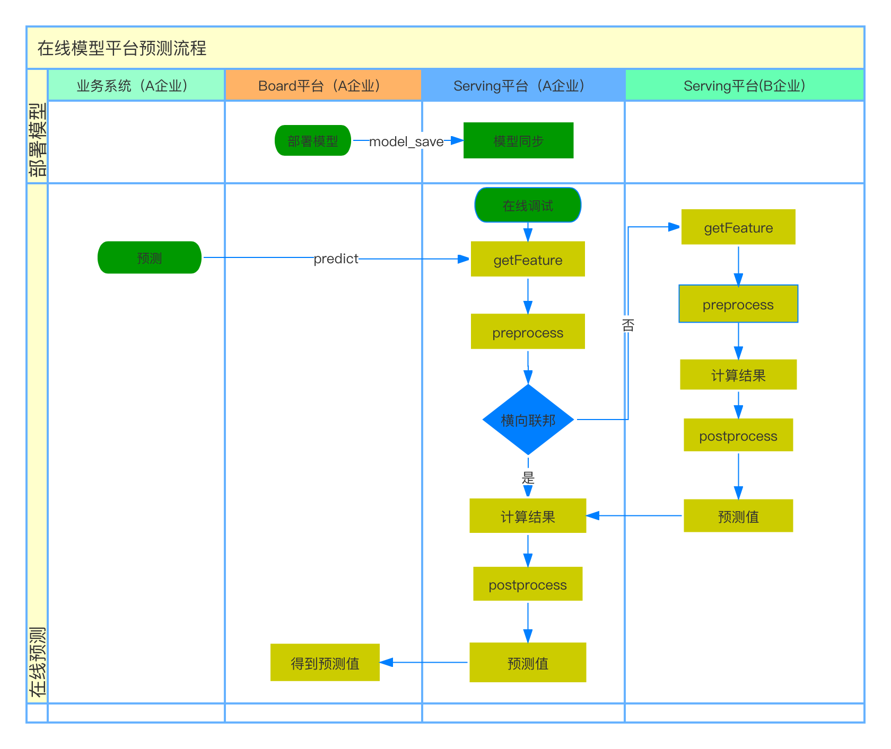

Serving 是一个模型联合在线服务平台，为Wefe系统提供联邦学习联合预测功能。

Serving 本身是一个独立的服务，但其预测所需的模型数据依赖于 WeFe-Member 的模型训练结果的同步。

##### 工作泳道图



# 功能实现  

单条、批量的预测功能；

基于 RSA 密钥验签保证暴露 API 的安全；

联合建模的多方成员数据不出库，保证数据隐私安全性；

实时记录模型的调用日志、统计调用情况；

结合(serving-website此处是link)通过可视化的页面，多维度的图表监控与观测模型的使用情况；

一键上下线模型，便于控制模型的调用安全性；

提供java-sdk包，简化调用，减少部署维护成本；

支持一键同步模型，基于wefe其他服务训练的模型一键同步

支持在线调试模型。


# 项目的构建与部署

#### 后端

serving-service基于spring-boot框架。数据库类型为MySql,通过spring-data-jpa组件管理数据访问层。


###### 项目打包方法

```
mvn clean install -Dmaven.test.skip=true -am -pl serving/serving-service
```

###### 初始化数据库

执行SQl脚本：serving-init.sql

###### 相关配置

| 配置项 | 配置项含义 | 默认值 |
| :----- | ---------- | ------ |
| spring.datasource.serving.username | 数据库用户名 | -      |
| spring.datasource.serving.password       |   数据库密码         | - |
| spring.datasource.serving.url       |     数据库地址       | - |
| spring.datasource.serving.driver-class-name       | 驱动类型           |     com.mysql.jdbc.Driver   |


#### 前端

[部署文档](../serving/serving-website/README.md)


# SDK 使用方法

导入 sdk

```maven
 <dependencies>
    <dependency>
         <groupId>com.welab.wefe</groupId>
          <artifactId>serving-sdk-java</artifactId>
          <version>1.0.0</version>
      </dependency>
</dependencies>
```

代码示例

```java
package com.welab.wefe.serving.sdk.test;

import com.alibaba.fastjson.JSONObject;
import com.welab.wefe.common.enums.Algorithm;
import com.welab.wefe.common.enums.FederatedLearningType;
import com.welab.wefe.common.enums.JobMemberRole;
import com.welab.wefe.serving.sdk.dto.PredictParams;
import com.welab.wefe.serving.sdk.dto.ProviderParams;
import com.welab.wefe.serving.sdk.model.BaseModel;
import com.welab.wefe.serving.sdk.predicter.single.AbstractPromoterPredicter;

import java.util.List;
import java.util.Map;

/**
 * 该类主要演示如何定制发起方预测类
 *
 */
public class ExamplePromoterPredicter extends AbstractPromoterPredicter {

    public ExamplePromoterPredicter(String modelId, PredictParams predictParams, JSONObject params, List<ProviderParams> providers, String memberId) {
        super(modelId, predictParams, params, providers, memberId);
    }

    @Override
    public BaseModel getModel() {

        /**
         * Custom example
         */
        BaseModel model = new BaseModel();
        model.setModelId(modelId);
        model.setAlgorithm(Algorithm.LogisticRegression);
        model.setFlType(FederatedLearningType.horizontal);
        model.setMyRole(JobMemberRole.promoter);
        model.setParams("{\n" +
                "  \"iters\": 1,\n" +
                "  \"weight\": {\n" +
                "    \"x0\": -0.90541326,\n" +
                "    \"x1\": -0.12530537,\n" +
                "    \"x2\": -0.36894084,\n" +
                "    \"x3\": -1.16595136,\n" +
                "    \"x4\": -0.81097973,\n" +
                "    \"x5\": -0.42861154\n" +
                "  },\n" +
                "  \"intercept\": -2.28208168,\n" +
                "  \"header\": [\n" +
                "    \"x0\",\n" +
                "    \"x1\",\n" +
                "    \"x2\",\n" +
                "    \"x3\",\n" +
                "    \"x4\",\n" +
                "    \"x5\"\n" +
                "  ]\n" +
                "}");

        return model;
    }


    @Override
    public Map<String, Object> fillFeatureData() {
        /**
         * custom
         */
        return predictParams.getFeatureData();
    }

    @Override
    public void featureEngineering() {
        /**
         * custom
         */
    }
}

```

```java
package com.welab.wefe.serving.sdk.test;

import com.alibaba.fastjson.JSONObject;
import com.welab.wefe.common.enums.Algorithm;
import com.welab.wefe.common.enums.FederatedLearningType;
import com.welab.wefe.common.enums.JobMemberRole;
import com.welab.wefe.serving.sdk.dto.FederatedParams;
import com.welab.wefe.serving.sdk.dto.PredictParams;
import com.welab.wefe.serving.sdk.model.BaseModel;
import com.welab.wefe.serving.sdk.predicter.single.AbstractProviderPredicter;

import java.util.Map;

/**
 * 该类主要演示如何定制协作方预测类
 *
 */
public class ExampleProviderPredicter extends AbstractProviderPredicter {


    public ExampleProviderPredicter(FederatedParams federatedParams, PredictParams predictParams, JSONObject params) {
        super(federatedParams, predictParams, params);
    }

    @Override
    public BaseModel getModel() {

        /**
         * Custom example
         */
        BaseModel model = new BaseModel();
        model.setModelId(modelId);
        model.setAlgorithm(Algorithm.LogisticRegression);
        model.setFlType(FederatedLearningType.horizontal);
        model.setMyRole(JobMemberRole.promoter);
        model.setParams("{\n" +
                "  \"iters\": 1,\n" +
                "  \"weight\": {\n" +
                "    \"x0\": -0.90541326,\n" +
                "    \"x1\": -0.12530537,\n" +
                "    \"x2\": -0.36894084,\n" +
                "    \"x3\": -1.16595136,\n" +
                "    \"x4\": -0.81097973,\n" +
                "    \"x5\": -0.42861154\n" +
                "  },\n" +
                "  \"intercept\": -2.28208168,\n" +
                "  \"header\": [\n" +
                "    \"x0\",\n" +
                "    \"x1\",\n" +
                "    \"x2\",\n" +
                "    \"x3\",\n" +
                "    \"x4\",\n" +
                "    \"x5\"\n" +
                "  ]\n" +
                "}");

        return model;
    }


    @Override
    public Map<String, Object> fillFeatureData() {
        /**
         * Custom example
         */
        return predictParams.getFeatureData();
    }

    @Override
    public void featureEngineering() {
        /**
         * Custom example
         */
    }
}

```

```java
package com.welab.wefe.serving.sdk.test;

import com.alibaba.fastjson.JSON;
import com.alibaba.fastjson.JSONObject;
import com.welab.wefe.serving.sdk.config.Launcher;
import com.welab.wefe.serving.sdk.dto.FederatedParams;
import com.welab.wefe.serving.sdk.dto.PredictParams;
import com.welab.wefe.serving.sdk.dto.PredictResult;
import com.welab.wefe.serving.sdk.dto.ProviderParams;
import org.apache.commons.compress.utils.Lists;

import java.util.HashMap;
import java.util.List;
import java.util.Map;

/**
 * 该类主要演示如和发起调用推理预测
 *
 */
public class Example {

    static {
        try {
            Launcher.init("memberId", "rsaPrivateKey", "rsaPublicKey");
        } catch (Exception e) {
            e.printStackTrace();
        }
    }

    public static void main(String[] args) {

        List<ProviderParams> providers = Lists.newArrayList();
        providers.add(ProviderParams.of("member01", "https://10.0.0.1/provider"));
        providers.add(ProviderParams.of("member02", "https://10.0.0.2/provider"));

        Map<String, Object> featureData = new HashMap<>(16);
        featureData.put("x0", 0.100016);
        featureData.put("x1", 1.210);
        featureData.put("x2", 2.321);
        featureData.put("x3", 3.432);
        featureData.put("x4", 4.543);
        featureData.put("x5", 5.654);
        PredictParams predictParams = PredictParams.of("15555555555", featureData);

        try {

            /**
             * promoter
             */
            ExamplePromoterPredicter promoter = new ExamplePromoterPredicter("modelId", predictParams, new JSONObject(), providers, "memberId");
            PredictResult promoterResult = promoter.predict();
            System.err.println(JSON.toJSONString(promoterResult));


            /**
             * provider
             */
            ExampleProviderPredicter provider = new ExampleProviderPredicter(
                    FederatedParams.of("", "modelId-02", "memberId"),
                    predictParams,
                    new JSONObject());
            PredictResult providerResult = provider.predict();
            System.err.println(JSON.toJSONString(providerResult));

        } catch (Exception e) {
            e.printStackTrace();
        }
        System.err.println("over");
    }


}

```


sdk jar 包下载

[下载地址]()


# 模型配置

[配置说明](../serving/serving-service/README.md)
