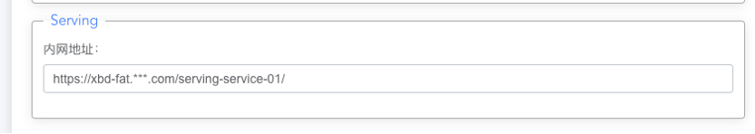
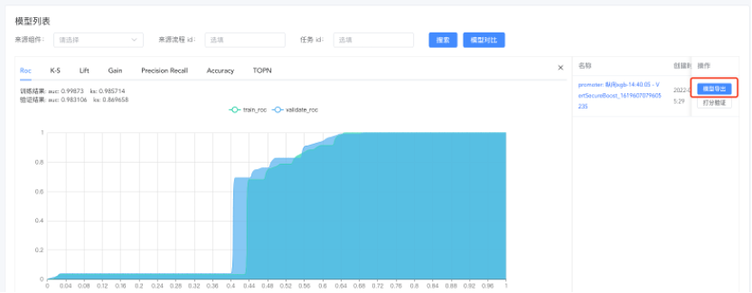
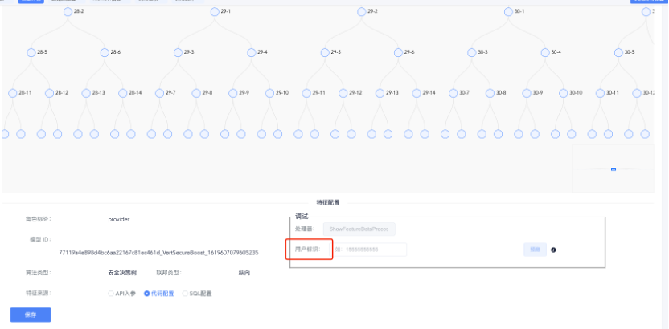
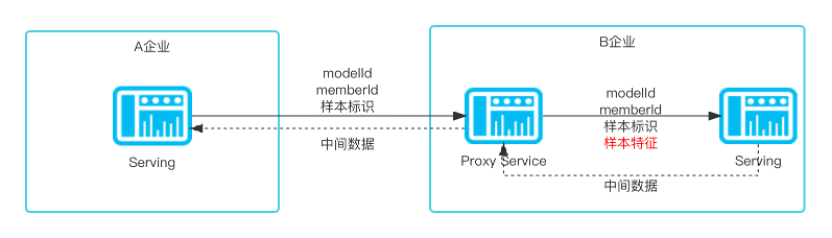
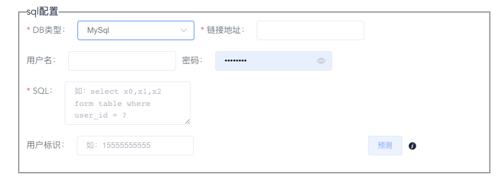

## 模型推送

##### Board配置Serving地址    

在Wefe-Board中配置serving的服务地址用于board推送已训练好的模型。

 

位置：全局设置->系统设置->Serving



##### 推送模型

  推送模型参数以及相关的模型参与方的相关信息，包含：公钥、memberId等。




## Serving配置

##### 名词解释：

用户标识： 推测/检验样本的唯一标识，例如：手机号、身份证号、银行卡号等其中的一项或者多项组合。




##### 入模特征配置

Api入参：使用方在调用接口时，将特征作为入参传递。(注意：发起方在调用协作方时，发起方是不清楚协作方的入参的，所以协作方如果想使用这种方式作为特征来源需要中间部署一层代理，如图)



代码配置：通过在serving代码中编写获取特征的方法

示例：

```java
package com.welab.wefe.serving.service.feature.code;

import com.welab.wefe.serving.service.enums.DatabaseType;
import com.welab.wefe.serving.service.manager.JdbcManager;

import java.sql.Connection;
import java.sql.PreparedStatement;
import java.sql.ResultSet;
import java.sql.SQLException;
import java.util.HashMap;
import java.util.Map;

/**
 * @author hunter.zhao
 */
@FeatureProcessor(id = "77119a4e898d4bc6aa22167c81ec461d_VertSecureBoost_1619607079605235")
public class ShowFeatureDataProcessor extends AbstractFeatureDataProcessor {

    private static final String host = "127.0.0.1";
    private static final int port = 3306;
    private static final String userName = "wefe";
    private static final String password = "*****";
    private static final String databaseName = "*****";

    @Override
    public Map<String, Object> process(String userId) {

        Map<String, Object> map = new HashMap<>();
        JdbcManager jdbcManager = new JdbcManager();
        Connection conn = null;
        try {
            conn = jdbcManager.getConnection(DatabaseType.MySql, host, port, userName, password, databaseName);

            PreparedStatement ps = conn.prepareStatement(String.format("select * from provider where id=%s", userId));
            ResultSet rs = ps.executeQuery();


            if (rs.next()) {

                int count = rs.getMetaData().getColumnCount();

                for (int i = 0; i < count; i++) {
                    /**
                     * The index of resultSet starts with 1 and needs to be added with 1
                     */

                    map.put(rs.getMetaData().getColumnLabel(i + 1), rs.getObject(i + 1));
                }
            }
        } catch (Exception e) {
            e.printStackTrace();
        } finally {
            if (conn != null) {
                try {
                    conn.close();
                } catch (SQLException e) {
                    e.printStackTrace();
                }
            }
        }

        return map;
    }
}

```


Sql配置： 通过编写sql脚本指定特征获取方式，例：select x1,x2 from table where id = ? 。此处?为占位符，实际运行时会根据接口中的用户标识入参进行sql拼接，得到想要查询的某条样本的特征。查询的特征名需要对应到模型里面的特征，如果表中的某个特征的字段名跟模型的特征名有差异需要改成名称一样，具体做法select a as x1,b as x2 from table where id = ? 。




# 推理预测

协作方接口：

​    请求路径：{{baseUrl}}/predict/provider/

​    用途：本方作为协作方角色时提供给发起方联合预测的接口

| 参数名    | 是否必填 | 类型   | 描述         |
| --------- | -------- | ------ | ------------ |
| member_id | true     | String | 调用者身份ID |
| data      | true     | JSON   | 调用参数     |
| sign      | true     | String | 调用者签名   |

请求示例

```json
{
    "data": "{\"memberId\":\"d3c9199e15154d9eac22690a55abc0f4\",\"modelId\":\"398bf490717547219dff2965deaa8df8_promoter_VertLR_16208726964963839\",\"seqNo\":\"2021051314225747286711\",\"userId\":\"15555555555\"}",
    "memberId": "d3c9199e15154d9eac22690a55abc0f4",
    "sign": "h6s3uNeLIKyQTDxh/7uILQQdOO1Bn9TBIgWym7rs8UwYnHG7r8Cxcy/mt34z7ErueOS/MBbS+06x2rCLk2lXKjNCt6OeZ6s0NqxMRaqnWAxffrIQTJ0g4bhOWDRX/VuId5mEFGaXF9qBN//BUSP7jRq3zR62MCDt3Fm3FTuWdu9eYU86AiF+KFZHYHi/I/DPn6Y+GX7Bg7xZWXpFRbyX+6Yit+e2lCB1gtrls9zO6/rP6TZ4Iezw/OnOgnXqKioJLHQ0rqVF3/Xu4Qzop4WMQxvJi5x0NjXYwyQzCPRTXnkVaEhSHeJ+lzZQG40YXI/Fcw2qJgEX3Eumcn6Zzc63YQ=="
}
```


批量预测请求示例：

```json
{
    "data": "{\"predictParams\":{\"user_ids\":[\"1626943742316\",\"1626943742391\",\"1626943742452\",\"1626943742521\",\"1626943742599\",\"1626943742663\",\"1626943742724\",\"1626943742793\",\"1626943742854\",\"1626943742916\",\"1626943742980\",\"1626943743049\",\"1626943743127\",\"1626943743196\",\"1626943743269\",\"1626943743342\",\"1626943743419\",\"1626943743502\",\"1626943743603\",\"1626943743685\",\"1626943743770\",\"1626943743860\",\"1626943743945\",\"1626943744019\",\"1626943744089\",\"1626943744178\",\"1626943744288\",\"1626943744390\",\"1626943744470\",\"1626943744552\"]},\"isBatch\":true,\"memberId\":\"d0f47307804844898ecfc65b875abe87\",\"modelId\":\"ca1c62f35e254461b95edbf65b49d618_VertSecureBoost_1619607079605235\",\"seqNo\":\"2021072216493149855416\"}",
    "memberId": "d0f47307804844898ecfc65b875abe87",
    "sign": "ijrtBbA+827f9qZ3CVzj8ZxALz1W03UOoJRy8xFJ8lkFmiGmIvsw8OpaOIdHJWgSfjmvwLYmOQ9rnrh09e5ToHD7ByKgOEXUwxEjMWaIWK4CKDLhqMccFLWoRk/jWWlxoyU7YyoPC4BZz3+houLK6SvMjmeZJqCAg5JU0divytkUfbQOGyd6K4qdhr3mHAL97nY7VxTi/NxNDXCEPUOpU/d0HvCAiuAfvIjc64bRWC69SXvO4YgQU6KT85n1DpDO+ts9t33yDgKqzshdtRlO4Z2ayXWBdrGqsp+epReccDd8kWQDDzlq72Y/onojGDTVrmvEqLzJSzKS71QrDLfs3w=="
}
```


 发起方接口：

​    请求路径：{{baseUrl}}/predict/promoter

​    用途：本方作为发起方角色时提供给自身内部业务系统进行推理预测的接口

| 参数名    | 是否必填 | 类型   | 描述         |
| --------- | -------- | ------ | ------------ |
| member_id | true     | String | 调用者身份ID |
| data      | true     | JSON   | 调用参数     |
| sign      | true     | String | 调用者签名   |

请求示例：

```json
{
    "data": "{\"memberId\":\"d3c9199e15154d9eac22690a55abc0f4\",\"modelId\":\"398bf490717547219dff2965deaa8df8_promoter_VertLR_16208726964963839\",\"seqNo\":\"2021051314225747286711\",\"userId\":\"15555555555\"}",
    "memberId": "d3c9199e15154d9eac22690a55abc0f4",
    "sign": "h6s3uNeLIKyQTDxh/7uILQQdOO1Bn9TBIgWym7rs8UwYnHG7r8Cxcy/mt34z7ErueOS/MBbS+06x2rCLk2lXKjNCt6OeZ6s0NqxMRaqnWAxffrIQTJ0g4bhOWDRX/VuId5mEFGaXF9qBN//BUSP7jRq3zR62MCDt3Fm3FTuWdu9eYU86AiF+KFZHYHi/I/DPn6Y+GX7Bg7xZWXpFRbyX+6Yit+e2lCB1gtrls9zO6/rP6TZ4Iezw/OnOgnXqKioJLHQ0rqVF3/Xu4Qzop4WMQxvJi5x0NjXYwyQzCPRTXnkVaEhSHeJ+lzZQG40YXI/Fcw2qJgEX3Eumcn6Zzc63YQ=="
}
```


批量预测请求示例：

```json
{
    "data": "{\"featureDataMap\":{\"1\":{\"x0\":0.1223213,\"x1\":0.1223213},\"2\":{}},\"modelId\":\"77119a4e898d4bc6aa22167c81ec461d_VertSecureBoost_1619607079605235\",\"userId\":235}",
    "sign": "iKa0kpmpHphCRyMQTNWQ2tVVWCZ+GiqsURobfqG+ard9dEpd2GAqjTUnQQS4CMD0Y6Tymfa03UjFhlJZpeVodeIAPI3eHXGdBnKGnKHJ35a7IBo/piTY1KC7zhKAbCuZ7C5RxSNmO2BcRnxAS8AizVjGImdphxZIIowMFpz4YP96kcx21pstriZaX2sL6TGMmjXHUBdAvxXjJ2ZrBABI+r7O9prt8bElXsgrYDBuY+BCm04ieG03AeCD7a9u9D/Ukou6BnDZWw6hobGZ8bNCPmOVU12Prg/KYlS5DCeJnQ0XjUiShxwNQAQNZEtsjjTw7GpYyi9jb/HMuADGP/zJPw==",
    "memberId": "087973c99d26410683944bf3f46c8635"
}
```

