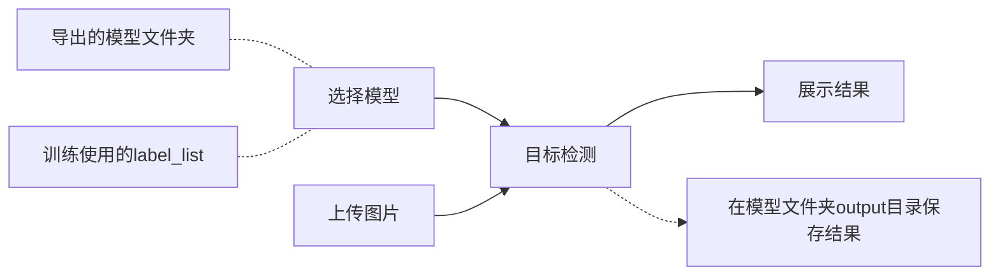

# Wefe深度学习 - Serving部署

## 环境

https://github.com/PaddlePaddle/PaddleDetection/blob/release/0.5/deploy/serving/README.md

```
sudo su
pip3 install --upgrade pip
# ==0.7.0
pip3 install paddle-serving-client -i https://mirror.baidu.com/pypi/simple
pip3 install paddle-serving-server -i https://mirror.baidu.com/pypi/simple
# pip3 install paddle-serving-app -i https://mirror.baidu.com/pypi/simple

# 升级 gcc 到 8.3
wget http://ftp.gnu.org/gnu/gcc/gcc-8.3.0/gcc-8.3.0.tar.gz
tar -xzf gcc-8.3.0.tar.gz
cd gcc-8.3.0/
./contrib/download_prerequisites
mkdir build
cd build
../configure -enable-checking=release -enable-languages=c,c++ -disable-multilib
yum groupinstall "Development Tools"
make #这个步骤非常耗时长 2.5h
make install
reboot #一定要记得重启

find / -name "libstdc++.so*"
输出如下（最新动态库的目录）
/usr/local/gcc-8.2.0/build/stage1-x86_64-pc-linux-gnu/libstdc++-v3/src/.libs/libstdc++.so.6.0.25
/usr/local/gcc-8.2.0/build/stage1-x86_64-pc-linux-gnu/libstdc++-v3/src/.libs/libstdc++.so.6
/usr/local/gcc-8.2.0/build/stage1-x86_64-pc-linux-gnu/libstdc++-v3/src/.libs/libstdc++.so

复制最新动态库文件libstdc++.so.6.0.25到/usr/lib64下
cp /usr/local/gcc-8.2.0/build/stage1-x86_64-pc-linux-gnu/libstdc++-v3/src/.libs/libstdc++.so.6.0.25 /usr/lib64

复制后，修改系统默认动态库的指向，即：重建默认库的软连接。切换工作目录至/usr/lib64：
cd /usr/lib64

删除原来软连接
rm -rf libstdc++.so.6

将默认库的软连接指向最新动态库：
ln -s libstdc++.so.6.0.25 libstdc++.so.6

默认动态库升级完成。重新运行以下命令检查动态库：
strings /usr/lib64/libstdc++.so.6 | grep GLIBC

gcc -v 查看版本号就变成8.3了

补充库
pip3 install -r requirements.txt -i https://mirror.baidu.com/pypi/simple

pip3 install tqdm
pip3 install pycocotools
pip3 install scipy -i https://mirror.baidu.com/pypi/simple
pip3 install lap -i https://mirror.baidu.com/pypi/simple
pip3 install motmetrics -i https://mirror.baidu.com/pypi/simple
pip3 install openpyxl -i https://mirror.baidu.com/pypi/simple

# 正文，下载模型到 inference_model 文件夹
python3 tools/export_serving_model.py -c configs/yolov3_mobilenet_v1_roadsign.yml -o use_gpu=false weights=https://paddlemodels.bj.bcebos.com/object_detection/yolov3_mobilenet_v1_roadsign.pdparams --output_dir=./inference_model
cd inference_model/

以下 见2 

sudo nohup python3 -m paddle_serving_server.serve --model yolov3_mobilenet_v1_roadsign/serving_server --port 9393 >> paddle_serving_server.nohup.out 2>&1 &

# test_client.py 缺动态库 libpython3.7m.so.1.0
cd /usr/lib64/
sudo ln -s libpython3.so libpython3.7m.so.1.0

```


# 服务端预测部署

`PaddleDetection`训练出来的模型可以使用[Serving](https://github.com/PaddlePaddle/Serving) 部署在服务端。
本教程以在路标数据集[roadsign_voc](https://paddlemodels.bj.bcebos.com/object_detection/roadsign_voc.tar) 使用`configs/yolov3_mobilenet_v1_roadsign.yml`算法训练的模型进行部署。
预训练模型权重文件为[yolov3_mobilenet_v1_roadsign.pdparams](https://paddlemodels.bj.bcebos.com/object_detection/yolov3_mobilenet_v1_roadsign.pdparams) 。

## 1. 首先验证模型

```
python tools/infer.py -c configs/yolov3_mobilenet_v1_roadsign.yml -o use_gpu=true weights=https://paddlemodels.bj.bcebos.com/object_detection/yolov3_mobilenet_v1_roadsign.pdparams --infer_img=demo/road554.png
```

## 2. 安装 paddle serving

```
# 安装 paddle-serving-client
pip install paddle-serving-client -i https://mirror.baidu.com/pypi/simple

# 安装 paddle-serving-server
pip install paddle-serving-server -i https://mirror.baidu.com/pypi/simple

# 安装 paddle-serving-server-gpu
pip install paddle-serving-server-gpu -i https://mirror.baidu.com/pypi/simple
```

## 3. 导出模型

PaddleDetection在训练过程包括网络的前向和优化器相关参数，而在部署过程中，我们只需要前向参数，具体参考:[导出模型](https://github.com/PaddlePaddle/PaddleDetection/blob/master/docs/advanced_tutorials/deploy/EXPORT_MODEL.md)

```
python tools/export_serving_model.py -c configs/yolov3_mobilenet_v1_roadsign.yml -o use_gpu=true weights=https://paddlemodels.bj.bcebos.com/object_detection/yolov3_mobilenet_v1_roadsign.pdparams --output_dir=./inference_model
```

以上命令会在./inference_model文件夹下生成一个`yolov3_mobilenet_v1_roadsign`文件夹：

```
inference_model
│   ├── yolov3_mobilenet_v1_roadsign
│   │   ├── infer_cfg.yml
│   │   ├── serving_client
│   │   │   ├── serving_client_conf.prototxt
│   │   │   ├── serving_client_conf.stream.prototxt
│   │   ├── serving_server
│   │   │   ├── conv1_bn_mean
│   │   │   ├── conv1_bn_offset
│   │   │   ├── conv1_bn_scale
│   │   │   ├── ...
```

`serving_client`文件夹下`serving_client_conf.prototxt`详细说明了模型输入输出信息 `serving_client_conf.prototxt`文件内容为：

```
feed_var {
  name: "image"
  alias_name: "image"
  is_lod_tensor: false
  feed_type: 1
  shape: 3
  shape: 608
  shape: 608
}
feed_var {
  name: "im_size"
  alias_name: "im_size"
  is_lod_tensor: false
  feed_type: 2
  shape: 2
}
fetch_var {
  name: "multiclass_nms_0.tmp_0"
  alias_name: "multiclass_nms_0.tmp_0"
  is_lod_tensor: true
  fetch_type: 1
  shape: -1
}
```

## 4. 启动PaddleServing服务

```
cd inference_model/yolov3_mobilenet_v1_roadsign/

# GPU
python -m paddle_serving_server_gpu.serve --model serving_server --port 9393 --gpu_ids 0

# CPU
python -m paddle_serving_server.serve --model serving_server --port 9393
```

## 5. 测试部署的服务

准备`label_list.txt`文件

```
# 进入到导出模型文件夹
cd inference_model/yolov3_mobilenet_v1_roadsign/

# 将数据集对应的label_list.txt文件拷贝到当前文件夹下
cp ../../dataset/roadsign_voc/label_list.txt .
```

设置`prototxt`文件路径为`serving_client/serving_client_conf.prototxt` 。
设置`fetch`为`fetch=["multiclass_nms_0.tmp_0"])`

测试

```
# 进入目录
cd inference_model/yolov3_mobilenet_v1_roadsign/

# 测试代码 test_client.py 会自动创建output文件夹，并在output下生成`bbox.json`和`road554.png`两个文件
python ../../deploy/serving/test_client.py ../../demo/road554.png
```


## 方案一：直接在Serving服务器本地启动PaddleServing服务



### 1. 导出模型

在wefe平台进行导出，后台会生成一个文件夹，将文件夹打包发到serving服务器。

```
inference_model    # output_dir 导出时指定的文件夹路径
│   ├── yolov3_mobilenet_v1_roadsign  # 模型文件夹
│   │   ├── infer_cfg.yml
│   │   ├── serving_client
│   │   │   ├── serving_client_conf.prototxt    # 模型输入输出说明
│   │   │   ├── serving_client_conf.stream.prototxt
│   │   ├── serving_server    # 启动服务的参数 --model serving_server 
│   │   │   ├── conv1_bn_mean
│   │   │   ├── conv1_bn_offset
│   │   │   ├── conv1_bn_scale
│   │   │   ├── ...
```

### 2. 启动PaddleServing服务

- 进入模型文件夹启动服务

```
cd inference_model/yolov3_mobilenet_v1_roadsign/

加 sudo

# GPU
python -m paddle_serving_server_gpu.serve --model serving_server --port 9393 --gpu_ids 0

# CPU
python3 -m paddle_serving_server.serve --model serving_server --port 9393
```

```
chace@WSL:~/PaddleDetection/inference_model/yolov3_mobilenet_v1_roadsign$ py -m paddle_serving_server.serve --model serving_server --port 9393
/usr/lib/python3.8/runpy.py:127: RuntimeWarning: 'paddle_serving_server.serve' found in sys.modules after import of package 'paddle_serving_server', but prior to execution of 'paddle_serving_server.serve'; this may result in unpredictable behaviour
  warn(RuntimeWarning(msg))
Going to Run Comand
/home/chace/.local/lib/python3.8/site-packages/paddle_serving_server/serving-cpu-avx-mkl-0.7.0/serving -enable_model_toolkit -inferservice_path workdir_9393 -inferservice_file infer_service.prototxt -max_concurrency 0 -num_threads 4 -port 9393 -precision fp32 -use_calib=False -reload_interval_s 10 -resource_path workdir_9393 -resource_file resource.prototxt -workflow_path workdir_9393 -workflow_file workflow.prototxt -bthread_concurrency 4 -max_body_size 536870912
I0100 00:00:00.000000  1812 op_repository.h:68] RAW: Succ regist op: GeneralDistKVInferOp
I0100 00:00:00.000000  1812 op_repository.h:68] RAW: Succ regist op: GeneralDistKVQuantInferOp
I0100 00:00:00.000000  1812 op_repository.h:68] RAW: Succ regist op: GeneralInferOp
I0100 00:00:00.000000  1812 op_repository.h:68] RAW: Succ regist op: GeneralReaderOp
I0100 00:00:00.000000  1812 op_repository.h:68] RAW: Succ regist op: GeneralResponseOp
I0100 00:00:00.000000  1812 service_manager.h:79] RAW: Service[LoadGeneralModelService] insert successfully!
I0100 00:00:00.000000  1812 load_general_model_service.pb.h:333] RAW: Success regist service[LoadGeneralModelService][PN5baidu14paddle_serving9predictor26load_general_model_service27LoadGeneralModelServiceImplE]
I0100 00:00:00.000000  1812 service_manager.h:79] RAW: Service[GeneralModelService] insert successfully!
I0100 00:00:00.000000  1812 general_model_service.pb.h:1608] RAW: Success regist service[GeneralModelService][PN5baidu14paddle_serving9predictor13general_model23GeneralModelServiceImplE]
I0100 00:00:00.000000  1812 factory.h:155] RAW: Succ insert one factory, tag: PADDLE_INFER, base type N5baidu14paddle_serving9predictor11InferEngineE
W0100 00:00:00.000000  1812 paddle_engine.cpp:29] RAW: Succ regist factory: ::baidu::paddle_serving::predictor::FluidInferEngine<PaddleInferenceEngine>->::baidu::paddle_serving::predictor::InferEngine, tag: PADDLE_INFER in macro!
--- Running analysis [ir_graph_build_pass]
--- Running analysis [ir_graph_clean_pass]
--- Running analysis [ir_analysis_pass]
--- Running analysis [ir_params_sync_among_devices_pass]
--- Running analysis [adjust_cudnn_workspace_size_pass]
--- Running analysis [inference_op_replace_pass]
--- Running analysis [memory_optimize_pass]
--- Running analysis [ir_graph_to_program_pass]
```

### 3. 检测

例如，现有预测代码`test_client.py`，他需要三个参数

- label_list.txt 文件路径，内容如下：

```
speedlimit
crosswalk
trafficlight
stop
```

- road554.png 待检测的图片路径

- output 结果保存路径，默认 ./output

```
output/
├── bbox.json        # 输出的坐标数据
└── road554.png      # 标记出目标的结果图片，此实例中只标记了一个 speedlimit
```

###### 运行

```
python3 test_client.py road554.png label_list.txt output
```

##### 效果图

     

##### bbox.json 文件解读

```
[
    {
        "category_id": 0,     # 对应label_list第一个标签 speedlimit
        "bbox": [             # 矩形框的坐标
            175.15353393554688,
            390.3569030761719,
            109.04568481445312,
            77.5528564453125
        ],
        "score": 0.9784660339355469     # 预测概率
    },
    # 以下可能由于 score 未满足要求，而没有在图上标记
    {
        "category_id": 0,
        "bbox": [
            0.0,
            537.8342895507812,
            42.406158447265625,
            54.166259765625
        ],
        "score": 0.0162621159106493
    },
    {
        "category_id": 1,
        "bbox": [
            0.47641944885253906,
            541.58447265625,
            41.470808029174805,
            45.9769287109375
        ],
        "score": 0.04761514812707901
    },
    {
        "category_id": 1,
        "bbox": [
            175.15353393554688,
            390.3569030761719,
            109.04568481445312,
            77.5528564453125
        ],
        "score": 0.013775470666587353
    },
    {
        "category_id": 2,
        "bbox": [
            0.0,
            537.8342895507812,
            42.406158447265625,
            54.166259765625
        ],
        "score": 0.04716694727540016
    },
    {
        "category_id": 2,
        "bbox": [
            175.15353393554688,
            390.3569030761719,
            109.04568481445312,
            77.5528564453125
        ],
        "score": 0.010113640688359737
    },
    {
        "category_id": 3,
        "bbox": [
            175.15353393554688,
            390.3569030761719,
            109.04568481445312,
            77.5528564453125
        ],
        "score": 0.015119721181690693
    }
]
```

